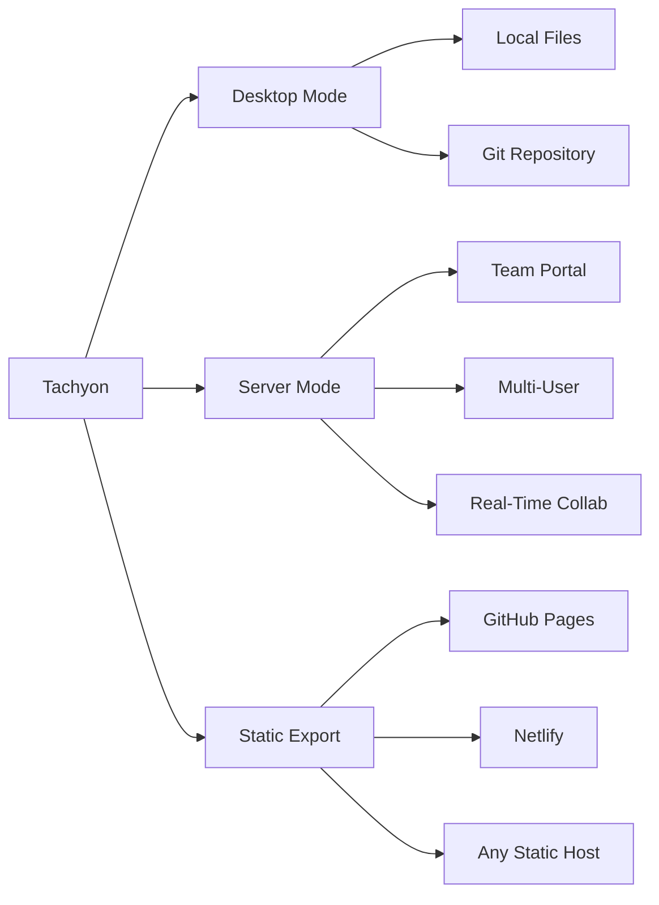

# Tachyon User Guide

Welcome to Tachyon, a high-performance knowledge management platform designed for teams and individuals.

## What is Tachyon?

Tachyon is a deterministic, high-performance documentation engine that operates directly on your file system or Git repository. Unlike traditional static site generators, Tachyon eliminates build steps by providing instant, just-in-time rendering.

### Key Features

- **Sub-15ms Rendering**: Content renders on-demand without build steps
- **Local-First**: Full offline functionality with Git-based version control
- **Real-Time Collaboration**: Live cursors, presence, and collaborative editing
- **Full-Text Search**: Sub-100ms search with fuzzy matching
- **Role-Based Access Control**: Fine-grained permissions and content redaction
- **Cross-Platform**: Native desktop apps + web interface + headless server

### Operation Modes



## Quick Start

### 1. Install Tachyon

```bash
# Desktop Application
# Download from: https://github.com/tachyon-org/tachyon/releases

# Docker
docker pull tachyon-org/tachyon-server:latest
docker run -d -p 8080:8080 -v /path/to/docs:/docs tachyon-org/tachyon-server:latest

# From Source
git clone https://github.com/tachyon-org/tachyon.git
cd tachyon && cargo build --release
```

### 2. Create Your First Document

```bash
# Create a new document repository
mkdir my-docs && cd my-docs
echo "# Welcome to Tachyon" > README.md
```

### 3. Start Tachyon

```bash
# Desktop
tachyon /path/to/my-docs

# Server
tachyon serve --port 8080

# Open in browser
open http://localhost:8080
```

## Documentation Guide

| Guide | Description |
|-------|-------------|
| [Installation](installation.md) | Detailed installation instructions |
| [Configuration](configuration.md) | Configuration options and settings |
| [Authentication](authentication.md) | Authentication methods and setup |
| [Documents](documents.md) | Document management and editing |
| [Search](search.md) | Search functionality and queries |
| [Teams](teams.md) | Team management and collaboration |
| [API Keys](api-keys.md) | API key usage and management |

## Getting Help

- **FAQ**: Check [FAQ](../user/faq.md) for common questions
- **Troubleshooting**: See [Troubleshooting Guide](../user/troubleshooting_guide.md)
- **Community**: GitHub Discussions and Issues
- **Security**: Report issues to security@tachyon.example.com

## Next Steps

1. Follow the [Installation Guide](installation.md)
2. Configure Tachyon with the [Configuration Guide](configuration.md)
3. Learn about [Document Management](documents.md)
4. Explore [Search Functionality](search.md)
