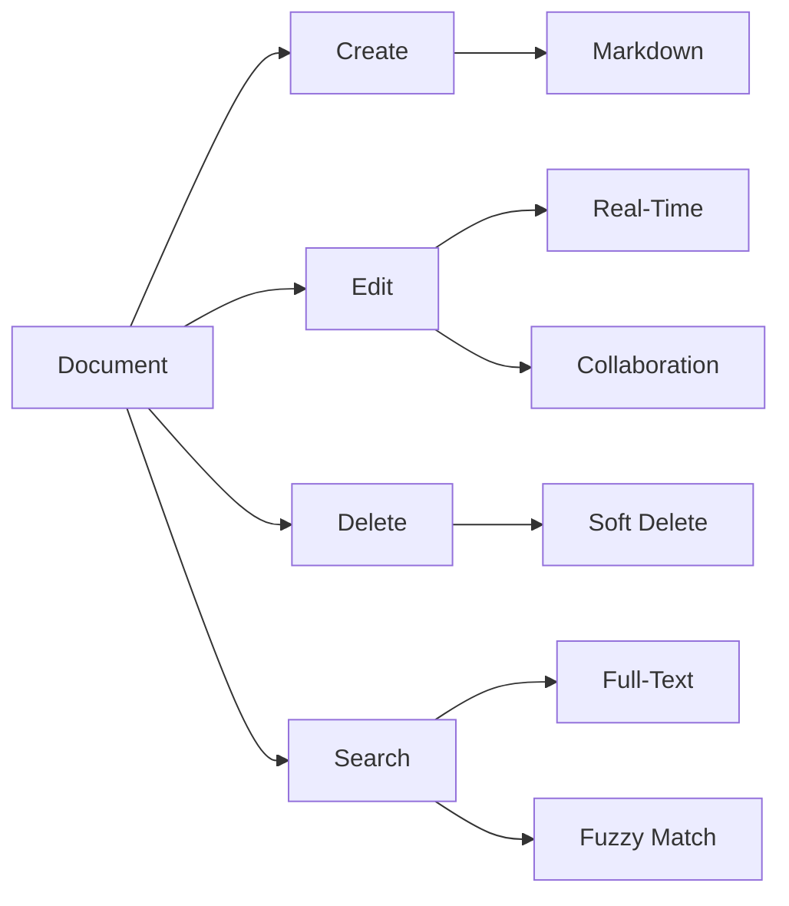
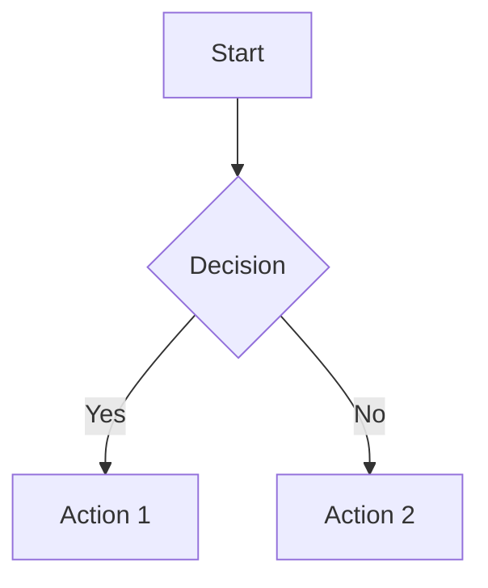

# Document Management Guide

This guide covers document management and editing in Tachyon.

## Overview

Tachyon provides powerful document management capabilities with real-time collaboration, version control, and intelligent search.



## Document Structure

### Document Model

Each document has the following properties:

```typescript
interface Document {
  id: string;              // UUID
  project_id: string;      // Parent project
  parent_id?: string;      // Parent document (for hierarchy)
  title: string;           // Document title
  content: string;         // Markdown content
  content_type: string;    // "markdown" | "text" | "html"
  tags: string[];          // Tags for categorization
  metadata: object;        // Custom metadata
  is_public: boolean;      // Public visibility
  created_at: string;      // ISO timestamp
  updated_at: string;      // ISO timestamp
  created_by: string;      // User ID
  updated_by: string;      // User ID
  version: number;         // Version number
}
```

### Document Hierarchy

Documents can be organized hierarchically:

```
Project Root
├── Getting Started
│   ├── Installation
│   └── Quick Start
├── User Guide
│   ├── Documents
│   ├── Search
│   └── Teams
└── API Reference
    ├── Authentication
    └── Endpoints
```

## Creating Documents

### Via Web Interface

1. Navigate to your project
2. Click "New Document" button
3. Enter title and content
4. Add tags and metadata
5. Click "Save"

### Via API

```bash
POST /api/v1/documents
Authorization: Bearer YOUR_TOKEN
Content-Type: application/json

{
  "project_id": "project-uuid",
  "title": "Getting Started",
  "content": "# Getting Started\n\nWelcome to Tachyon!",
  "content_type": "markdown",
  "tags": ["guide", "intro"],
  "is_public": false,
  "metadata": {
    "author": "John Doe",
    "category": "documentation"
  }
}
```

**Response:**
```json
{
  "id": "doc-uuid",
  "project_id": "project-uuid",
  "title": "Getting Started",
  "content": "# Getting Started\n\nWelcome to Tachyon!",
  "content_type": "markdown",
  "tags": ["guide", "intro"],
  "is_public": false,
  "metadata": {
    "author": "John Doe",
    "category": "documentation"
  },
  "created_at": "2026-03-09T12:00:00Z",
  "updated_at": "2026-03-09T12:00:00Z",
  "version": 1
}
```

### Via Desktop App

1. Create a new `.md` file in your documents folder
2. Tachyon automatically detects and indexes it
3. Add frontmatter for metadata:

```markdown
---
title: Getting Started
tags: [guide, intro]
author: John Doe
is_public: false
---

# Getting Started

Welcome to Tachyon!
```

## Editing Documents

### Real-Time Collaboration

Tachyon supports real-time collaborative editing:

1. Multiple users can edit simultaneously
2. Changes are synchronized instantly
3. Cursor positions are shared
4. Operational transform resolves conflicts

### Editing via API

```bash
PUT /api/v1/documents/{document_id}
Authorization: Bearer YOUR_TOKEN
Content-Type: application/json

{
  "title": "Updated Title",
  "content": "# Updated Content\n\nNew content here.",
  "tags": ["updated", "guide"],
  "metadata": {
    "last_review": "2026-03-09"
  }
}
```

### Version History

View document history:

```bash
GET /api/v1/documents/{document_id}/versions
Authorization: Bearer YOUR_TOKEN
```

**Response:**
```json
{
  "versions": [
    {
      "version": 3,
      "updated_at": "2026-03-09T14:00:00Z",
      "updated_by": "user-uuid",
      "changes": "Updated introduction"
    },
    {
      "version": 2,
      "updated_at": "2026-03-09T13:00:00Z",
      "updated_by": "user-uuid",
      "changes": "Added sections"
    },
    {
      "version": 1,
      "updated_at": "2026-03-09T12:00:00Z",
      "updated_by": "user-uuid",
      "changes": "Initial creation"
    }
  ]
}
```

### Restore Previous Version

```bash
POST /api/v1/documents/{document_id}/restore/{version}
Authorization: Bearer YOUR_TOKEN
```

## Document Hierarchy

### Creating Hierarchies

Set `parent_id` to create nested documents:

```bash
POST /api/v1/documents
Authorization: Bearer YOUR_TOKEN
Content-Type: application/json

{
  "project_id": "project-uuid",
  "parent_id": "parent-doc-uuid",
  "title": "Child Document",
  "content": "This is a child document."
}
```

### Getting Document Tree

```bash
GET /api/v1/projects/{project_id}/tree
Authorization: Bearer YOUR_TOKEN
```

**Response:**
```json
{
  "tree": {
    "id": "root-uuid",
    "title": "Project Root",
    "children": [
      {
        "id": "doc-1-uuid",
        "title": "Getting Started",
        "children": [
          {
            "id": "doc-1-1-uuid",
            "title": "Installation",
            "children": []
          }
        ]
      }
    ]
  }
}
```

## Markdown Support

### CommonMark + GFM

Tachyon supports:
- Standard CommonMark
- GitHub Flavored Markdown (GFM)
- Tables
- Task lists
- Strikethrough
- Autolinks

### Code Highlighting

```markdown
```rust
fn main() {
    println!("Hello, Tachyon!");
}
```
```

Supports 12+ languages with syntax highlighting.

### Math Rendering

Inline math: `$E = mc^2$`

Block math:
```markdown
$$
\int_{-\infty}^{\infty} e^{-x^2} dx = \sqrt{\pi}
$$
```

### Diagrams

Mermaid.js diagrams:

```markdown

```

### YAML Frontmatter

```markdown
---
title: Document Title
tags: [tag1, tag2]
author: John Doe
date: 2026-03-09
custom_field: value
---

# Content starts here
```

## Document Metadata

### Adding Metadata

```bash
PATCH /api/v1/documents/{document_id}/metadata
Authorization: Bearer YOUR_TOKEN
Content-Type: application/json

{
  "metadata": {
    "author": "Jane Doe",
    "review_status": "approved",
    "category": "technical",
    "difficulty": "intermediate"
  }
}
```

### Querying by Metadata

Use metadata in search queries:

```bash
GET /api/v1/search?q=api+author:Jane+category:technical
Authorization: Bearer YOUR_TOKEN
```

## Tags and Categorization

### Adding Tags

```bash
PATCH /api/v1/documents/{document_id}/tags
Authorization: Bearer YOUR_TOKEN
Content-Type: application/json

{
  "tags": ["guide", "api", "v2"]
}
```

### Searching by Tags

```bash
GET /api/v1/search?tags=guide,api
Authorization: Bearer YOUR_TOKEN
```

## Document Permissions

### Setting Visibility

```bash
PATCH /api/v1/documents/{document_id}
Authorization: Bearer YOUR_TOKEN
Content-Type: application/json

{
  "is_public": true
}
```

### Document-Level Permissions

```bash
POST /api/v1/documents/{document_id}/permissions
Authorization: Bearer YOUR_TOKEN
Content-Type: application/json

{
  "user_id": "user-uuid",
  "permission": "edit"  // "view" | "edit" | "admin"
}
```

## Deleting Documents

### Soft Delete

```bash
DELETE /api/v1/documents/{document_id}
Authorization: Bearer YOUR_TOKEN
```

Documents are soft-deleted and can be recovered:

```bash
POST /api/v1/documents/{document_id}/restore
Authorization: Bearer YOUR_TOKEN
```

### Permanent Delete

```bash
DELETE /api/v1/documents/{document_id}?permanent=true
Authorization: Bearer YOUR_TOKEN
```

## Document Operations

### Duplicate Document

```bash
POST /api/v1/documents/{document_id}/duplicate
Authorization: Bearer YOUR_TOKEN
```

### Export Document

```bash
GET /api/v1/documents/{document_id}/export?format=pdf
Authorization: Bearer YOUR_TOKEN
```

Formats: `markdown`, `html`, `pdf`

### Move Document

```bash
POST /api/v1/documents/{document_id}/move
Authorization: Bearer YOUR_TOKEN
Content-Type: application/json

{
  "target_project_id": "new-project-uuid",
  "target_parent_id": "new-parent-uuid"
}
```

## Bulk Operations

### Bulk Create

```bash
POST /api/v1/documents/bulk
Authorization: Bearer YOUR_TOKEN
Content-Type: application/json

{
  "documents": [
    {
      "title": "Doc 1",
      "content": "Content 1"
    },
    {
      "title": "Doc 2",
      "content": "Content 2"
    }
  ]
}
```

### Bulk Update

```bash
PATCH /api/v1/documents/bulk
Authorization: Bearer YOUR_TOKEN
Content-Type: application/json

{
  "document_ids": ["id1", "id2"],
  "updates": {
    "tags": ["bulk-updated"]
  }
}
```

### Bulk Delete

```bash
DELETE /api/v1/documents/bulk
Authorization: Bearer YOUR_TOKEN
Content-Type: application/json

{
  "document_ids": ["id1", "id2"]
}
```

## Best Practices

### 1. Use Meaningful Titles

Good: "API Authentication Guide"
Bad: "Untitled Document"

### 2. Add Descriptive Tags

```json
{
  "tags": ["api", "authentication", "v2", "guide"]
}
```

### 3. Use Frontmatter for Metadata

```markdown
---
title: Document Title
author: Your Name
date: 2026-03-09
reviewed: true
---
```

### 4. Organize with Hierarchy

Create logical document trees:
```
API Reference
├── Authentication
│   ├── JWT
│   └── API Keys
└── Endpoints
    ├── Documents
    └── Search
```

### 5. Regular Reviews

Set review dates in metadata:
```json
{
  "metadata": {
    "next_review": "2026-06-09"
  }
}
```

## Troubleshooting

### Document Not Found

- Check document ID is correct
- Verify you have access permissions
- Check if document was deleted

### Edit Conflicts

- Use real-time collaboration
- Refresh before editing
- Check version history

### Large Documents

- Split into smaller documents
- Use document hierarchy
- Consider pagination

## Next Steps

- [Search Guide](search.md) - Learn about search functionality
- [Teams Guide](teams.md) - Collaborate with teams
- [API Reference](../api/documents.md) - Document API endpoints
