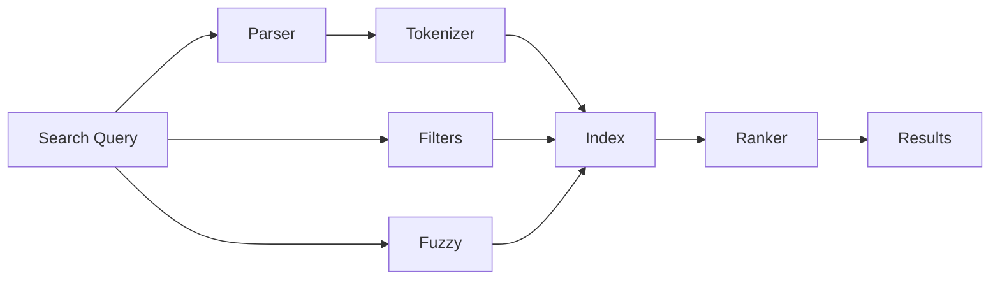

# Search Guide

This guide covers search functionality and queries in Tachyon.

## Overview

Tachyon provides powerful full-text search capabilities powered by Tantivy, delivering sub-100ms query performance with fuzzy matching and advanced filtering.



## Basic Search

### Simple Queries

Search across all documents:

```bash
GET /api/v1/search?q=authentication
Authorization: Bearer YOUR_TOKEN
```

**Response:**
```json
{
  "results": [
    {
      "id": "doc-uuid",
      "title": "Authentication Guide",
      "excerpt": "...guide covers authentication methods...",
      "score": 0.95,
      "highlighted": "...guide covers <mark>authentication</mark> methods..."
    }
  ],
  "total": 42,
  "page": 1,
  "per_page": 20,
  "query_time_ms": 23
}
```

### Pagination

```bash
GET /api/v1/search?q=authentication&page=2&per_page=50
Authorization: Bearer YOUR_TOKEN
```

## Search Syntax

### Phrase Search

Use quotes for exact phrases:

```bash
GET /api/v1/search?q="API authentication"
```

### Boolean Operators

- AND (implicit): `api authentication` → documents with both terms
- OR: `api OR rest` → documents with either term
- NOT: `api -deprecated` → documents with "api" but not "deprecated"

```bash
GET /api/v1/search?q=api+AND+authentication
GET /api/v1/search?q=api+OR+rest
GET /api/v1/search?q=api+-deprecated
```

### Field Search

Search specific fields:

```bash
# Search in title only
GET /api/v1/search?q=title:authentication

# Search in content only
GET /api/v1/search?q=content:authentication

# Search in tags
GET /api/v1/search?q=tags:guide

# Search in metadata
GET /api/v1/search?q=author:john
```

### Wildcards

- `*` matches any number of characters
- `?` matches a single character

```bash
GET /api/v1/search?q=auth*
GET /api/v1/search?q=api?guide
```

### Fuzzy Search

Use `~` for fuzzy matching:

```bash
# Finds "authentication" even with typos
GET /api/v1/search?q=authenticaton~
```

Specify edit distance (1-2):

```bash
GET /api/v1/search?q=authenticaton~2
```

### Proximity Search

Find terms within N words:

```bash
# "api" within 5 words of "authentication"
GET /api/v1/search?q="api authentication"~5
```

### Range Search

Date and numeric ranges:

```bash
# Date range
GET /api/v1/search?q=created_at:[2026-01-01 TO 2026-12-31]

# Numeric range (version)
GET /api/v1/search?q=version:[1 TO 5]
```

## Advanced Filters

### Filter by Project

```bash
GET /api/v1/search?q=authentication&project_id=project-uuid
```

### Filter by Tags

```bash
GET /api/v1/search?q=api&tags=guide,reference
```

### Filter by Author

```bash
GET /api/v1/search?q=api&author=john@example.com
```

### Filter by Date

```bash
GET /api/v1/search?q=api&created_after=2026-01-01&created_before=2026-12-31
```

### Filter by Visibility

```bash
GET /api/v1/search?q=api&is_public=true
```

### Combining Filters

```bash
GET /api/v1/search?q=api+authentication&project_id=project-uuid&tags=guide&author=john&is_public=true
```

## Search Options

### Sorting

Sort by different fields:

```bash
# Sort by relevance (default)
GET /api/v1/search?q=api&sort=score

# Sort by date
GET /api/v1/search?q=api&sort=created_at

# Sort by title
GET /api/v1/search?q=api&sort=title

# Sort order
GET /api/v1/search?q=api&sort=created_at&order=desc
```

### Highlighting

Control result highlighting:

```bash
# Enable highlighting (default)
GET /api/v1/search?q=api&highlight=true

# Disable highlighting
GET /api/v1/search?q=api&highlight=false

# Custom highlight tags
GET /api/v1/search?q=api&highlight_pre=<em>&highlight_post=</em>
```

### Result Fields

Select which fields to return:

```bash
GET /api/v1/search?q=api&fields=id,title,score
```

## Search Types

### Global Search

Search across all accessible projects:

```bash
GET /api/v1/search/global?q=authentication
Authorization: Bearer YOUR_TOKEN
```

### Project Search

Search within a specific project:

```bash
GET /api/v1/projects/{project_id}/search?q=authentication
Authorization: Bearer YOUR_TOKEN
```

### Document Search

Search within a document tree:

```bash
GET /api/v1/documents/{document_id}/search?q=authentication
Authorization: Bearer YOUR_TOKEN
```

## Faceted Search

### Get Facets

Retrieve search facets for filtering:

```bash
GET /api/v1/search?q=api&facets=tags,author,project
Authorization: Bearer YOUR_TOKEN
```

**Response:**
```json
{
  "results": [...],
  "facets": {
    "tags": {
      "guide": 45,
      "api": 32,
      "reference": 28
    },
    "author": {
      "john@example.com": 23,
      "jane@example.com": 18
    },
    "project": {
      "API Documentation": 67,
      "User Guide": 42
    }
  }
}
```

### Filter by Facets

Use facet values to filter:

```bash
GET /api/v1/search?q=api&tags=guide&author=john@example.com
```

## Search Suggestions

### Auto-Complete

Get search suggestions:

```bash
GET /api/v1/search/suggest?q=auth
Authorization: Bearer YOUR_TOKEN
```

**Response:**
```json
{
  "suggestions": [
    "authentication",
    "authorization",
    "author",
    "auth token"
  ]
}
```

### Related Searches

Get related search queries:

```bash
GET /api/v1/search/related?q=authentication
Authorization: Bearer YOUR_TOKEN
```

**Response:**
```json
{
  "related": [
    "API authentication",
    "JWT tokens",
    "OAuth",
    "API keys"
  ]
}
```

## Search Performance

### Query Time Limits

Queries timeout after 5 seconds by default:

```bash
GET /api/v1/search?q=api&timeout=10000  # 10 seconds
```

### Index Status

Check search index status:

```bash
GET /api/v1/search/status
Authorization: Bearer YOUR_TOKEN
```

**Response:**
```json
{
  "status": "ready",
  "document_count": 1250,
  "index_size_mb": 45,
  "last_indexed": "2026-03-09T12:00:00Z",
  "indexing_in_progress": false
}
```

### Rebuild Index

Force index rebuild (admin only):

```bash
POST /api/v1/search/reindex
Authorization: Bearer YOUR_TOKEN
```

## Search Examples

### Example 1: Find Recent API Guides

```bash
GET /api/v1/search?q=api+guide&tags=guide&sort=created_at&order=desc&per_page=10
```

### Example 2: Find Documents by Author

```bash
GET /api/v1/search?q=*&author=john@example.com&sort=updated_at&order=desc
```

### Example 3: Fuzzy Search with Filters

```bash
GET /api/v1/search?q=authenticaton~&project_id=project-uuid&is_public=true
```

### Example 4: Date Range Search

```bash
GET /api/v1/search?q=api&created_after=2026-01-01&created_before=2026-03-31
```

### Example 5: Complex Boolean Query

```bash
GET /api/v1/search?q=(api+OR+rest)+AND+authentication+-deprecated
```

## Search Best Practices

### 1. Use Specific Terms

Good: `"JWT authentication"`
Better: `title:"JWT authentication" tags:security`

### 2. Combine Filters

```bash
?q=api&tags=guide&project_id=uuid&sort=score
```

### 3. Use Pagination

```bash
?q=api&page=1&per_page=20
```

### 4. Leverage Facets

```bash
?q=api&facets=tags,author
```

### 5. Use Fuzzy for Typos

```bash
?q=authenticaton~2
```

## Search API Endpoints

| Endpoint | Description |
|----------|-------------|
| `GET /api/v1/search` | Basic search |
| `GET /api/v1/search/global` | Global search |
| `GET /api/v1/search/suggest` | Auto-complete |
| `GET /api/v1/search/related` | Related queries |
| `GET /api/v1/search/status` | Index status |
| `POST /api/v1/search/reindex` | Rebuild index |
| `GET /api/v1/projects/{id}/search` | Project search |

## Troubleshooting

### No Results Found

- Check query spelling
- Try fuzzy search (`~`)
- Remove filters
- Check document permissions

### Slow Queries

- Use more specific terms
- Add filters to narrow scope
- Use pagination
- Check index status

### Outdated Results

- Trigger reindex
- Check last indexed time
- Verify document is accessible

## Next Steps

- [Document Management](documents.md) - Manage your documents
- [API Reference](../api/search.md) - Search API endpoints
- [Configuration](configuration.md#search-configuration) - Search settings
