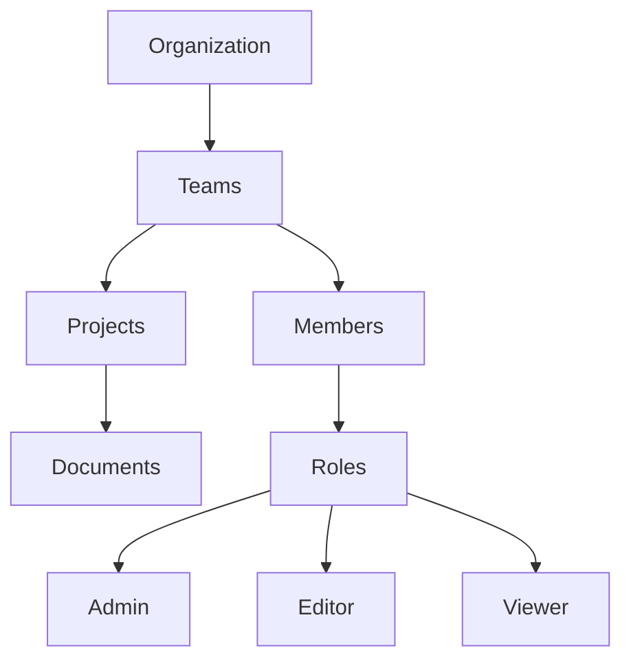

# Team Management Guide

This guide covers team management and collaboration features in Tachyon.

## Overview

Tachyon provides comprehensive team management capabilities for collaborative documentation.



## Team Structure

### Hierarchy

```
Organization
├── Team A
│   ├── Members (with roles)
│   └── Projects
│       └── Documents
├── Team B
│   ├── Members
│   └── Projects
└── Team C
    └── ...
```

### Member Roles

| Role | Permissions |
|------|-------------|
| `owner` | Full control, manage billing, delete team |
| `admin` | Manage members, projects, settings |
| `editor` | Create and edit documents |
| `viewer` | Read-only access |

## Creating Teams

### Via Web Interface

1. Navigate to Teams page
2. Click "Create Team"
3. Enter team name and description
4. Click "Create"

### Via API

```bash
POST /api/v1/teams
Authorization: Bearer YOUR_TOKEN
Content-Type: application/json

{
  "name": "Engineering Team",
  "description": "Product engineering documentation",
  "settings": {
    "default_role": "viewer",
    "allow_public_projects": true
  }
}
```

**Response:**
```json
{
  "id": "team-uuid",
  "name": "Engineering Team",
  "description": "Product engineering documentation",
  "owner_id": "user-uuid",
  "created_at": "2026-03-09T12:00:00Z",
  "member_count": 1,
  "project_count": 0
}
```

## Managing Members

### Inviting Members

```bash
POST /api/v1/teams/{team_id}/members
Authorization: Bearer YOUR_TOKEN
Content-Type: application/json

{
  "email": "newuser@example.com",
  "role": "editor",
  "message": "Join our engineering team!"
}
```

**Response:**
```json
{
  "id": "membership-uuid",
  "team_id": "team-uuid",
  "user_id": "user-uuid",
  "email": "newuser@example.com",
  "role": "editor",
  "status": "pending",
  "invited_at": "2026-03-09T12:00:00Z"
}
```

### Listing Members

```bash
GET /api/v1/teams/{team_id}/members
Authorization: Bearer YOUR_TOKEN
```

**Response:**
```json
{
  "members": [
    {
      "id": "membership-uuid",
      "user_id": "user-uuid",
      "email": "user@example.com",
      "name": "John Doe",
      "role": "admin",
      "joined_at": "2026-01-15T10:00:00Z",
      "last_active": "2026-03-09T11:00:00Z"
    }
  ],
  "total": 5
}
```

### Updating Member Role

```bash
PATCH /api/v1/teams/{team_id}/members/{member_id}
Authorization: Bearer YOUR_TOKEN
Content-Type: application/json

{
  "role": "admin"
}
```

### Removing Members

```bash
DELETE /api/v1/teams/{team_id}/members/{member_id}
Authorization: Bearer YOUR_TOKEN
```

## Team Projects

### Creating Projects

```bash
POST /api/v1/teams/{team_id}/projects
Authorization: Bearer YOUR_TOKEN
Content-Type: application/json

{
  "name": "API Documentation",
  "description": "REST API reference",
  "visibility": "team"
}
```

### Listing Team Projects

```bash
GET /api/v1/teams/{team_id}/projects
Authorization: Bearer YOUR_TOKEN
```

**Response:**
```json
{
  "projects": [
    {
      "id": "project-uuid",
      "name": "API Documentation",
      "description": "REST API reference",
      "visibility": "team",
      "document_count": 45,
      "created_at": "2026-02-01T10:00:00Z"
    }
  ],
  "total": 3
}
```

### Project Access Control

Set project-level permissions:

```bash
POST /api/v1/projects/{project_id}/permissions
Authorization: Bearer YOUR_TOKEN
Content-Type: application/json

{
  "team_id": "team-uuid",
  "access_level": "edit"
}
```

Access levels:
- `none` - No access
- `view` - Read-only
- `edit` - Can edit documents
- `admin` - Full project management

## Team Settings

### Updating Team Info

```bash
PATCH /api/v1/teams/{team_id}
Authorization: Bearer YOUR_TOKEN
Content-Type: application/json

{
  "name": "Updated Team Name",
  "description": "New description",
  "settings": {
    "default_role": "editor",
    "allow_public_projects": false
  }
}
```

### Team Settings Options

| Setting | Type | Description |
|---------|------|-------------|
| `default_role` | string | Default role for new members |
| `allow_public_projects` | boolean | Allow public project creation |
| `require_2fa` | boolean | Require 2FA for members |
| `allowed_domains` | array | Email domains for auto-approval |

## Role-Based Access Control (RBAC)

### Permission Matrix

| Action | Owner | Admin | Editor | Viewer |
|--------|-------|-------|--------|--------|
| Delete team | [OK] | [NO] | [NO] | [NO] |
| Manage members | [OK] | [OK] | [NO] | [NO] |
| Create projects | [OK] | [OK] | [NO] | [NO] |
| Edit documents | [OK] | [OK] | [OK] | [NO] |
| View documents | [OK] | [OK] | [OK] | [OK] |

### Checking Permissions

```bash
GET /api/v1/teams/{team_id}/permissions
Authorization: Bearer YOUR_TOKEN
```

**Response:**
```json
{
  "role": "admin",
  "permissions": [
    "team:read",
    "team:update",
    "members:read",
    "members:invite",
    "members:remove",
    "projects:create",
    "projects:read",
    "documents:create",
    "documents:update",
    "documents:delete"
  ]
}
```

## Collaboration Features

### Real-Time Presence

See who's viewing/editing:

```bash
GET /api/v1/documents/{document_id}/presence
Authorization: Bearer YOUR_TOKEN
```

**Response:**
```json
{
  "users": [
    {
      "user_id": "user-uuid",
      "name": "John Doe",
      "action": "editing",
      "cursor_position": 245,
      "last_active": "2026-03-09T12:00:00Z"
    }
  ]
}
```

### Comments and Threads

Add comments to documents:

```bash
POST /api/v1/documents/{document_id}/comments
Authorization: Bearer YOUR_TOKEN
Content-Type: application/json

{
  "content": "This section needs clarification",
  "position": {
    "line": 42,
    "column": 1
  }
}
```

### Activity Feed

View team activity:

```bash
GET /api/v1/teams/{team_id}/activity
Authorization: Bearer YOUR_TOKEN
```

**Response:**
```json
{
  "activities": [
    {
      "id": "activity-uuid",
      "type": "document.updated",
      "user": {
        "id": "user-uuid",
        "name": "John Doe"
      },
      "resource": {
        "type": "document",
        "id": "doc-uuid",
        "name": "API Guide"
      },
      "timestamp": "2026-03-09T12:00:00Z"
    }
  ]
}
```

## Team Analytics

### Usage Statistics

```bash
GET /api/v1/teams/{team_id}/analytics
Authorization: Bearer YOUR_TOKEN
```

**Response:**
```json
{
  "period": {
    "start": "2026-02-01",
    "end": "2026-03-09"
  },
  "metrics": {
    "active_members": 12,
    "documents_created": 45,
    "documents_edited": 234,
    "searches_performed": 567,
    "comments_added": 89
  },
  "top_contributors": [
    {
      "user_id": "user-uuid",
      "name": "John Doe",
      "edits": 67
    }
  ]
}
```

## Team Workflows

### Document Review

Set up review workflows:

```bash
POST /api/v1/documents/{document_id}/review
Authorization: Bearer YOUR_TOKEN
Content-Type: application/json

{
  "reviewers": ["user-uuid-1", "user-uuid-2"],
  "due_date": "2026-03-16T12:00:00Z",
  "message": "Please review before release"
}
```

### Approval Process

```bash
POST /api/v1/documents/{document_id}/approve
Authorization: Bearer YOUR_TOKEN
Content-Type: application/json

{
  "status": "approved",
  "comment": "Looks good!"
}
```

## Best Practices

### 1. Define Clear Roles

Assign roles based on responsibilities:
- **Admins**: Team leads, project managers
- **Editors**: Content creators, writers
- **Viewers**: Stakeholders, reviewers

### 2. Use Projects for Organization

```
Team
├── Product Documentation
│   ├── User Guides
│   └── API Reference
└── Internal Documentation
    ├── Architecture
    └── Runbooks
```

### 3. Regular Access Reviews

Periodically review member access:

```bash
GET /api/v1/teams/{team_id}/members?inactive_days=90
```

### 4. Document Ownership

Assign document owners:

```bash
PATCH /api/v1/documents/{document_id}
Content-Type: application/json

{
  "owner_id": "user-uuid"
}
```

### 5. Use Comments for Feedback

Encourage collaborative review through comments rather than direct edits.

## Troubleshooting

### Cannot Invite Member

- Check email format
- Verify invite permissions
- Check team member limit

### Permission Denied

- Verify user role
- Check resource permissions
- Confirm team membership

### Member Not Receiving Invite

- Check spam folder
- Verify email address
- Resend invitation

## Team API Endpoints

| Endpoint | Description |
|----------|-------------|
| `POST /api/v1/teams` | Create team |
| `GET /api/v1/teams` | List teams |
| `GET /api/v1/teams/{id}` | Get team |
| `PATCH /api/v1/teams/{id}` | Update team |
| `DELETE /api/v1/teams/{id}` | Delete team |
| `POST /api/v1/teams/{id}/members` | Invite member |
| `GET /api/v1/teams/{id}/members` | List members |
| `PATCH /api/v1/teams/{id}/members/{mid}` | Update member |
| `DELETE /api/v1/teams/{id}/members/{mid}` | Remove member |
| `GET /api/v1/teams/{id}/projects` | List team projects |
| `GET /api/v1/teams/{id}/activity` | Team activity |
| `GET /api/v1/teams/{id}/analytics` | Team analytics |

## Next Steps

- [Authentication](authentication.md) - Set up authentication
- [Document Management](documents.md) - Manage documents
- [API Keys](api-keys.md) - API access for teams
- [Permissions](../user/permissions.md) - Detailed permissions guide
