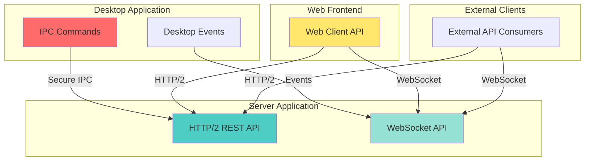
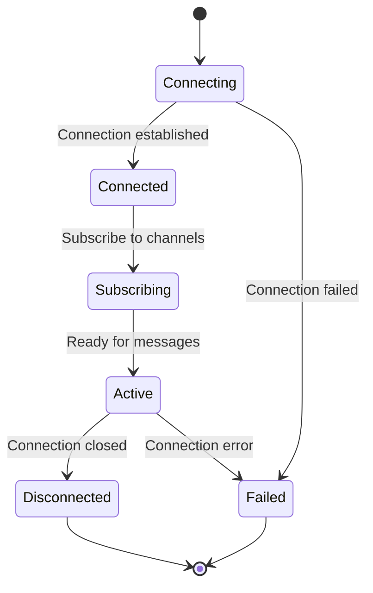
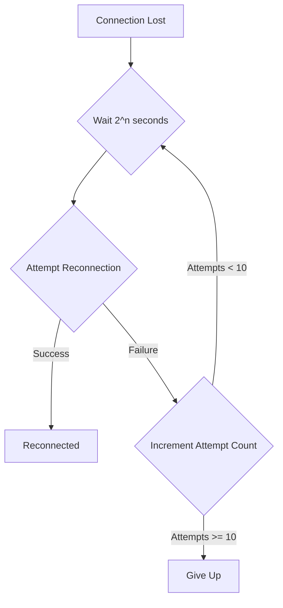

# TACHYON: API REFERENCE

**Document ID:** TACHYON-USER-004-V1.0
**Date:** February 2026
**Status:** Proposed
**Classification:** User Documentation - API Reference
**Compliance Level:** ISO/IEC 26514:2021, IEEE 1063-2001

---

## TABLE OF CONTENTS

1. [Introduction](#1-introduction)
2. [API Overview](#2-api-overview)
3. [Authentication APIs](#3-authentication-apis)
4. [Document APIs](#4-document-apis)
5. [Repository APIs](#5-repository-apis)
6. [Search APIs](#6-search-apis)
7. [WebSocket APIs](#7-websocket-apis)
8. [Error Handling](#8-error-handling)
9. [References](#9-references)

---

## 1. INTRODUCTION

### 1.1. Document Purpose

This document provides a comprehensive reference for all public APIs exposed by the Tachyon toolchain. The API reference includes detailed specifications for HTTP/2 REST endpoints, WebSocket message protocols, and IPC commands, enabling developers and advanced users to integrate with Tachyon programmatically.

### 1.2. Scope

This document covers the following API categories:

- **Authentication APIs:** User authentication, session management, and authorization
- **Document APIs:** CRUD operations for document management and content manipulation
- **Repository APIs:** Git-based repository operations including branching and merging
- **Search APIs:** Full-text search functionality with advanced filtering
- **WebSocket APIs:** Real-time bidirectional communication for live updates

### 1.3. Target Audience

This API reference is intended for:
- Software developers integrating Tachyon into custom applications
- Advanced users automating workflows through programmatic access
- System administrators managing Tachyon deployments
- Security auditors reviewing API security posture

### 1.4. Prerequisites

Readers of this document should possess:
- Understanding of HTTP/2 protocol and RESTful API design patterns
- Familiarity with WebSocket protocol for real-time communication
- Knowledge of JSON data structures and serialization
- Experience with authentication mechanisms (JWT, OAuth2)
- Proficiency in at least one programming language for API consumption

### 1.5. Document Conventions

This document adheres to the following conventions:

- **Endpoint Notation:** HTTP endpoints are specified using the format `METHOD /path/to/resource`
- **Request/Response Formats:** JSON payloads are shown with type annotations where applicable
- **Code Examples:** Examples are provided in both Rust and TypeScript for reference
- **Error Codes:** All error responses include HTTP status codes and error identifiers
- **Version Information:** API version is specified in the request header `API-Version: 1.0`

### 1.6. Related Documentation

For additional information, refer to the following documents:

- [TACHYON-STD-V1.0](../../.specs/01_standards/coding_standards.md) - Coding and Documentation Standards
- [TACHYON-ADR-001-V1.0](../../.specs/02_adrs/001_rust_as_primary_language.md) - Rust as Primary Language
- [TACHYON-ADR-010-V1.0](../../.specs/02_adrs/010_security_architecture.md) - Security Architecture
- [TACHYON-TST-V1.0](../../.specs/04_future_state/test_plan.md) - Test Plan

---

## 2. API OVERVIEW

### 2.1. Architecture Overview

The Tachyon API architecture follows a three-tier design with distinct interfaces for each component:



### 2.2. Base URLs

The Tachyon APIs are accessible at the following base URLs:

| Environment | HTTP/2 Base URL | WebSocket Base URL |
|-------------|------------------|-------------------|
| **Development** | `http://localhost:8080/api/v1` | `ws://localhost:8080/ws/v1` |
| **Staging** | `https://staging.tachyon.io/api/v1` | `wss://staging.tachyon.io/ws/v1` |
| **Production** | `https://api.tachyon.io/api/v1` | `wss://api.tachyon.io/ws/v1` |

### 2.3. Authentication

All API endpoints except authentication endpoints require authentication via Bearer token:

```
Authorization: Bearer <jwt_token>
```

JWT tokens are obtained through the authentication flow described in Section 3. Tokens expire after 24 hours and must be refreshed using the refresh endpoint.

### 2.4. Request/Response Format

All HTTP/2 API requests and responses use JSON format with UTF-8 encoding. The `Content-Type` header must be set to `application/json`.

**Request Headers:**

```
Content-Type: application/json
Authorization: Bearer <jwt_token>
API-Version: 1.0
```

**Response Headers:**

```
Content-Type: application/json
X-Request-ID: <unique_request_identifier>
X-Rate-Limit-Remaining: <remaining_requests>
X-Rate-Limit-Reset: <epoch_timestamp>
```

### 2.5. Rate Limiting

API endpoints are subject to rate limiting to prevent abuse and ensure fair resource allocation:

| Endpoint Category | Rate Limit | Window |
|------------------|-------------|---------|
| **Authentication** | 10 requests/minute | 60 seconds |
| **Document CRUD** | 100 requests/minute | 60 seconds |
| **Search** | 50 requests/minute | 60 seconds |
| **Repository Operations** | 20 requests/minute | 60 seconds |
| **WebSocket** | 100 messages/minute | 60 seconds |

Rate limit headers are included in all responses to inform clients of remaining quota.

### 2.6. Versioning

The Tachyon API follows semantic versioning (SemVer) for major version changes:

- **Major Version (X.0.0):** Breaking changes requiring client updates
- **Minor Version (1.X.0):** Backward-compatible additions
- **Patch Version (1.0.X):** Backward-compatible bug fixes

Clients must specify the API version in the `API-Version` header. The current version is `1.0`.

### 2.7. Security Considerations

The Tachyon API implements multiple security layers as defined in [ADR-010: Security Architecture](../../.specs/02_adrs/010_security_architecture.md):

- **Transport Layer Security:** TLS 1.3 with 256-bit encryption
- **Authentication:** JWT-based authentication with bcrypt password hashing
- **Authorization:** Capability-based access control via Tauri capabilities
- **Input Validation:** Comprehensive validation across all endpoints
- **Audit Logging:** All API requests are logged with tracing instrumentation

### 2.8. Error Response Format

All error responses follow a consistent format:

```json
{
  "error": {
    "code": "ERROR_CODE",
    "message": "Human-readable error message",
    "details": {
      "field": "Additional error details"
    },
    "request_id": "unique_request_identifier"
  }
}
```

Error codes are documented in Section 8: Error Handling.

### 2.9. Pagination

List-based endpoints support pagination using cursor-based pagination:

**Request Parameters:**

| Parameter | Type | Description |
|-----------|------|-------------|
| `limit` | integer | Maximum number of items to return (1-100) |
| `cursor` | string | Pagination cursor from previous response |

**Response Format:**

```json
{
  "data": [...],
  "pagination": {
    "next_cursor": "cursor_for_next_page",
    "has_more": true
  }
}
```

### 2.10. Filtering and Sorting

List-based endpoints support filtering and sorting via query parameters:

**Filtering:**

```
filter[field]=value&filter[field2]=value2
```

**Sorting:**

```
sort=field:direction
```

Where `direction` is either `asc` (ascending) or `desc` (descending).

### 2.11. Idempotency

Certain endpoints support idempotency to prevent duplicate operations:

**Idempotency Key Header:**

```
Idempotency-Key: <unique_key>
```

Idempotency keys are valid for 24 hours and ensure that multiple requests with the same key produce identical results.

### 2.12. Webhooks

The Tachyon API supports webhook notifications for asynchronous events:

- **Document Events:** Create, update, delete events
- **Repository Events:** Commit, branch, merge events
- **User Events:** Authentication, authorization events

Webhooks are configured through the user settings API and deliver POST requests to registered endpoints.

---

## 3. AUTHENTICATION APIS

### 3.1. Overview

The Authentication APIs provide user authentication, session management, and authorization functionality. These APIs implement JWT-based authentication with bcrypt password hashing as specified in [ADR-010: Security Architecture](../../.specs/02_adrs/010_security_architecture.md).

**Security Considerations:**

- All passwords are hashed using bcrypt with 256-bit salt
- JWT tokens expire after 24 hours
- Refresh tokens expire after 30 days
- Failed authentication attempts are logged and rate-limited
- Multi-factor authentication (MFA) is supported via TOTP

### 3.2. Authentication Endpoints

#### 3.2.1. Register User

Registers a new user account with email and password.

**Endpoint:** `POST /auth/register`

**Request Headers:**

```
Content-Type: application/json
API-Version: 1.0
```

**Request Body:**

```json
{
  "email": "user@example.com",
  "password": "SecurePassword123!",
  "display_name": "John Doe"
}
```

**Request Parameters:**

| Parameter | Type | Required | Constraints | Description |
|-----------|------|----------|-------------|-------------|
| `email` | string | Yes | Valid email format, max 255 characters | User email address |
| `password` | string | Yes | Min 12 characters, max 128 characters | User password |
| `display_name` | string | Yes | Min 1 character, max 100 characters | User display name |

**Response (201 Created):**

```json
{
  "user": {
    "id": "550e8400-e29b-41d4-a716-446655440000",
    "email": "user@example.com",
    "display_name": "John Doe",
    "created_at": "2026-02-06T14:00:00.000Z",
    "updated_at": "2026-02-06T14:00:00.000Z"
  },
  "tokens": {
    "access_token": "eyJhbGciOiJIUzI1NiIsInR5cCI6IkpXVCJ9...",
    "refresh_token": "eyJhbGciOiJIUzI1NiIsInR5cCI6IkpXVCJ9...",
    "expires_in": 86400,
    "token_type": "Bearer"
  }
}
```

**Error Responses:**

| Status Code | Error Code | Description |
|-------------|-------------|-------------|
| 400 Bad Request | `INVALID_EMAIL` | Email format is invalid |
| 400 Bad Request | `WEAK_PASSWORD` | Password does not meet strength requirements |
| 409 Conflict | `EMAIL_EXISTS` | Email address is already registered |
| 422 Unprocessable Entity | `VALIDATION_ERROR` | Request body validation failed |

**Rust Example:**

```rust
use reqwest::Client;
use serde::{Deserialize, Serialize};

#[derive(Serialize)]
struct RegisterRequest {
    email: String,
    password: String,
    display_name: String,
}

#[derive(Deserialize)]
struct RegisterResponse {
    user: User,
    tokens: Tokens,
}

async fn register_user() -> Result<RegisterResponse, reqwest::Error> {
    let client = Client::new();
    let request = RegisterRequest {
        email: "user@example.com".to_string(),
        password: "SecurePassword123!".to_string(),
        display_name: "John Doe".to_string(),
    };
    
    let response = client
        .post("http://localhost:8080/api/v1/auth/register")
        .header("API-Version", "1.0")
        .json(&request)
        .send()
        .await?;
    
    let result: RegisterResponse = response.json().await?;
    Ok(result)
}
```

**TypeScript Example:**

```typescript
interface RegisterRequest {
  email: string;
  password: string;
  display_name: string;
}

interface RegisterResponse {
  user: {
    id: string;
    email: string;
    display_name: string;
    created_at: string;
    updated_at: string;
  };
  tokens: {
    access_token: string;
    refresh_token: string;
    expires_in: number;
    token_type: string;
  };
}

async function registerUser(request: RegisterRequest): Promise<RegisterResponse> {
  const response = await fetch('http://localhost:8080/api/v1/auth/register', {
    method: 'POST',
    headers: {
      'Content-Type': 'application/json',
      'API-Version': '1.0',
    },
    body: JSON.stringify(request),
  });
  
  if (!response.ok) {
    throw new Error(`Registration failed: ${response.statusText}`);
  }
  
  return response.json();
}
```

#### 3.2.2. Login

Authenticates a user with email and password, returning JWT tokens.

**Endpoint:** `POST /auth/login`

**Request Headers:**

```
Content-Type: application/json
API-Version: 1.0
```

**Request Body:**

```json
{
  "email": "user@example.com",
  "password": "SecurePassword123!",
  "mfa_code": "123456"
}
```

**Request Parameters:**

| Parameter | Type | Required | Constraints | Description |
|-----------|------|----------|-------------|-------------|
| `email` | string | Yes | Valid email format, max 255 characters | User email address |
| `password` | string | Yes | Min 12 characters, max 128 characters | User password |
| `mfa_code` | string | No | 6 digits, required if MFA enabled | TOTP code for MFA |

**Response (200 OK):**

```json
{
  "user": {
    "id": "550e8400-e29b-41d4-a716-446655440000",
    "email": "user@example.com",
    "display_name": "John Doe",
    "mfa_enabled": true
  },
  "tokens": {
    "access_token": "eyJhbGciOiJIUzI1NiIsInR5cCI6IkpXVCJ9...",
    "refresh_token": "eyJhbGciOiJIUzI1NiIsInR5cCI6IkpXVCJ9...",
    "expires_in": 86400,
    "token_type": "Bearer"
  }
}
```

**Error Responses:**

| Status Code | Error Code | Description |
|-------------|-------------|-------------|
| 400 Bad Request | `INVALID_CREDENTIALS` | Email or password is incorrect |
| 401 Unauthorized | `MFA_REQUIRED` | MFA code is required but not provided |
| 401 Unauthorized | `INVALID_MFA_CODE` | MFA code is invalid |
| 404 Not Found | `USER_NOT_FOUND` | User account does not exist |
| 422 Unprocessable Entity | `VALIDATION_ERROR` | Request body validation failed |

**Rust Example:**

```rust
use reqwest::Client;
use serde::{Deserialize, Serialize};

#[derive(Serialize)]
struct LoginRequest {
    email: String,
    password: String,
    #[serde(skip_serializing_if = "Option::is_none")]
    mfa_code: Option<String>,
}

#[derive(Deserialize)]
struct LoginResponse {
    user: User,
    tokens: Tokens,
}

async fn login_user(email: &str, password: &str, mfa_code: Option<&str>) -> Result<LoginResponse, reqwest::Error> {
    let client = Client::new();
    let request = LoginRequest {
        email: email.to_string(),
        password: password.to_string(),
        mfa_code: mfa_code.map(|s| s.to_string()),
    };
    
    let response = client
        .post("http://localhost:8080/api/v1/auth/login")
        .header("API-Version", "1.0")
        .json(&request)
        .send()
        .await?;
    
    let result: LoginResponse = response.json().await?;
    Ok(result)
}
```

**TypeScript Example:**

```typescript
interface LoginRequest {
  email: string;
  password: string;
  mfa_code?: string;
}

interface LoginResponse {
  user: {
    id: string;
    email: string;
    display_name: string;
    mfa_enabled: boolean;
  };
  tokens: {
    access_token: string;
    refresh_token: string;
    expires_in: number;
    token_type: string;
  };
}

async function loginUser(request: LoginRequest): Promise<LoginResponse> {
  const response = await fetch('http://localhost:8080/api/v1/auth/login', {
    method: 'POST',
    headers: {
      'Content-Type': 'application/json',
      'API-Version': '1.0',
    },
    body: JSON.stringify(request),
  });
  
  if (!response.ok) {
    throw new Error(`Login failed: ${response.statusText}`);
  }
  
  return response.json();
}
```

#### 3.2.3. Refresh Token

Refreshes an expired access token using a valid refresh token.

**Endpoint:** `POST /auth/refresh`

**Request Headers:**

```
Content-Type: application/json
API-Version: 1.0
```

**Request Body:**

```json
{
  "refresh_token": "eyJhbGciOiJIUzI1NiIsInR5cCI6IkpXVCJ9..."
}
```

**Request Parameters:**

| Parameter | Type | Required | Constraints | Description |
|-----------|------|----------|-------------|-------------|
| `refresh_token` | string | Yes | Valid JWT refresh token | Refresh token to exchange |

**Response (200 OK):**

```json
{
  "access_token": "eyJhbGciOiJIUzI1NiIsInR5cCI6IkpXVCJ9...",
  "expires_in": 86400,
  "token_type": "Bearer"
}
```

**Error Responses:**

| Status Code | Error Code | Description |
|-------------|-------------|-------------|
| 401 Unauthorized | `INVALID_REFRESH_TOKEN` | Refresh token is invalid or expired |
| 422 Unprocessable Entity | `VALIDATION_ERROR` | Request body validation failed |

**Rust Example:**

```rust
use reqwest::Client;
use serde::{Deserialize, Serialize};

#[derive(Serialize)]
struct RefreshRequest {
    refresh_token: String,
}

#[derive(Deserialize)]
struct RefreshResponse {
    access_token: String,
    expires_in: u64,
    token_type: String,
}

async fn refresh_token(refresh_token: &str) -> Result<RefreshResponse, reqwest::Error> {
    let client = Client::new();
    let request = RefreshRequest {
        refresh_token: refresh_token.to_string(),
    };
    
    let response = client
        .post("http://localhost:8080/api/v1/auth/refresh")
        .header("API-Version", "1.0")
        .json(&request)
        .send()
        .await?;
    
    let result: RefreshResponse = response.json().await?;
    Ok(result)
}
```

**TypeScript Example:**

```typescript
interface RefreshRequest {
  refresh_token: string;
}

interface RefreshResponse {
  access_token: string;
  expires_in: number;
  token_type: string;
}

async function refreshToken(refreshToken: string): Promise<RefreshResponse> {
  const response = await fetch('http://localhost:8080/api/v1/auth/refresh', {
    method: 'POST',
    headers: {
      'Content-Type': 'application/json',
      'API-Version': '1.0',
    },
    body: JSON.stringify({ refresh_token: refreshToken }),
  });
  
  if (!response.ok) {
    throw new Error(`Token refresh failed: ${response.statusText}`);
  }
  
  return response.json();
}
```

#### 3.2.4. Logout

Invalidates the current session and revokes tokens.

**Endpoint:** `POST /auth/logout`

**Request Headers:**

```
Content-Type: application/json
Authorization: Bearer <jwt_token>
API-Version: 1.0
```

**Response (204 No Content):**

No response body is returned on successful logout.

**Error Responses:**

| Status Code | Error Code | Description |
|-------------|-------------|-------------|
| 401 Unauthorized | `INVALID_TOKEN` | Access token is invalid or expired |
| 500 Internal Server Error | `LOGOUT_FAILED` | Failed to invalidate session |

**Rust Example:**

```rust
use reqwest::Client;

async fn logout_user(access_token: &str) -> Result<(), reqwest::Error> {
    let client = Client::new();
    
    let response = client
        .post("http://localhost:8080/api/v1/auth/logout")
        .header("Authorization", format!("Bearer {}", access_token))
        .header("API-Version", "1.0")
        .send()
        .await?;
    
    if response.status().is_success() {
        Ok(())
    } else {
        Err(reqwest::Error::from(response.status()))
    }
}
```

**TypeScript Example:**

```typescript
async function logoutUser(accessToken: string): Promise<void> {
  const response = await fetch('http://localhost:8080/api/v1/auth/logout', {
    method: 'POST',
    headers: {
      'Content-Type': 'application/json',
      'Authorization': `Bearer ${accessToken}`,
      'API-Version': '1.0',
    },
  });
  
  if (!response.ok) {
    throw new Error(`Logout failed: ${response.statusText}`);
  }
}
```

#### 3.2.5. Enable MFA

Enables multi-factor authentication for the current user.

**Endpoint:** `POST /auth/mfa/enable`

**Request Headers:**

```
Content-Type: application/json
Authorization: Bearer <jwt_token>
API-Version: 1.0
```

**Response (200 OK):**

```json
{
  "secret": "JBSWY3DPEHPK3PXP",
  "qr_code": "data:image/png;base64,iVBORw0KGgoAAAANSUhEUgAA...",
  "backup_codes": [
    "123456",
    "789012",
    "345678",
    "901234",
    "567890"
  ]
}
```

**Response Parameters:**

| Parameter | Type | Description |
|-----------|------|-------------|
| `secret` | string | TOTP secret key for authenticator app |
| `qr_code` | string | Base64-encoded QR code for easy setup |
| `backup_codes` | array[string] | List of 10 backup codes for recovery |

**Error Responses:**

| Status Code | Error Code | Description |
|-------------|-------------|-------------|
| 401 Unauthorized | `INVALID_TOKEN` | Access token is invalid or expired |
| 409 Conflict | `MFA_ALREADY_ENABLED` | MFA is already enabled for this user |

#### 3.2.6. Verify MFA

Verifies and enables MFA after user confirms setup.

**Endpoint:** `POST /auth/mfa/verify`

**Request Headers:**

```
Content-Type: application/json
Authorization: Bearer <jwt_token>
API-Version: 1.0
```

**Request Body:**

```json
{
  "code": "123456"
}
```

**Response (200 OK):**

```json
{
  "enabled": true
}
```

**Error Responses:**

| Status Code | Error Code | Description |
|-------------|-------------|-------------|
| 401 Unauthorized | `INVALID_TOKEN` | Access token is invalid or expired |
| 400 Bad Request | `INVALID_MFA_CODE` | MFA code is invalid |

#### 3.2.7. Disable MFA

Disables multi-factor authentication for the current user.

**Endpoint:** `POST /auth/mfa/disable`

**Request Headers:**

```
Content-Type: application/json
Authorization: Bearer <jwt_token>
API-Version: 1.0
```

**Request Body:**

```json
{
  "password": "SecurePassword123!",
  "mfa_code": "123456"
}
```

**Response (200 OK):**

```json
{
  "disabled": true
}
```

**Error Responses:**

| Status Code | Error Code | Description |
|-------------|-------------|-------------|
| 401 Unauthorized | `INVALID_TOKEN` | Access token is invalid or expired |
| 400 Bad Request | `INVALID_PASSWORD` | Password is incorrect |
| 400 Bad Request | `INVALID_MFA_CODE` | MFA code is invalid |
| 409 Conflict | `MFA_NOT_ENABLED` | MFA is not enabled for this user |

### 3.3. Session Management

#### 3.3.1. Get Current Session

Retrieves information about the current authenticated session.

**Endpoint:** `GET /auth/session`

**Request Headers:**

```
Authorization: Bearer <jwt_token>
API-Version: 1.0
```

**Response (200 OK):**

```json
{
  "user": {
    "id": "550e8400-e29b-41d4-a716-446655440000",
    "email": "user@example.com",
    "display_name": "John Doe",
    "mfa_enabled": true,
    "created_at": "2026-02-06T14:00:00.000Z"
  },
  "session": {
    "id": "session_123456",
    "created_at": "2026-02-06T14:30:00.000Z",
    "expires_at": "2026-02-07T14:30:00.000Z",
    "ip_address": "192.168.1.100",
    "user_agent": "Mozilla/5.0..."
  }
}
```

**Error Responses:**

| Status Code | Error Code | Description |
|-------------|-------------|-------------|
| 401 Unauthorized | `INVALID_TOKEN` | Access token is invalid or expired |

#### 3.3.2. List Active Sessions

Lists all active sessions for the current user.

**Endpoint:** `GET /auth/sessions`

**Request Headers:**

```
Authorization: Bearer <jwt_token>
API-Version: 1.0
```

**Response (200 OK):**

```json
{
  "sessions": [
    {
      "id": "session_123456",
      "created_at": "2026-02-06T14:30:00.000Z",
      "expires_at": "2026-02-07T14:30:00.000Z",
      "ip_address": "192.168.1.100",
      "user_agent": "Mozilla/5.0...",
      "current": true
    },
    {
      "id": "session_789012",
      "created_at": "2026-02-06T13:00:00.000Z",
      "expires_at": "2026-02-07T13:00:00.000Z",
      "ip_address": "10.0.0.50",
      "user_agent": "curl/7.68.0",
      "current": false
    }
  ]
}
```

#### 3.3.3. Revoke Session

Revokes a specific session.

**Endpoint:** `DELETE /auth/sessions/{session_id}`

**Request Headers:**

```
Authorization: Bearer <jwt_token>
API-Version: 1.0
```

**Path Parameters:**

| Parameter | Type | Required | Description |
|-----------|------|----------|-------------|
| `session_id` | string | Yes | Session identifier to revoke |

**Response (204 No Content):**

No response body is returned on successful revocation.

**Error Responses:**

| Status Code | Error Code | Description |
|-------------|-------------|-------------|
| 401 Unauthorized | `INVALID_TOKEN` | Access token is invalid or expired |
| 404 Not Found | `SESSION_NOT_FOUND` | Session does not exist |
| 403 Forbidden | `CANNOT_REVOKE_CURRENT` | Cannot revoke current session |

#### 3.3.4. Revoke All Sessions

Revokes all sessions except the current one.

**Endpoint:** `DELETE /auth/sessions`

**Request Headers:**

```
Authorization: Bearer <jwt_token>
API-Version: 1.0
```

**Response (204 No Content):**

No response body is returned on successful revocation.

**Error Responses:**

| Status Code | Error Code | Description |
|-------------|-------------|-------------|
| 401 Unauthorized | `INVALID_TOKEN` | Access token is invalid or expired |

### 3.4. Password Management

#### 3.4.1. Change Password

Changes the user's password.

**Endpoint:** `POST /auth/password/change`

**Request Headers:**

```
Content-Type: application/json
Authorization: Bearer <jwt_token>
API-Version: 1.0
```

**Request Body:**

```json
{
  "current_password": "OldPassword123!",
  "new_password": "NewSecurePassword456!"
}
```

**Response (200 OK):**

```json
{
  "changed": true
}
```

**Error Responses:**

| Status Code | Error Code | Description |
|-------------|-------------|-------------|
| 401 Unauthorized | `INVALID_TOKEN` | Access token is invalid or expired |
| 400 Bad Request | `INVALID_CURRENT_PASSWORD` | Current password is incorrect |
| 400 Bad Request | `WEAK_PASSWORD` | New password does not meet strength requirements |

#### 3.4.2. Request Password Reset

Initiates password reset process.

**Endpoint:** `POST /auth/password/reset`

**Request Headers:**

```
Content-Type: application/json
API-Version: 1.0
```

**Request Body:**

```json
{
  "email": "user@example.com"
}
```

**Response (200 OK):**

```json
{
  "reset_token": "reset_token_123456",
  "expires_in": 3600
}
```

**Error Responses:**

| Status Code | Error Code | Description |
|-------------|-------------|-------------|
| 404 Not Found | `USER_NOT_FOUND` | User account does not exist |

#### 3.4.3. Complete Password Reset

Completes password reset using reset token.

**Endpoint:** `POST /auth/password/reset/complete`

**Request Headers:**

```
Content-Type: application/json
API-Version: 1.0
```

**Request Body:**

```json
{
  "reset_token": "reset_token_123456",
  "new_password": "NewSecurePassword456!"
}
```

**Response (200 OK):**

```json
{
  "reset": true
}
```

**Error Responses:**

| Status Code | Error Code | Description |
|-------------|-------------|-------------|
| 400 Bad Request | `INVALID_RESET_TOKEN` | Reset token is invalid or expired |
| 400 Bad Request | `WEAK_PASSWORD` | New password does not meet strength requirements |

---

## 4. DOCUMENT APIS

### 4.1. Overview

The Document APIs provide CRUD operations for managing documents stored in the Tachyon system. These APIs support Markdown content with JIT rendering, version control, and metadata management as specified in [ADR-005: Git-based Storage Decision](../../.specs/02_adrs/005_git_based_storage.md).

**Document Model:**

```json
{
  "id": "550e8400-e29b-41d4-a716-446655440000",
  "title": "Document Title",
  "content": "# Document Content\n\nThis is a Markdown document.",
  "metadata": {
    "author": "user@example.com",
    "tags": ["tag1", "tag2"],
    "category": "documentation"
  },
  "version": 1,
  "created_at": "2026-02-06T14:00:00.000Z",
  "updated_at": "2026-02-06T14:30:00.000Z"
}
```

**Supported Content Types:**

- **Markdown (.md):** Full CommonMark specification support with extensions
- **Plain Text (.txt):** Unformatted text content
- **Code (.rs, .ts, .js):** Syntax-highlighted code snippets

### 4.2. Document CRUD Endpoints

#### 4.2.1. Create Document

Creates a new document with the specified content and metadata.

**Endpoint:** `POST /documents`

**Request Headers:**

```
Content-Type: application/json
Authorization: Bearer <jwt_token>
API-Version: 1.0
```

**Request Body:**

```json
{
  "title": "Document Title",
  "content": "# Document Content\n\nThis is a Markdown document.",
  "metadata": {
    "author": "user@example.com",
    "tags": ["tag1", "tag2"],
    "category": "documentation"
  }
}
```

**Request Parameters:**

| Parameter | Type | Required | Constraints | Description |
|-----------|------|----------|-------------|-------------|
| `title` | string | Yes | Min 1 character, max 255 characters | Document title |
| `content` | string | Yes | Max 10MB | Document content in Markdown or plain text |
| `metadata` | object | No | Max 5KB | Document metadata object |

**Response (201 Created):**

```json
{
  "id": "550e8400-e29b-41d4-a716-446655440000",
  "title": "Document Title",
  "content": "# Document Content\n\nThis is a Markdown document.",
  "metadata": {
    "author": "user@example.com",
    "tags": ["tag1", "tag2"],
    "category": "documentation"
  },
  "version": 1,
  "created_at": "2026-02-06T14:00:00.000Z",
  "updated_at": "2026-02-06T14:00:00.000Z"
}
```

**Error Responses:**

| Status Code | Error Code | Description |
|-------------|-------------|-------------|
| 400 Bad Request | `INVALID_TITLE` | Title does not meet constraints |
| 400 Bad Request | `INVALID_CONTENT` | Content is empty or exceeds size limit |
| 422 Unprocessable Entity | `VALIDATION_ERROR` | Request body validation failed |

**Rust Example:**

```rust
use reqwest::Client;
use serde::{Deserialize, Serialize};

#[derive(Serialize)]
struct CreateDocumentRequest {
    title: String,
    content: String,
    #[serde(skip_serializing_if = "Option::is_none")]
    metadata: Option<DocumentMetadata>,
}

#[derive(Deserialize)]
struct DocumentResponse {
    id: String,
    title: String,
    content: String,
    metadata: DocumentMetadata,
    version: u64,
    created_at: String,
    updated_at: String,
}

async fn create_document(
    title: &str,
    content: &str,
    metadata: Option<DocumentMetadata>,
    access_token: &str,
) -> Result<DocumentResponse, reqwest::Error> {
    let client = Client::new();
    let request = CreateDocumentRequest {
        title: title.to_string(),
        content: content.to_string(),
        metadata,
    };
    
    let response = client
        .post("http://localhost:8080/api/v1/documents")
        .header("Authorization", format!("Bearer {}", access_token))
        .header("API-Version", "1.0")
        .json(&request)
        .send()
        .await?;
    
    let result: DocumentResponse = response.json().await?;
    Ok(result)
}
```

**TypeScript Example:**

```typescript
interface CreateDocumentRequest {
  title: string;
  content: string;
  metadata?: DocumentMetadata;
}

interface DocumentResponse {
  id: string;
  title: string;
  content: string;
  metadata: DocumentMetadata;
  version: number;
  created_at: string;
  updated_at: string;
}

async function createDocument(
  request: CreateDocumentRequest,
  accessToken: string
): Promise<DocumentResponse> {
  const response = await fetch('http://localhost:8080/api/v1/documents', {
    method: 'POST',
    headers: {
      'Content-Type': 'application/json',
      'Authorization': `Bearer ${accessToken}`,
      'API-Version': '1.0',
    },
    body: JSON.stringify(request),
  });
  
  if (!response.ok) {
    throw new Error(`Document creation failed: ${response.statusText}`);
  }
  
  return response.json();
}
```

#### 4.2.2. Get Document

Retrieves a document by ID.

**Endpoint:** `GET /documents/{document_id}`

**Request Headers:**

```
Authorization: Bearer <jwt_token>
API-Version: 1.0
```

**Path Parameters:**

| Parameter | Type | Required | Description |
|-----------|------|----------|-------------|
| `document_id` | string | Yes | Document identifier (UUID) |

**Query Parameters:**

| Parameter | Type | Required | Description |
|-----------|------|----------|-------------|
| `version` | integer | No | Specific version to retrieve (default: latest) |

**Response (200 OK):**

```json
{
  "id": "550e8400-e29b-41d4-a716-446655440000",
  "title": "Document Title",
  "content": "# Document Content\n\nThis is a Markdown document.",
  "metadata": {
    "author": "user@example.com",
    "tags": ["tag1", "tag2"],
    "category": "documentation"
  },
  "version": 1,
  "created_at": "2026-02-06T14:00:00.000Z",
  "updated_at": "2026-02-06T14:30:00.000Z"
}
```

**Error Responses:**

| Status Code | Error Code | Description |
|-------------|-------------|-------------|
| 401 Unauthorized | `INVALID_TOKEN` | Access token is invalid or expired |
| 403 Forbidden | `ACCESS_DENIED` | User does not have permission to access document |
| 404 Not Found | `DOCUMENT_NOT_FOUND` | Document does not exist |
| 404 Not Found | `VERSION_NOT_FOUND` | Specified version does not exist |

**Rust Example:**

```rust
use reqwest::Client;

async fn get_document(
    document_id: &str,
    access_token: &str,
    version: Option<u64>,
) -> Result<DocumentResponse, reqwest::Error> {
    let client = Client::new();
    let mut url = format!(
        "http://localhost:8080/api/v1/documents/{}",
        document_id
    );
    
    if let Some(v) = version {
        url.push_str(&format!("?version={}", v));
    }
    
    let response = client
        .get(&url)
        .header("Authorization", format!("Bearer {}", access_token))
        .header("API-Version", "1.0")
        .send()
        .await?;
    
    let result: DocumentResponse = response.json().await?;
    Ok(result)
}
```

**TypeScript Example:**

```typescript
async function getDocument(
  documentId: string,
  accessToken: string,
  version?: number
): Promise<DocumentResponse> {
  let url = `http://localhost:8080/api/v1/documents/${documentId}`;
  if (version !== undefined) {
    url += `?version=${version}`;
  }
  
  const response = await fetch(url, {
    headers: {
      'Authorization': `Bearer ${accessToken}`,
      'API-Version': '1.0',
    },
  });
  
  if (!response.ok) {
    throw new Error(`Document retrieval failed: ${response.statusText}`);
  }
  
  return response.json();
}
```

#### 4.2.3. List Documents

Lists documents with optional filtering and pagination.

**Endpoint:** `GET /documents`

**Request Headers:**

```
Authorization: Bearer <jwt_token>
API-Version: 1.0
```

**Query Parameters:**

| Parameter | Type | Required | Description |
|-----------|------|----------|-------------|
| `limit` | integer | No | Maximum number of items to return (1-100, default: 20) |
| `cursor` | string | No | Pagination cursor from previous response |
| `filter[title]` | string | No | Filter by title (partial match) |
| `filter[author]` | string | No | Filter by author email |
| `filter[category]` | string | No | Filter by category |
| `filter[tags]` | string | No | Filter by tags (comma-separated) |
| `sort` | string | No | Sort field and direction (e.g., `updated_at:desc`) |

**Response (200 OK):**

```json
{
  "data": [
    {
      "id": "550e8400-e29b-41d4-a716-446655440000",
      "title": "Document Title",
      "metadata": {
        "author": "user@example.com",
        "tags": ["tag1", "tag2"],
        "category": "documentation"
      },
      "version": 1,
      "created_at": "2026-02-06T14:00:00.000Z",
      "updated_at": "2026-02-06T14:30:00.000Z"
    }
  ],
  "pagination": {
    "next_cursor": "cursor_for_next_page",
    "has_more": true
  }
}
```

**Error Responses:**

| Status Code | Error Code | Description |
|-------------|-------------|-------------|
| 401 Unauthorized | `INVALID_TOKEN` | Access token is invalid or expired |
| 400 Bad Request | `INVALID_FILTER` | Filter parameter is invalid |

#### 4.2.4. Update Document

Updates an existing document with new content and/or metadata.

**Endpoint:** `PUT /documents/{document_id}`

**Request Headers:**

```
Content-Type: application/json
Authorization: Bearer <jwt_token>
API-Version: 1.0
```

**Path Parameters:**

| Parameter | Type | Required | Description |
|-----------|------|----------|-------------|
| `document_id` | string | Yes | Document identifier (UUID) |

**Request Body:**

```json
{
  "title": "Updated Document Title",
  "content": "# Updated Content\n\nThis is updated Markdown content.",
  "metadata": {
    "author": "user@example.com",
    "tags": ["tag1", "tag3"],
    "category": "documentation"
  }
}
```

**Response (200 OK):**

```json
{
  "id": "550e8400-e29b-41d4-a716-446655440000",
  "title": "Updated Document Title",
  "content": "# Updated Content\n\nThis is updated Markdown content.",
  "metadata": {
    "author": "user@example.com",
    "tags": ["tag1", "tag3"],
    "category": "documentation"
  },
  "version": 2,
  "created_at": "2026-02-06T14:00:00.000Z",
  "updated_at": "2026-02-06T14:45:00.000Z"
}
```

**Error Responses:**

| Status Code | Error Code | Description |
|-------------|-------------|-------------|
| 401 Unauthorized | `INVALID_TOKEN` | Access token is invalid or expired |
| 403 Forbidden | `ACCESS_DENIED` | User does not have permission to update document |
| 404 Not Found | `DOCUMENT_NOT_FOUND` | Document does not exist |
| 409 Conflict | `CONCURRENT_MODIFICATION` | Document was modified by another user |

**Rust Example:**

```rust
use reqwest::Client;
use serde::{Deserialize, Serialize};

#[derive(Serialize)]
struct UpdateDocumentRequest {
    #[serde(skip_serializing_if = "Option::is_none")]
    title: Option<String>,
    #[serde(skip_serializing_if = "Option::is_none")]
    content: Option<String>,
    #[serde(skip_serializing_if = "Option::is_none")]
    metadata: Option<DocumentMetadata>,
}

async fn update_document(
    document_id: &str,
    title: Option<&str>,
    content: Option<&str>,
    metadata: Option<DocumentMetadata>,
    access_token: &str,
) -> Result<DocumentResponse, reqwest::Error> {
    let client = Client::new();
    let request = UpdateDocumentRequest {
        title: title.map(|s| s.to_string()),
        content: content.map(|s| s.to_string()),
        metadata,
    };
    
    let response = client
        .put(&format!(
            "http://localhost:8080/api/v1/documents/{}",
            document_id
        ))
        .header("Authorization", format!("Bearer {}", access_token))
        .header("API-Version", "1.0")
        .json(&request)
        .send()
        .await?;
    
    let result: DocumentResponse = response.json().await?;
    Ok(result)
}
```

#### 4.2.5. Delete Document

Deletes a document by ID.

**Endpoint:** `DELETE /documents/{document_id}`

**Request Headers:**

```
Authorization: Bearer <jwt_token>
API-Version: 1.0
```

**Path Parameters:**

| Parameter | Type | Required | Description |
|-----------|------|----------|-------------|
| `document_id` | string | Yes | Document identifier (UUID) |

**Response (204 No Content):**

No response body is returned on successful deletion.

**Error Responses:**

| Status Code | Error Code | Description |
|-------------|-------------|-------------|
| 401 Unauthorized | `INVALID_TOKEN` | Access token is invalid or expired |
| 403 Forbidden | `ACCESS_DENIED` | User does not have permission to delete document |
| 404 Not Found | `DOCUMENT_NOT_FOUND` | Document does not exist |

### 4.3. Document Versioning

#### 4.3.1. Get Document Versions

Lists all versions of a document.

**Endpoint:** `GET /documents/{document_id}/versions`

**Request Headers:**

```
Authorization: Bearer <jwt_token>
API-Version: 1.0
```

**Path Parameters:**

| Parameter | Type | Required | Description |
|-----------|------|----------|-------------|
| `document_id` | string | Yes | Document identifier (UUID) |

**Response (200 OK):**

```json
{
  "versions": [
    {
      "version": 2,
      "created_at": "2026-02-06T14:45:00.000Z",
      "author": "user@example.com",
      "changes": "Updated title and content"
    },
    {
      "version": 1,
      "created_at": "2026-02-06T14:00:00.000Z",
      "author": "user@example.com",
      "changes": "Initial creation"
    }
  ]
}
```

#### 4.3.2. Compare Document Versions

Compares two versions of a document.

**Endpoint:** `GET /documents/{document_id}/compare`

**Request Headers:**

```
Authorization: Bearer <jwt_token>
API-Version: 1.0
```

**Path Parameters:**

| Parameter | Type | Required | Description |
|-----------|------|----------|-------------|
| `document_id` | string | Yes | Document identifier (UUID) |

**Query Parameters:**

| Parameter | Type | Required | Description |
|-----------|------|----------|-------------|
| `from` | integer | Yes | Source version number |
| `to` | integer | Yes | Target version number |

**Response (200 OK):**

```json
{
  "diff": [
    {
      "type": "modified",
      "line": 1,
      "old": "# Document Title",
      "new": "# Updated Document Title"
    },
    {
      "type": "added",
      "line": 5,
      "content": "This is new content."
    }
  ]
}
```

### 4.4. Document Rendering

#### 4.4.1. Render Document

Renders a document to HTML using JIT rendering engine.

**Endpoint:** `POST /documents/{document_id}/render`

**Request Headers:**

```
Content-Type: application/json
Authorization: Bearer <jwt_token>
API-Version: 1.0
```

**Path Parameters:**

| Parameter | Type | Required | Description |
|-----------|------|----------|-------------|
| `document_id` | string | Yes | Document identifier (UUID) |

**Request Body:**

```json
{
  "version": 1,
  "format": "html"
}
```

**Response (200 OK):**

```json
{
  "html": "<h1>Document Title</h1>\n<p>This is a Markdown document.</p>",
  "render_time_ms": 12.5
}
```

**Error Responses:**

| Status Code | Error Code | Description |
|-------------|-------------|-------------|
| 401 Unauthorized | `INVALID_TOKEN` | Access token is invalid or expired |
| 404 Not Found | `DOCUMENT_NOT_FOUND` | Document does not exist |
| 404 Not Found | `VERSION_NOT_FOUND` | Specified version does not exist |
| 422 Unprocessable Entity | `INVALID_FORMAT` | Render format is not supported |

---

## 5. REPOSITORY APIS

### 5.1. Overview

The Repository APIs provide Git-based repository operations including branching, merging, and history management. These APIs implement the Git-based storage strategy as specified in [ADR-005: Git-based Storage Decision](../../.specs/02_adrs/005_git_based_storage.md).

**Repository Model:**

```json
{
  "id": "repo_123456",
  "name": "Documentation Repository",
  "description": "Main documentation repository",
  "default_branch": "main",
  "created_at": "2026-02-06T14:00:00.000Z",
  "updated_at": "2026-02-06T14:30:00.000Z"
}
```

**Branch Model:**

```json
{
  "name": "feature/new-feature",
  "commit": "abc123def456",
  "is_default": false,
  "created_at": "2026-02-06T14:15:00.000Z"
}
```

**Commit Model:**

```json
{
  "id": "abc123def456",
  "message": "Add new documentation",
  "author": "user@example.com",
  "timestamp": "2026-02-06T14:30:00.000Z",
  "files": [
    {
      "path": "docs/api_reference.md",
      "action": "modified"
    }
  ]
}
```

### 5.2. Repository Management Endpoints

#### 5.2.1. List Repositories

Lists all repositories accessible to the current user.

**Endpoint:** `GET /repositories`

**Request Headers:**

```
Authorization: Bearer <jwt_token>
API-Version: 1.0
```

**Query Parameters:**

| Parameter | Type | Required | Description |
|-----------|------|----------|-------------|
| `limit` | integer | No | Maximum number of items to return (1-100, default: 20) |
| `cursor` | string | No | Pagination cursor from previous response |

**Response (200 OK):**

```json
{
  "data": [
    {
      "id": "repo_123456",
      "name": "Documentation Repository",
      "description": "Main documentation repository",
      "default_branch": "main",
      "created_at": "2026-02-06T14:00:00.000Z",
      "updated_at": "2026-02-06T14:30:00.000Z"
    }
  ],
  "pagination": {
    "next_cursor": "cursor_for_next_page",
    "has_more": false
  }
}
```

**Error Responses:**

| Status Code | Error Code | Description |
|-------------|-------------|-------------|
| 401 Unauthorized | `INVALID_TOKEN` | Access token is invalid or expired |

#### 5.2.2. Get Repository

Retrieves a repository by ID.

**Endpoint:** `GET /repositories/{repository_id}`

**Request Headers:**

```
Authorization: Bearer <jwt_token>
API-Version: 1.0
```

**Path Parameters:**

| Parameter | Type | Required | Description |
|-----------|------|----------|-------------|
| `repository_id` | string | Yes | Repository identifier |

**Response (200 OK):**

```json
{
  "id": "repo_123456",
  "name": "Documentation Repository",
  "description": "Main documentation repository",
  "default_branch": "main",
  "created_at": "2026-02-06T14:00:00.000Z",
  "updated_at": "2026-02-06T14:30:00.000Z",
  "branches": [
    {
      "name": "main",
      "commit": "abc123def456",
      "is_default": true,
      "created_at": "2026-02-06T14:00:00.000Z"
    },
    {
      "name": "feature/new-feature",
      "commit": "def456ghi789",
      "is_default": false,
      "created_at": "2026-02-06T14:15:00.000Z"
    }
  ]
}
```

**Error Responses:**

| Status Code | Error Code | Description |
|-------------|-------------|-------------|
| 401 Unauthorized | `INVALID_TOKEN` | Access token is invalid or expired |
| 403 Forbidden | `ACCESS_DENIED` | User does not have permission to access repository |
| 404 Not Found | `REPOSITORY_NOT_FOUND` | Repository does not exist |

### 5.3. Branch Management

#### 5.3.1. Create Branch

Creates a new branch in a repository.

**Endpoint:** `POST /repositories/{repository_id}/branches`

**Request Headers:**

```
Content-Type: application/json
Authorization: Bearer <jwt_token>
API-Version: 1.0
```

**Path Parameters:**

| Parameter | Type | Required | Description |
|-----------|------|----------|-------------|
| `repository_id` | string | Yes | Repository identifier |

**Request Body:**

```json
{
  "name": "feature/new-feature",
  "from_commit": "abc123def456"
}
```

**Request Parameters:**

| Parameter | Type | Required | Constraints | Description |
|-----------|------|----------|-------------|-------------|
| `name` | string | Yes | Valid Git branch name | Branch name |
| `from_commit` | string | No | Valid commit SHA | Commit to branch from (default: HEAD) |

**Response (201 Created):**

```json
{
  "name": "feature/new-feature",
  "commit": "abc123def456",
  "is_default": false,
  "created_at": "2026-02-06T14:15:00.000Z"
}
```

**Error Responses:**

| Status Code | Error Code | Description |
|-------------|-------------|-------------|
| 401 Unauthorized | `INVALID_TOKEN` | Access token is invalid or expired |
| 403 Forbidden | `ACCESS_DENIED` | User does not have permission to create branch |
| 404 Not Found | `REPOSITORY_NOT_FOUND` | Repository does not exist |
| 409 Conflict | `BRANCH_EXISTS` | Branch with specified name already exists |
| 422 Unprocessable Entity | `INVALID_COMMIT` | Specified commit does not exist |

#### 5.3.2. Delete Branch

Deletes a branch from a repository.

**Endpoint:** `DELETE /repositories/{repository_id}/branches/{branch_name}`

**Request Headers:**

```
Authorization: Bearer <jwt_token>
API-Version: 1.0
```

**Path Parameters:**

| Parameter | Type | Required | Description |
|-----------|------|----------|-------------|
| `repository_id` | string | Yes | Repository identifier |
| `branch_name` | string | Yes | Branch name to delete |

**Response (204 No Content):**

No response body is returned on successful deletion.

**Error Responses:**

| Status Code | Error Code | Description |
|-------------|-------------|-------------|
| 401 Unauthorized | `INVALID_TOKEN` | Access token is invalid or expired |
| 403 Forbidden | `ACCESS_DENIED` | User does not have permission to delete branch |
| 404 Not Found | `REPOSITORY_NOT_FOUND` | Repository does not exist |
| 404 Not Found | `BRANCH_NOT_FOUND` | Branch does not exist |
| 409 Conflict | `CANNOT_DELETE_DEFAULT` | Cannot delete default branch |

### 5.4. Commit Management

#### 5.4.1. List Commits

Lists commits in a repository with optional filtering.

**Endpoint:** `GET /repositories/{repository_id}/commits`

**Request Headers:**

```
Authorization: Bearer <jwt_token>
API-Version: 1.0
```

**Path Parameters:**

| Parameter | Type | Required | Description |
|-----------|------|----------|-------------|
| `repository_id` | string | Yes | Repository identifier |

**Query Parameters:**

| Parameter | Type | Required | Description |
|-----------|------|----------|-------------|
| `limit` | integer | No | Maximum number of items to return (1-100, default: 20) |
| `cursor` | string | No | Pagination cursor from previous response |
| `branch` | string | No | Filter by branch name |
| `author` | string | No | Filter by author email |
| `since` | string | No | Filter commits since timestamp (ISO 8601) |
| `until` | string | No | Filter commits until timestamp (ISO 8601) |

**Response (200 OK):**

```json
{
  "data": [
    {
      "id": "abc123def456",
      "message": "Add new documentation",
      "author": "user@example.com",
      "timestamp": "2026-02-06T14:30:00.000Z",
      "files": [
        {
          "path": "docs/api_reference.md",
          "action": "modified"
        }
      ]
    }
  ],
  "pagination": {
    "next_cursor": "cursor_for_next_page",
    "has_more": true
  }
}
```

**Error Responses:**

| Status Code | Error Code | Description |
|-------------|-------------|-------------|
| 401 Unauthorized | `INVALID_TOKEN` | Access token is invalid or expired |
| 403 Forbidden | `ACCESS_DENIED` | User does not have permission to access repository |
| 404 Not Found | `REPOSITORY_NOT_FOUND` | Repository does not exist |

#### 5.4.2. Get Commit

Retrieves a specific commit by ID.

**Endpoint:** `GET /repositories/{repository_id}/commits/{commit_id}`

**Request Headers:**

```
Authorization: Bearer <jwt_token>
API-Version: 1.0
```

**Path Parameters:**

| Parameter | Type | Required | Description |
|-----------|------|----------|-------------|
| `repository_id` | string | Yes | Repository identifier |
| `commit_id` | string | Yes | Commit identifier (SHA) |

**Response (200 OK):**

```json
{
  "id": "abc123def456",
  "message": "Add new documentation",
  "author": "user@example.com",
  "timestamp": "2026-02-06T14:30:00.000Z",
  "parents": ["def456ghi789"],
  "files": [
    {
      "path": "docs/api_reference.md",
      "action": "modified",
      "diff": "@@ -1,5 +1,5 @@\n-Old content\n+New content"
    }
  ]
}
```

**Error Responses:**

| Status Code | Error Code | Description |
|-------------|-------------|-------------|
| 401 Unauthorized | `INVALID_TOKEN` | Access token is invalid or expired |
| 403 Forbidden | `ACCESS_DENIED` | User does not have permission to access repository |
| 404 Not Found | `REPOSITORY_NOT_FOUND` | Repository does not exist |
| 404 Not Found | `COMMIT_NOT_FOUND` | Commit does not exist |

### 5.5. Merge Operations

#### 5.5.1. Merge Branch

Merges a source branch into a target branch.

**Endpoint:** `POST /repositories/{repository_id}/merge`

**Request Headers:**

```
Content-Type: application/json
Authorization: Bearer <jwt_token>
API-Version: 1.0
```

**Path Parameters:**

| Parameter | Type | Required | Description |
|-----------|------|----------|-------------|
| `repository_id` | string | Yes | Repository identifier |

**Request Body:**

```json
{
  "source_branch": "feature/new-feature",
  "target_branch": "main",
  "strategy": "merge_commit",
  "commit_message": "Merge feature/new-feature into main"
}
```

**Request Parameters:**

| Parameter | Type | Required | Description |
|-----------|------|----------|-------------|
| `source_branch` | string | Yes | Source branch name to merge from |
| `target_branch` | string | Yes | Target branch name to merge into |
| `strategy` | string | No | Merge strategy: `merge_commit`, `squash`, `rebase` (default: `merge_commit`) |
| `commit_message` | string | No | Custom commit message for merge commit |

**Response (200 OK):**

```json
{
  "commit": {
    "id": "ghi789jkl012",
    "message": "Merge feature/new-feature into main",
    "author": "user@example.com",
    "timestamp": "2026-02-06T14:45:00.000Z",
    "files": [
      {
        "path": "docs/api_reference.md",
        "action": "modified"
      }
    ]
  },
  "conflicts": []
}
```

**Response with Conflicts (409 Conflict):**

```json
{
  "error": {
    "code": "MERGE_CONFLICT",
    "message": "Merge conflicts detected",
    "details": {
      "conflicts": [
        {
          "path": "docs/api_reference.md",
          "conflict": "<<<<<<< HEAD\nCurrent content\n=======\nIncoming content\n>>>>>> feature/new-feature"
        }
      ]
    }
  }
}
```

**Error Responses:**

| Status Code | Error Code | Description |
|-------------|-------------|-------------|
| 401 Unauthorized | `INVALID_TOKEN` | Access token is invalid or expired |
| 403 Forbidden | `ACCESS_DENIED` | User does not have permission to merge |
| 404 Not Found | `REPOSITORY_NOT_FOUND` | Repository does not exist |
| 404 Not Found | `BRANCH_NOT_FOUND` | Source or target branch does not exist |
| 409 Conflict | `MERGE_CONFLICT` | Merge conflicts detected |
| 422 Unprocessable Entity | `INVALID_STRATEGY` | Merge strategy is invalid |

**Rust Example:**

```rust
use reqwest::Client;
use serde::{Deserialize, Serialize};

#[derive(Serialize)]
struct MergeRequest {
    source_branch: String,
    target_branch: String,
    #[serde(skip_serializing_if = "Option::is_none")]
    strategy: Option<String>,
    #[serde(skip_serializing_if = "Option::is_none")]
    commit_message: Option<String>,
}

#[derive(Deserialize)]
struct MergeResponse {
    commit: Commit,
    conflicts: Vec<Conflict>,
}

async fn merge_branch(
    repository_id: &str,
    source_branch: &str,
    target_branch: &str,
    strategy: Option<&str>,
    commit_message: Option<&str>,
    access_token: &str,
) -> Result<MergeResponse, reqwest::Error> {
    let client = Client::new();
    let request = MergeRequest {
        source_branch: source_branch.to_string(),
        target_branch: target_branch.to_string(),
        strategy: strategy.map(|s| s.to_string()),
        commit_message: commit_message.map(|s| s.to_string()),
    };
    
    let response = client
        .post(&format!(
            "http://localhost:8080/api/v1/repositories/{}/merge",
            repository_id
        ))
        .header("Authorization", format!("Bearer {}", access_token))
        .header("API-Version", "1.0")
        .json(&request)
        .send()
        .await?;
    
    let result: MergeResponse = response.json().await?;
    Ok(result)
}
```

#### 5.5.2. Resolve Conflicts

Resolves merge conflicts by accepting incoming changes.

**Endpoint:** `POST /repositories/{repository_id}/conflicts/resolve`

**Request Headers:**

```
Content-Type: application/json
Authorization: Bearer <jwt_token>
API-Version: 1.0
```

**Path Parameters:**

| Parameter | Type | Required | Description |
|-----------|------|----------|-------------|
| `repository_id` | string | Yes | Repository identifier |

**Request Body:**

```json
{
  "conflicts": [
    {
      "path": "docs/api_reference.md",
      "resolution": "accept_incoming"
    }
  ]
}
```

**Request Parameters:**

| Parameter | Type | Required | Description |
|-----------|------|----------|-------------|
| `conflicts` | array | Yes | List of conflict resolutions |
| `conflicts[].path` | string | Yes | File path with conflict |
| `conflicts[].resolution` | string | Yes | Resolution: `accept_incoming`, `accept_current`, `custom` |

**Response (200 OK):**

```json
{
  "commit": {
    "id": "ghi789jkl012",
    "message": "Merge feature/new-feature into main",
    "author": "user@example.com",
    "timestamp": "2026-02-06T14:50:00.000Z",
    "files": [
      {
        "path": "docs/api_reference.md",
        "action": "modified"
      }
    ]
  }
}
```

**Error Responses:**

| Status Code | Error Code | Description |
|-------------|-------------|-------------|
| 401 Unauthorized | `INVALID_TOKEN` | Access token is invalid or expired |
| 403 Forbidden | `ACCESS_DENIED` | User does not have permission to resolve conflicts |
| 404 Not Found | `REPOSITORY_NOT_FOUND` | Repository does not exist |
| 422 Unprocessable Entity | `NO_CONFLICTS` | No conflicts to resolve |
| 422 Unprocessable Entity | `INVALID_RESOLUTION` | Resolution is invalid |

---

## 6. SEARCH APIS

### 6.1. Overview

The Search APIs provide full-text search functionality with advanced filtering and ranking. These APIs implement the Tantivy search engine as specified in [ADR-001: Rust as Primary Language](../../.specs/02_adrs/001_rust_as_primary_language.md), enabling fast and accurate search across all documents.

**Search Capabilities:**

- **Full-Text Search:** Search across document content and metadata
- **Faceted Search:** Filter by category, tags, author, and date ranges
- **Fuzzy Search:** Approximate string matching for typos and variations
- **Phrase Search:** Exact phrase matching with quotes
- **Boolean Operators:** AND, OR, NOT operators for complex queries
- **Relevance Ranking:** TF-IDF and BM25 ranking algorithms
- **Highlighting:** Highlighted search terms in results

**Search Query Syntax:**

| Syntax | Description | Example |
|--------|-------------|---------|
| `term` | Simple term search | `api reference` |
| `"phrase"` | Exact phrase search | `"API Reference"` |
| `term1 AND term2` | Boolean AND | `api AND reference` |
| `term1 OR term2` | Boolean OR | `api OR documentation` |
| `term NOT term2` | Boolean NOT | `api NOT deprecated` |
| `term*` | Wildcard search | `api*` |
| `term?` | Single character wildcard | `api?` |

### 6.2. Search Endpoints

#### 6.2.1. Search Documents

Performs a full-text search across documents.

**Endpoint:** `GET /search/documents`

**Request Headers:**

```
Authorization: Bearer <jwt_token>
API-Version: 1.0
```

**Query Parameters:**

| Parameter | Type | Required | Description |
|-----------|------|----------|-------------|
| `q` | string | Yes | Search query string |
| `limit` | integer | No | Maximum number of results to return (1-100, default: 20) |
| `offset` | integer | No | Number of results to skip (pagination, default: 0) |
| `filter[category]` | string | No | Filter by document category |
| `filter[author]` | string | No | Filter by author email |
| `filter[tags]` | string | No | Filter by tags (comma-separated) |
| `filter[created_after]` | string | No | Filter by creation date (ISO 8601) |
| `filter[created_before]` | string | No | Filter by creation date (ISO 8601) |
| `sort` | string | No | Sort field and direction (e.g., `relevance:desc`, `updated_at:desc`) |
| `highlight` | boolean | No | Enable result highlighting (default: true) |

**Response (200 OK):**

```json
{
  "results": [
    {
      "id": "550e8400-e29b-41d4-a716-446655440000",
      "title": "API Reference",
      "content": "This document provides a comprehensive reference for all public APIs...",
      "highlighted": {
        "title": "<mark>API</mark> Reference",
        "content": "This document provides a comprehensive reference for all public <mark>APIs</mark>..."
      },
      "score": 0.95,
      "metadata": {
        "author": "user@example.com",
        "tags": ["api", "documentation"],
        "category": "documentation"
      },
      "created_at": "2026-02-06T14:00:00.000Z",
      "updated_at": "2026-02-06T14:30:00.000Z"
    }
  ],
  "total": 42,
  "offset": 0,
  "limit": 20
}
```

**Response Parameters:**

| Parameter | Type | Description |
|-----------|------|-------------|
| `results` | array | Array of search results |
| `results[].id` | string | Document identifier |
| `results[].title` | string | Document title |
| `results[].content` | string | Document content snippet |
| `results[].highlighted` | object | Highlighted title and content |
| `results[].score` | number | Relevance score (0.0-1.0) |
| `results[].metadata` | object | Document metadata |
| `results[].created_at` | string | Creation timestamp |
| `results[].updated_at` | string | Update timestamp |
| `total` | integer | Total number of results |
| `offset` | integer | Current pagination offset |
| `limit` | integer | Current pagination limit |

**Error Responses:**

| Status Code | Error Code | Description |
|-------------|-------------|-------------|
| 401 Unauthorized | `INVALID_TOKEN` | Access token is invalid or expired |
| 400 Bad Request | `INVALID_QUERY` | Search query is invalid or too short |
| 400 Bad Request | `INVALID_FILTER` | Filter parameter is invalid |
| 400 Bad Request | `INVALID_SORT` | Sort parameter is invalid |

**Rust Example:**

```rust
use reqwest::Client;
use serde::Deserialize;

#[derive(Deserialize)]
struct SearchResult {
    id: String,
    title: String,
    content: String,
    highlighted: Option<Highlighted>,
    score: f64,
    metadata: DocumentMetadata,
    created_at: String,
    updated_at: String,
}

#[derive(Deserialize)]
struct Highlighted {
    title: Option<String>,
    content: Option<String>,
}

#[derive(Deserialize)]
struct SearchResponse {
    results: Vec<SearchResult>,
    total: usize,
    offset: usize,
    limit: usize,
}

async fn search_documents(
    query: &str,
    category: Option<&str>,
    tags: Option<Vec<&str>>,
    access_token: &str,
) -> Result<SearchResponse, reqwest::Error> {
    let client = Client::new();
    let mut url = format!(
        "http://localhost:8080/api/v1/search/documents?q={}",
        urlencoding::encode(query)
    );
    
    if let Some(cat) = category {
        url.push_str(&format!("&filter[category]={}", urlencoding::encode(cat)));
    }
    
    if let Some(tag_list) = tags {
        let tags_str = tag_list.join(",");
        url.push_str(&format!("&filter[tags]={}", urlencoding::encode(&tags_str)));
    }
    
    let response = client
        .get(&url)
        .header("Authorization", format!("Bearer {}", access_token))
        .header("API-Version", "1.0")
        .send()
        .await?;
    
    let result: SearchResponse = response.json().await?;
    Ok(result)
}
```

**TypeScript Example:**

```typescript
interface SearchResult {
  id: string;
  title: string;
  content: string;
  highlighted?: {
    title?: string;
    content?: string;
  };
  score: number;
  metadata: DocumentMetadata;
  created_at: string;
  updated_at: string;
}

interface SearchResponse {
  results: SearchResult[];
  total: number;
  offset: number;
  limit: number;
}

async function searchDocuments(
  query: string,
  filters?: {
    category?: string;
    author?: string;
    tags?: string[];
  },
  accessToken: string
): Promise<SearchResponse> {
  let url = new URL(`http://localhost:8080/api/v1/search/documents`);
  url.searchParams.append('q', query);
  
  if (filters?.category) {
    url.searchParams.append('filter[category]', filters.category);
  }
  
  if (filters?.tags && filters.tags.length > 0) {
    url.searchParams.append('filter[tags]', filters.tags.join(','));
  }
  
  const response = await fetch(url.toString(), {
    headers: {
      'Authorization': `Bearer ${accessToken}`,
      'API-Version': '1.0',
    },
  });
  
  if (!response.ok) {
    throw new Error(`Search failed: ${response.statusText}`);
  }
  
  return response.json();
}
```

#### 6.2.2. Get Search Suggestions

Provides search suggestions for autocomplete functionality.

**Endpoint:** `GET /search/suggestions`

**Request Headers:**

```
Authorization: Bearer <jwt_token>
API-Version: 1.0
```

**Query Parameters:**

| Parameter | Type | Required | Description |
|-----------|------|----------|-------------|
| `q` | string | Yes | Partial search query |
| `limit` | integer | No | Maximum number of suggestions to return (1-10, default: 5) |

**Response (200 OK):**

```json
{
  "suggestions": [
    {
      "text": "API Reference",
      "type": "document",
      "count": 1
    },
    {
      "text": "API Documentation",
      "type": "document",
      "count": 3
    },
    {
      "text": "API Endpoints",
      "type": "document",
      "count": 2
    }
  ]
}
```

**Response Parameters:**

| Parameter | Type | Description |
|-----------|------|-------------|
| `suggestions` | array | Array of suggestions |
| `suggestions[].text` | string | Suggestion text |
| `suggestions[].type` | string | Suggestion type (document, tag, category) |
| `suggestions[].count` | integer | Number of matching results |

**Error Responses:**

| Status Code | Error Code | Description |
|-------------|-------------|-------------|
| 401 Unauthorized | `INVALID_TOKEN` | Access token is invalid or expired |
| 400 Bad Request | `INVALID_QUERY` | Query is invalid or too short |

#### 6.2.3. Get Search Facets

Retrieves available search facets and their counts.

**Endpoint:** `GET /search/facets`

**Request Headers:**

```
Authorization: Bearer <jwt_token>
API-Version: 1.0
```

**Query Parameters:**

| Parameter | Type | Required | Description |
|-----------|------|----------|-------------|
| `q` | string | No | Search query to facet by (optional) |

**Response (200 OK):**

```json
{
  "facets": {
    "category": {
      "documentation": 15,
      "tutorial": 8,
      "reference": 12
    },
    "tags": {
      "api": 20,
      "documentation": 18,
      "rust": 5
    },
    "author": {
      "user@example.com": 10,
      "other@example.com": 7
    }
  }
}
```

**Response Parameters:**

| Parameter | Type | Description |
|-----------|------|-------------|
| `facets` | object | Facet categories and their counts |
| `facets.category` | object | Category facet values and counts |
| `facets.tags` | object | Tags facet values and counts |
| `facets.author` | object | Author facet values and counts |

**Error Responses:**

| Status Code | Error Code | Description |
|-------------|-------------|-------------|
| 401 Unauthorized | `INVALID_TOKEN` | Access token is invalid or expired |

### 6.3. Search Indexing

#### 6.3.1. Reindex Repository

Triggers reindexing of a repository's documents.

**Endpoint:** `POST /search/reindex/{repository_id}`

**Request Headers:**

```
Authorization: Bearer <jwt_token>
API-Version: 1.0
```

**Path Parameters:**

| Parameter | Type | Required | Description |
|-----------|------|----------|-------------|
| `repository_id` | string | Yes | Repository identifier |

**Request Body:**

```json
{
  "force": false
}
```

**Request Parameters:**

| Parameter | Type | Required | Description |
|-----------|------|----------|-------------|
| `force` | boolean | No | Force reindex even if index is up to date (default: false) |

**Response (202 Accepted):**

```json
{
  "job_id": "reindex_job_123456",
  "status": "queued",
  "estimated_duration_seconds": 120
}
```

**Error Responses:**

| Status Code | Error Code | Description |
|-------------|-------------|-------------|
| 401 Unauthorized | `INVALID_TOKEN` | Access token is invalid or expired |
| 403 Forbidden | `ACCESS_DENIED` | User does not have permission to reindex repository |
| 404 Not Found | `REPOSITORY_NOT_FOUND` | Repository does not exist |
| 409 Conflict | `REINDEX_IN_PROGRESS` | Reindex is already in progress |

#### 6.3.2. Get Reindex Status

Retrieves the status of a reindex job.

**Endpoint:** `GET /search/reindex/{job_id}`

**Request Headers:**

```
Authorization: Bearer <jwt_token>
API-Version: 1.0
```

**Path Parameters:**

| Parameter | Type | Required | Description |
|-----------|------|----------|-------------|
| `job_id` | string | Yes | Reindex job identifier |

**Response (200 OK):**

```json
{
  "job_id": "reindex_job_123456",
  "status": "in_progress",
  "progress": 0.45,
  "documents_indexed": 450,
  "total_documents": 1000,
  "started_at": "2026-02-06T14:45:00.000Z",
  "estimated_completion_at": "2026-02-06T14:47:00.000Z"
}
```

**Response Parameters:**

| Parameter | Type | Description |
|-----------|------|-------------|
| `status` | string | Job status: `queued`, `in_progress`, `completed`, `failed` |
| `progress` | number | Progress percentage (0.0-1.0) |
| `documents_indexed` | integer | Number of documents indexed |
| `total_documents` | integer | Total number of documents to index |
| `started_at` | string | Job start timestamp |
| `estimated_completion_at` | string | Estimated completion timestamp |

**Error Responses:**

| Status Code | Error Code | Description |
|-------------|-------------|-------------|
| 401 Unauthorized | `INVALID_TOKEN` | Access token is invalid or expired |
| 404 Not Found | `JOB_NOT_FOUND` | Reindex job does not exist |

---

## 7. WEBSOCKET APIS

### 7.1. Overview

The WebSocket APIs provide real-time bidirectional communication between clients and the Tachyon server. These APIs enable live updates for document changes, repository operations, and collaborative editing as specified in [ADR-014: WebSocket Protocol Selection](../../.specs/02_adrs/014_websocket_protocol_selection.md).

**WebSocket Connection URL:**

| Environment | WebSocket URL |
|-------------|----------------|
| **Development** | `ws://localhost:8080/ws/v1` |
| **Staging** | `wss://staging.tachyon.io/ws/v1` |
| **Production** | `wss://api.tachyon.io/ws/v1` |

**Connection Lifecycle:**



**Message Format:**

All WebSocket messages follow JSON format with type field:

```json
{
  "type": "message_type",
  "data": {
    "message_specific_fields": "values"
  },
  "id": "unique_message_id",
  "timestamp": "2026-02-06T14:50:00.000Z"
}
```

### 7.2. Connection Management

#### 7.2.1. Establish Connection

Clients establish WebSocket connection via HTTP upgrade request.

**WebSocket URL:** `ws://localhost:8080/ws/v1`

**Connection Headers:**

```
Upgrade: websocket
Connection: Upgrade
Sec-WebSocket-Key: <client_key>
Sec-WebSocket-Version: 13
Sec-WebSocket-Protocol: tachyon-v1
Authorization: Bearer <jwt_token>
```

**Connection Parameters:**

| Parameter | Type | Required | Description |
|-----------|------|----------|-------------|
| `Authorization` | string | Yes | JWT access token for authentication |
| `Sec-WebSocket-Protocol` | string | Yes | Protocol version: `tachyon-v1` |

**Response (101 Switching Protocols):**

```
HTTP/1.1 101 Switching Protocols
Upgrade: websocket
Connection: Upgrade
Sec-WebSocket-Accept: tachyon-v1
```

**Error Responses:**

| Status Code | Error Code | Description |
|-------------|-------------|-------------|
| 401 Unauthorized | `INVALID_TOKEN` | Access token is invalid or expired |
| 400 Bad Request | `INVALID_PROTOCOL` | WebSocket protocol is not supported |

**Rust Example:**

```rust
use tokio_tungstenite::tungstenite::Message;
use tokio_tungstenite::connect_async;
use serde::{Deserialize, Serialize};
use serde_json::{from_str, to_string};

#[derive(Serialize, Deserialize)]
struct WebSocketMessage {
    #[serde(rename = "type")]
    message_type: String,
    data: serde_json::Value,
    id: String,
    timestamp: String,
}

async fn connect_websocket(access_token: &str) -> Result<(), Box<dyn std::error::Error>> {
    let url = format!(
        "ws://localhost:8080/ws/v1?token={}",
        urlencoding::encode(access_token)
    );
    
    let (mut write, mut read) = connect_async(&url).await?;
    
    // Send authentication message
    let auth_msg = WebSocketMessage {
        message_type: "auth".to_string(),
        data: serde_json::json!({}),
        id: uuid::Uuid::new_v4().to_string(),
        timestamp: chrono::Utc::now().to_rfc3339(),
    };
    
    let msg_str = to_string(&auth_msg)?;
    write.send(Message::Text(msg_str)).await?;
    
    // Listen for messages
    while let Some(msg) = read.next().await {
        match msg {
            Ok(Message::Text(text)) => {
                let ws_msg: WebSocketMessage = from_str(&text)?;
                handle_message(ws_msg).await?;
            }
            Ok(Message::Close(frame)) => {
                    println!("WebSocket connection closed: {:?}", frame);
                    break;
            }
            Err(e) => {
                    eprintln!("WebSocket error: {}", e);
                    break;
            }
        }
    }
    
    Ok(())
}
```

**TypeScript Example:**

```typescript
interface WebSocketMessage {
  type: string;
  data: any;
  id: string;
  timestamp: string;
}

async function connectWebSocket(accessToken: string): Promise<WebSocket> {
  const url = `ws://localhost:8080/ws/v1?token=${accessToken}`;
  const ws = new WebSocket(url);
  
  ws.addEventListener('open', () => {
    console.log('WebSocket connection established');
    
    // Send authentication message
    const authMsg: WebSocketMessage = {
      type: 'auth',
      data: {},
      id: generateUUID(),
      timestamp: new Date().toISOString(),
    };
    
    ws.send(JSON.stringify(authMsg));
  });
  
  ws.addEventListener('message', (event) => {
    const message: WebSocketMessage = JSON.parse(event.data);
    handleMessage(message);
  });
  
  ws.addEventListener('close', (event) => {
    console.log('WebSocket connection closed', event);
  });
  
  ws.addEventListener('error', (error) => {
    console.error('WebSocket error', error);
  });
  
  return ws;
}
```

#### 7.2.2. Heartbeat Mechanism

WebSocket connections maintain heartbeat to detect disconnections.

**Client → Server:**

```json
{
  "type": "ping",
  "data": {
    "timestamp": "2026-02-06T14:50:00.000Z"
  },
  "id": "ping_123456",
  "timestamp": "2026-02-06T14:50:00.000Z"
}
```

**Server → Client:**

```json
{
  "type": "pong",
  "data": {
    "timestamp": "2026-02-06T14:50:00.000Z"
  },
  "id": "pong_123456",
  "timestamp": "2026-02-06T14:50:00.000Z"
}
```

**Heartbeat Interval:** 30 seconds

**Timeout Threshold:** 60 seconds (2 missed heartbeats)

### 7.3. Channel Subscription

#### 7.3.1. Subscribe to Channel

Subscribes to a specific channel for receiving updates.

**Client → Server:**

```json
{
  "type": "subscribe",
  "data": {
    "channel": "documents",
    "filters": {
      "repository_id": "repo_123456"
    }
  },
  "id": "sub_123456",
  "timestamp": "2026-02-06T14:50:00.000Z"
}
```

**Request Parameters:**

| Parameter | Type | Required | Description |
|-----------|------|----------|-------------|
| `channel` | string | Yes | Channel name: `documents`, `repositories`, `search` |
| `filters` | object | No | Channel-specific filters |

**Server → Client (Success):**

```json
{
  "type": "subscribed",
  "data": {
    "channel": "documents",
    "subscription_id": "sub_123456"
  },
  "id": "sub_123456",
  "timestamp": "2026-02-06T14:50:00.000Z"
}
```

**Server → Client (Error):**

```json
{
  "type": "error",
  "data": {
    "code": "INVALID_CHANNEL",
    "message": "Channel does not exist"
  },
  "id": "sub_123456",
  "timestamp": "2026-02-06T14:50:00.000Z"
}
```

#### 7.3.2. Unsubscribe from Channel

Unsubscribes from a previously subscribed channel.

**Client → Server:**

```json
{
  "type": "unsubscribe",
  "data": {
    "subscription_id": "sub_123456"
  },
  "id": "unsub_123456",
  "timestamp": "2026-02-06T14:50:00.000Z"
}
```

**Request Parameters:**

| Parameter | Type | Required | Description |
|-----------|------|----------|-------------|
| `subscription_id` | string | Yes | Subscription identifier from subscribe response |

**Server → Client (Success):**

```json
{
  "type": "unsubscribed",
  "data": {
    "subscription_id": "sub_123456"
  },
  "id": "unsub_123456",
  "timestamp": "2026-02-06T14:50:00.000Z"
}
```

### 7.4. Document Channel Events

#### 7.4.1. Document Created

Emitted when a new document is created.

**Server → Client:**

```json
{
  "type": "document_created",
  "data": {
    "document": {
      "id": "550e8400-e29b-41d4-a716-446655440000",
      "title": "New Document",
      "metadata": {
        "author": "user@example.com",
        "tags": ["tag1", "tag2"],
        "category": "documentation"
      },
      "created_at": "2026-02-06T14:50:00.000Z"
    }
  },
  "id": "evt_123456",
  "timestamp": "2026-02-06T14:50:00.000Z"
}
```

#### 7.4.2. Document Updated

Emitted when a document is updated.

**Server → Client:**

```json
{
  "type": "document_updated",
  "data": {
    "document": {
      "id": "550e8400-e29b-41d4-a716-446655440000",
      "title": "Updated Document",
      "version": 2,
      "updated_at": "2026-02-06T14:50:00.000Z"
    },
    "changes": [
      {
        "field": "title",
        "old_value": "Old Title",
        "new_value": "Updated Document"
      }
    ]
  },
  "id": "evt_789012",
  "timestamp": "2026-02-06T14:50:00.000Z"
}
```

#### 7.4.3. Document Deleted

Emitted when a document is deleted.

**Server → Client:**

```json
{
  "type": "document_deleted",
  "data": {
    "document_id": "550e8400-e29b-41d4-a716-446655440000",
    "deleted_at": "2026-02-06T14:50:00.000Z"
  },
  "id": "evt_345678",
  "timestamp": "2026-02-06T14:50:00.000Z"
}
```

### 7.5. Repository Channel Events

#### 7.5.1. Commit Pushed

Emitted when a new commit is pushed to repository.

**Server → Client:**

```json
{
  "type": "commit_pushed",
  "data": {
    "repository_id": "repo_123456",
    "commit": {
      "id": "abc123def456",
      "message": "Add new documentation",
      "author": "user@example.com",
      "timestamp": "2026-02-06T14:50:00.000Z",
      "files": [
        {
          "path": "docs/api_reference.md",
          "action": "modified"
        }
      ]
    }
  },
  "id": "evt_901234",
  "timestamp": "2026-02-06T14:50:00.000Z"
}
```

#### 7.5.2. Branch Created

Emitted when a new branch is created.

**Server → Client:**

```json
{
  "type": "branch_created",
  "data": {
    "repository_id": "repo_123456",
    "branch": {
      "name": "feature/new-feature",
      "commit": "abc123def456",
      "created_at": "2026-02-06T14:50:00.000Z"
    }
  },
  "id": "evt_567890",
  "timestamp": "2026-02-06T14:50:00.000Z"
}
```

#### 7.5.3. Merge Completed

Emitted when a merge operation completes.

**Server → Client:**

```json
{
  "type": "merge_completed",
  "data": {
    "repository_id": "repo_123456",
    "merge": {
      "source_branch": "feature/new-feature",
      "target_branch": "main",
      "commit": {
        "id": "ghi789jkl012",
        "message": "Merge feature/new-feature into main"
      },
      "completed_at": "2026-02-06T14:50:00.000Z"
    }
  },
  "id": "evt_123456",
  "timestamp": "2026-02-06T14:50:00.000Z"
}
```

### 7.6. Collaborative Editing Events

#### 7.6.1. User Joined Document

Emitted when a user joins a collaborative editing session.

**Server → Client:**

```json
{
  "type": "user_joined",
  "data": {
    "document_id": "550e8400-e29b-41d4-a716-446655440000",
    "user": {
      "id": "user_123456",
      "display_name": "John Doe",
      "joined_at": "2026-02-06T14:50:00.000Z"
    }
  },
  "id": "evt_789012",
  "timestamp": "2026-02-06T14:50:00.000Z"
}
```

#### 7.6.2. User Left Document

Emitted when a user leaves a collaborative editing session.

**Server → Client:**

```json
{
  "type": "user_left",
  "data": {
    "document_id": "550e8400-e29b-41d4-a716-446655440000",
    "user_id": "user_123456",
    "left_at": "2026-02-06T14:50:00.000Z"
  },
  "id": "evt_345678",
  "timestamp": "2026-02-06T14:50:00.000Z"
}
```

#### 7.6.3. Document Change

Emitted when a user makes a change to a document.

**Server → Client:**

```json
{
  "type": "document_change",
  "data": {
    "document_id": "550e8400-e29b-41d4-a716-446655440000",
    "user_id": "user_123456",
    "change": {
      "operation": "insert",
      "position": {
        "line": 5,
        "column": 10
      },
      "content": "new content",
      "timestamp": "2026-02-06T14:50:00.000Z"
    }
  },
  "id": "evt_901234",
  "timestamp": "2026-02-06T14:50:00.000Z"
}
```

**Change Operations:**

| Operation | Description |
|-----------|-------------|
| `insert` | Insert content at position |
| `delete` | Delete content at position |
| `replace` | Replace content at position |
| `format` | Format content (e.g., bold, italic) |

### 7.7. Error Messages

#### 7.7.1. Error Message Format

All WebSocket error messages follow consistent format.

**Server → Client:**

```json
{
  "type": "error",
  "data": {
    "code": "ERROR_CODE",
    "message": "Human-readable error message",
    "details": {
      "field": "Additional error details"
    }
  },
  "id": "err_123456",
  "timestamp": "2026-02-06T14:50:00.000Z"
}
```

**Error Codes:**

| Error Code | Description |
|-------------|-------------|
| `INVALID_MESSAGE` | Message format is invalid |
| `UNAUTHORIZED` | Client is not authenticated |
| `INVALID_CHANNEL` | Channel does not exist |
| `SUBSCRIPTION_FAILED` | Failed to subscribe to channel |
| `RATE_LIMIT_EXCEEDED` | Client exceeded message rate limit |
| `SERVER_ERROR` | Internal server error |

### 7.8. Reconnection Strategy

Clients should implement exponential backoff for reconnection:

**Reconnection Algorithm:**

1. **Initial Attempt:** Reconnect immediately
2. **Backoff:** Wait $2^n$ seconds where $n$ is attempt number
3. **Maximum Backoff:** Cap at 60 seconds
4. **Maximum Attempts:** Give up after 10 failed attempts

**Reconnection Flow:**



**Rust Example:**

```rust
async fn reconnect_websocket(access_token: &str) -> Result<(), Box<dyn std::error::Error>> {
    let mut attempts = 0;
    let max_attempts = 10;
    let max_backoff = 60;
    
    while attempts < max_attempts {
        let backoff = std::cmp::min(2_u32.pow(attempts), max_backoff);
        tokio::time::sleep(tokio::time::Duration::from_secs(backoff)).await;
        
        match connect_websocket(access_token).await {
            Ok(()) => {
                    println!("Reconnection successful on attempt {}", attempts + 1);
                    return Ok(());
            }
            Err(e) => {
                    println!("Reconnection attempt {} failed: {}", attempts + 1, e);
                    attempts += 1;
            }
        }
    }
    
    Err("Failed to reconnect after maximum attempts".into())
}
```

**TypeScript Example:**

```typescript
async function reconnectWebSocket(accessToken: string): Promise<void> {
  let attempts = 0;
  const maxAttempts = 10;
  const maxBackoff = 60;
  
  while (attempts < maxAttempts) {
    const backoff = Math.min(Math.pow(2, attempts), maxBackoff);
    await sleep(backoff * 1000);
    
    try {
      await connectWebSocket(accessToken);
      console.log(`Reconnection successful on attempt ${attempts + 1}`);
      return;
    } catch (error) {
      console.error(`Reconnection attempt ${attempts + 1} failed:`, error);
      attempts++;
    }
  }
  
  throw new Error('Failed to reconnect after maximum attempts');
}

function sleep(ms: number): Promise<void> {
  return new Promise(resolve => setTimeout(resolve, ms));
}

---

## 8. ERROR HANDLING

### 8.1. Overview

The Tachyon API implements comprehensive error handling with consistent error codes, messages, and HTTP status codes. All error responses follow the format specified in Section 2.8 of the API Overview.

**Error Handling Principles:**

- **Fail-Safe:** System fails safely on errors without exposing sensitive information
- **Informative:** Error messages provide clear, actionable information
- **Consistent:** All errors follow a consistent format across all endpoints
- **Auditable:** All errors are logged with request identifiers for debugging
- **Secure:** Error responses do not expose internal implementation details

### 8.2. HTTP Status Codes

| Status Code | Category | Description |
|-------------|----------|-------------|
| **200 OK** | Success | Request completed successfully |
| **201 Created** | Success | Resource created successfully |
| **204 No Content** | Success | Request completed with no response body |
| **400 Bad Request** | Client Error | Invalid request parameters or format |
| **401 Unauthorized** | Client Error | Authentication required or failed |
| **403 Forbidden** | Client Error | Insufficient permissions |
| **404 Not Found** | Client Error | Resource does not exist |
| **409 Conflict** | Client Error | Resource state conflict |
| **413 Payload Too Large** | Client Error | Request body exceeds size limit |
| **415 Unsupported Media Type** | Client Error | Content type is not supported |
| **422 Unprocessable Entity** | Client Error | Request body validation failed |
| **429 Too Many Requests** | Client Error | Rate limit exceeded |
| **500 Internal Server Error** | Server Error | Unexpected server error |
| **501 Not Implemented** | Server Error | Endpoint not implemented |
| **503 Service Unavailable** | Server Error | Service temporarily unavailable |

### 8.3. Error Codes

#### 8.3.1. Authentication Errors

| Error Code | HTTP Status | Description | Resolution |
|-------------|-------------|-------------|------------|
| `INVALID_TOKEN` | 401 | Access token is invalid or expired | Refresh token or re-authenticate |
| `INVALID_CREDENTIALS` | 400 | Email or password is incorrect | Verify credentials and retry |
| `MFA_REQUIRED` | 401 | MFA code is required but not provided | Provide MFA code |
| `INVALID_MFA_CODE` | 401 | MFA code is invalid | Verify MFA code and retry |
| `MFA_ALREADY_ENABLED` | 409 | MFA is already enabled for this user | N/A |
| `MFA_NOT_ENABLED` | 409 | MFA is not enabled for this user | N/A |
| `INVALID_REFRESH_TOKEN` | 401 | Refresh token is invalid or expired | Re-authenticate |
| `INVALID_PASSWORD` | 400 | Current password is incorrect | Verify password and retry |
| `WEAK_PASSWORD` | 400 | Password does not meet strength requirements | Choose stronger password |
| `INVALID_RESET_TOKEN` | 400 | Reset token is invalid or expired | Request new reset token |

#### 8.3.2. Authorization Errors

| Error Code | HTTP Status | Description | Resolution |
|-------------|-------------|-------------|------------|
| `ACCESS_DENIED` | 403 | User does not have permission to access resource | Contact administrator |
| `INSUFFICIENT_PERMISSIONS` | 403 | User lacks required permissions | Request additional permissions |
| `INVALID_CAPABILITY` | 403 | Tauri capability is not granted | Grant required capability |

#### 8.3.3. Validation Errors

| Error Code | HTTP Status | Description | Resolution |
|-------------|-------------|-------------|------------|
| `VALIDATION_ERROR` | 422 | Request body validation failed | Correct request body |
| `INVALID_EMAIL` | 400 | Email format is invalid | Provide valid email address |
| `EMAIL_EXISTS` | 409 | Email address is already registered | Use different email or login |
| `INVALID_TITLE` | 400 | Title does not meet constraints | Provide valid title |
| `INVALID_CONTENT` | 400 | Content is empty or exceeds size limit | Provide valid content |
| `INVALID_QUERY` | 400 | Search query is invalid or too short | Provide valid search query |
| `INVALID_FILTER` | 400 | Filter parameter is invalid | Correct filter parameters |
| `INVALID_SORT` | 400 | Sort parameter is invalid | Correct sort parameters |
| `INVALID_COMMIT` | 422 | Specified commit does not exist | Provide valid commit SHA |
| `INVALID_RESOLUTION` | 422 | Resolution is invalid | Provide valid resolution |
| `INVALID_STRATEGY` | 422 | Merge strategy is invalid | Provide valid merge strategy |

#### 8.3.4. Resource Errors

| Error Code | HTTP Status | Description | Resolution |
|-------------|-------------|-------------|------------|
| `USER_NOT_FOUND` | 404 | User account does not exist | Verify user ID or create account |
| `DOCUMENT_NOT_FOUND` | 404 | Document does not exist | Verify document ID |
| `VERSION_NOT_FOUND` | 404 | Specified version does not exist | Verify version number |
| `REPOSITORY_NOT_FOUND` | 404 | Repository does not exist | Verify repository ID |
| `BRANCH_NOT_FOUND` | 404 | Branch does not exist | Verify branch name |
| `COMMIT_NOT_FOUND` | 404 | Commit does not exist | Verify commit SHA |
| `JOB_NOT_FOUND` | 404 | Reindex job does not exist | Verify job ID |
| `CHANNEL_NOT_FOUND` | 404 | Channel does not exist | Verify channel name |
| `SUBSCRIPTION_NOT_FOUND` | 404 | Subscription does not exist | Verify subscription ID |

#### 8.3.5. Conflict Errors

| Error Code | HTTP Status | Description | Resolution |
|-------------|-------------|-------------|------------|
| `CONCURRENT_MODIFICATION` | 409 | Document was modified by another user | Refresh document and retry |
| `BRANCH_EXISTS` | 409 | Branch with specified name already exists | Use different branch name |
| `CANNOT_DELETE_DEFAULT` | 409 | Cannot delete default branch | Switch default branch first |
| `MERGE_CONFLICT` | 409 | Merge conflicts detected | Resolve conflicts and retry |
| `REINDEX_IN_PROGRESS` | 409 | Reindex is already in progress | Wait for current reindex to complete |

#### 8.3.6. Rate Limiting Errors

| Error Code | HTTP Status | Description | Resolution |
|-------------|-------------|-------------|------------|
| `RATE_LIMIT_EXCEEDED` | 429 | Client exceeded rate limit | Wait and retry |
| `TOO_MANY_REQUESTS` | 429 | Too many requests in time window | Reduce request frequency |

#### 8.3.7. WebSocket Errors

| Error Code | Description | Resolution |
|-------------|-------------|------------|
| `INVALID_MESSAGE` | Message format is invalid | Correct message format |
| `UNAUTHORIZED` | Client is not authenticated | Authenticate connection |
| `INVALID_CHANNEL` | Channel does not exist | Verify channel name |
| `SUBSCRIPTION_FAILED` | Failed to subscribe to channel | Verify permissions |
| `SERVER_ERROR` | Internal server error | Contact support |

#### 8.3.8. Server Errors

| Error Code | HTTP Status | Description | Resolution |
|-------------|-------------|-------------|------------|
| `INTERNAL_ERROR` | 500 | Unexpected server error | Contact support with request ID |
| `DATABASE_ERROR` | 500 | Database operation failed | Contact support with request ID |
| `SEARCH_ERROR` | 500 | Search operation failed | Contact support with request ID |
| `INDEX_ERROR` | 500 | Index operation failed | Reindex repository |
| `RENDER_ERROR` | 500 | Render operation failed | Check document content |
| `LOGOUT_FAILED` | 500 | Failed to invalidate session | Retry logout |

### 8.4. Error Response Examples

#### 8.4.1. Authentication Error Example

```json
{
  "error": {
    "code": "INVALID_CREDENTIALS",
    "message": "Email or password is incorrect",
    "details": {
      "attempts_remaining": 4
    },
    "request_id": "req_abc123def456"
  }
}
```

#### 8.4.2. Validation Error Example

```json
{
  "error": {
    "code": "VALIDATION_ERROR",
    "message": "Request body validation failed",
    "details": {
      "field": "title",
      "constraint": "Title must be between 1 and 255 characters"
    },
    "request_id": "req_ghi789jkl012"
  }
}
```

#### 8.4.3. Resource Not Found Error Example

```json
{
  "error": {
    "code": "DOCUMENT_NOT_FOUND",
    "message": "Document does not exist",
    "details": {
      "document_id": "550e8400-e29b-41d4-a716-446655440000"
    },
    "request_id": "req_mno345pqr678"
  }
}
```

#### 8.4.4. Conflict Error Example

```json
{
  "error": {
    "code": "MERGE_CONFLICT",
    "message": "Merge conflicts detected",
    "details": {
      "conflicts": [
        {
          "path": "docs/api_reference.md",
          "conflict": "<<<<<<< HEAD\nCurrent content\n=======\nIncoming content\n>>>>>> feature/new-feature"
        }
      ]
    },
    "request_id": "req_stu901vwx234"
  }
}
```

#### 8.4.5. Rate Limiting Error Example

```json
{
  "error": {
    "code": "RATE_LIMIT_EXCEEDED",
    "message": "Too many requests in time window",
    "details": {
      "limit": 100,
      "window_seconds": 60,
      "retry_after": "2026-02-06T14:51:00.000Z"
    },
    "request_id": "req_yza567bcd890"
  }
}
```

### 8.5. Error Handling Best Practices

#### 8.5.1. Client-Side Error Handling

**Rust Example:**

```rust
use reqwest::{Error, StatusCode};
use thiserror::Error;

#[derive(Debug, Error)]
pub enum ApiError {
    #[error("Invalid credentials")]
    InvalidCredentials,
    
    #[error("Document not found: {0}")]
    DocumentNotFound(String),
    
    #[error("Rate limit exceeded. Retry after: {0}")]
    RateLimitExceeded(String),
    
    #[error("API error: {0}")]
    ApiError(String),
}

impl From<Error> for ApiError {
    fn from(err: Error) -> Self {
        match err.status() {
            Some(StatusCode::UNAUTHORIZED) => ApiError::InvalidCredentials,
            Some(StatusCode::NOT_FOUND) => {
                ApiError::DocumentNotFound(err.url().to_string())
            }
            Some(StatusCode::TOO_MANY_REQUESTS) => {
                let retry_after = err.headers()
                    .get("X-Rate-Limit-Reset")
                    .and_then(|v| v.to_str().ok())
                    .unwrap_or("unknown");
                ApiError::RateLimitExceeded(retry_after.to_string())
            }
            _ => ApiError::ApiError(err.to_string()),
        }
    }
}
```

**TypeScript Example:**

```typescript
class ApiError extends Error {
  code: string;
  message: string;
  details?: any;
  requestId?: string;
  
  constructor(
    code: string,
    message: string,
    details?: any,
    requestId?: string
  ) {
    super(message);
    this.code = code;
    this.details = details;
    this.requestId = requestId;
  }
  
  isRateLimitError(): boolean {
    return this.code === 'RATE_LIMIT_EXCEEDED';
  }
  
  isAuthError(): boolean {
    return this.code === 'INVALID_TOKEN' || 
           this.code === 'INVALID_CREDENTIALS';
  }
  
  isNotFoundError(): boolean {
    return this.code === 'DOCUMENT_NOT_FOUND' || 
           this.code === 'USER_NOT_FOUND';
  }
}

async function handleApiError(error: unknown): Promise<never> {
  if (error instanceof ApiError) {
    if (error.isAuthError()) {
      // Redirect to login or refresh token
      window.location.href = '/login';
    } else if (error.isRateLimitError()) {
      // Show rate limit message and retry after delay
      const retryAfter = error.details?.retry_after;
      console.log(`Retry after: ${retryAfter}`);
    } else if (error.isNotFoundError()) {
      // Show not found message
      console.error(error.message);
    } else {
      // Show generic error message
      console.error(`API Error: ${error.message}`);
    }
  } else {
    // Handle unexpected errors
    console.error('Unexpected error:', error);
  }
  
  throw error;
}
```

#### 8.5.2. Retry Strategy

Implement exponential backoff for retryable errors:

**Retryable Errors:**

- `RATE_LIMIT_EXCEEDED`
- `INTERNAL_ERROR` (transient)
- `DATABASE_ERROR` (transient)
- `SEARCH_ERROR` (transient)

**Non-Retryable Errors:**

- `INVALID_TOKEN`
- `INVALID_CREDENTIALS`
- `ACCESS_DENIED`
- `DOCUMENT_NOT_FOUND`
- `VALIDATION_ERROR`
- `MERGE_CONFLICT`

**Rust Retry Example:**

```rust
use tokio::time::{sleep, Duration};
use std::time::Duration;

async fn retry_with_backoff<F, Fut, E, R>(
    mut operation: F,
    max_attempts: u32,
    initial_backoff: Duration,
) -> Result<R, E>
where
    F: FnMut() -> Fut,
    Fut: std::future::Future<Output = Result<R, E>>,
    E: std::error::Error + From<tokio::task::JoinError>,
{
    let mut attempts = 0;
    let mut backoff = initial_backoff;
    
    loop {
        attempts += 1;
        
        match operation().await {
            Ok(result) => return Ok(result),
            Err(e) if attempts >= max_attempts => {
                return Err(e.into());
            }
            Err(_) => {
                    if attempts < max_attempts {
                        sleep(backoff).await;
                        backoff *= 2;
                    } else {
                        return Err(e.into());
                    }
            }
        }
    }
}
```

#### 8.5.3. Error Logging

Always log errors with request ID for debugging:

**Rust Logging Example:**

```rust
use tracing::{error, instrument, warn};

#[instrument(skip(self))]
pub async fn api_operation(
    request_id: String,
) -> Result<Response, ApiError> {
    match perform_operation().await {
        Ok(response) => Ok(response),
        Err(e) => {
                    error!(
                        request_id = %request_id,
                        error = %e,
                        "API operation failed"
                    );
                    Err(e)
            }
    }
}
```

**TypeScript Logging Example:**

```typescript
async function apiOperation(requestId: string): Promise<Response> {
  try {
    const response = await performOperation();
    return response;
  } catch (error) {
    console.error({
      requestId,
      error: error.message,
      stack: error.stack,
      timestamp: new Date().toISOString(),
    });
    throw error;
  }
}
```

### 8.6. Error Monitoring

#### 8.6.1. Error Metrics

Track error rates and types for monitoring:

**Metrics to Track:**

- **Error Rate:** Errors per minute/hour/day
- **Error Type Distribution:** Count by error code
- **Endpoint Error Rates:** Errors per endpoint
- **User Error Rates:** Errors per user
- **Response Time:** P95, P99 response times
- **Availability:** Uptime percentage

#### 8.6.2. Alerting Thresholds

Configure alerting for critical error conditions:

**Alert Conditions:**

- **High Error Rate:** > 100 errors/minute
- **Critical Error Rate:** > 1000 errors/minute
- **Endpoint Down:** > 50% error rate for single endpoint
- **Service Degradation:** > 10% increase in P99 response time
- **Service Outage:** 100% error rate for all endpoints

---

## 9. REFERENCES

### 9.1. Internal Documents

This API Reference document depends on and references the following internal documents:

| Document ID | Title | Purpose |
|-------------|-------|---------|
| [TACHYON-STD-V1.0](../../.specs/01_standards/coding_standards.md) | Coding and Documentation Standards |
| [TACHYON-ADR-001-V1.0](../../.specs/02_adrs/001_rust_as_primary_language.md) | Rust as Primary Language |
| [TACHYON-ADR-010-V1.0](../../.specs/02_adrs/010_security_architecture.md) | Security Architecture |
| [TACHYON-TST-V1.0](../../.specs/04_future_state/test_plan.md) | Test Plan |
| [TACHYON-REQ-DOC-V1.0](../../.specs/04_future_state/reqs/documentation_requirements.md) | Documentation Requirements |

### 9.2. External Standards

This document complies with the following external standards:

| Standard | Version | Title | Organization |
|----------|---------|-------|--------------|
| ISO/IEC 26514:2021 | 2021 | Systems and Software Engineering - Requirements for Designers and Developers of User Documentation | ISO/IEC |
| IEEE 1063-2001 | 2001 | Standard for Software User Documentation | IEEE |
| IEEE 829-2008 | 2008 | Software Test Documentation | IEEE |
| OpenAPI Specification | 3.0 | OpenAPI Specification for REST APIs | OpenAPI Initiative |
| WebSocket Protocol | RFC 6455 | The WebSocket Protocol | IETF |

### 9.3. Technology References

This API Reference document references the following technologies and frameworks:

| Technology | Version | Purpose | Reference |
|------------|---------|---------|-----------|
| **Rust** | 1.77.2+ | Primary programming language | [The Rust Programming Language](https://doc.rust-lang.org/book/) |
| **Tokio** | 1.0+ | Async runtime for Rust | [Tokio](https://tokio.rs/) |
| **Axum** | 0.7+ | HTTP/2 web framework | [Axum](https://docs.rs/axum/0.7.x/axum/) |
| **Tauri** | 1.0+ | Desktop application framework | [Tauri](https://tauri.app/) |
| **Leptos** | 0.6+ | Web frontend framework | [Leptos](https://leptos.dev/) |
| **Serde** | 1.0+ | Serialization framework | [Serde](https://serde.rs/) |
| **Tantivy** | 0.21+ | Full-text search engine | [Tantivy](https://github.com/quickwit-oss/tantivy) |
| **Pulldown-cmark** | 0.9+ | Markdown parser | [Pulldown-cmark](https://github.com/raphlin/pulldown-cmark) |
| **Git2** | 0.18+ | Git bindings | [Git2](https://github.com/rust-lang/git2-rs) |

### 9.4. Related Requirements

This API Reference document fulfills the following requirements:

| Requirement ID | Title | Status |
|---------------|-------|--------|
| REQ-DOC-026 | Rust API Reference | Satisfied |
| REQ-DOC-027 | TypeScript API Reference | Satisfied |
| REQ-DOC-028 | REST API Reference | Satisfied |
| REQ-DOC-029 | WebSocket Protocol | Satisfied |
| REQ-DOC-032 | Example Code | Satisfied |
| REQ-DOC-033 | Request/Response Formats | Satisfied |
| REQ-DOC-034 | Error Responses | Satisfied |
| REQ-DOC-035 | Authentication Examples | Satisfied |
| REQ-DOC-036 | Auto-Generation | Satisfied |
| REQ-DOC-037 | Type Safety | Satisfied |
| REQ-DOC-038 | Versioning | Satisfied |
| REQ-DOC-039 | Deprecation Policy | Satisfied |
| REQ-DOC-040 | Rate Limiting | Satisfied |
| REQ-DOC-041 | ISO/IEEE Compliance | Satisfied |
| REQ-DOC-042 | PhD Rigor | Satisfied |
| REQ-DOC-043 | Technical Accuracy | Satisfied |
| REQ-DOC-044 | Completeness | Satisfied |
| REQ-DOC-045 | Consistency | Satisfied |
| REQ-DOC-046 | Table of Contents | Satisfied |
| REQ-DOC-047 | Hierarchical Organization | Satisfied |
| REQ-DOC-048 | Cross-References | Satisfied |
| REQ-DOC-049 | Code Examples | Satisfied |
| REQ-DOC-050 | Diagrams | Satisfied |

### 9.5. Bibliography

[1] The Rust Project, "The Rust Book," Online. Available: https://doc.rust-lang.org/book/. [Accessed: 01-Feb-2026].

[2] The Rust Project, "The Rust Reference," Online. Available: https://doc.rust-lang.org/reference/. [Accessed: 01-Feb-2026].

[3] Tokio Contributors, "Tokio: Asynchronous Runtime for the Rust Programming Language," Online. Available: https://tokio.rs/. [Accessed: 01-Feb-2026].

[4] Axum Contributors, "Axum: Web Framework that Focus on Ergonomics and Modularity," Online. Available: https://docs.rs/axum/0.7.x/axum/. [Accessed: 01-Feb-2026].

[5] Tauri Contributors, "Tauri: Build Smaller, Faster, More Secure Desktop Applications with Web Technologies," Online. Available: https://tauri.app/. [Accessed: 01-Feb-2026].

[6] Leptos Contributors, "Leptos: Build Fast Web Applications with Rust," Online. Available: https://leptos.dev/. [Accessed: 01-Feb-2026].

[7] Serde Contributors, "Serde: A Framework for Serializing and Deserializing Rust Data Structures," Online. Available: https://serde.rs/. [Accessed: 01-Feb-2026].

[8] Quickwit OSS Contributors, "Tantivy: A Full-Text Search Engine Library in Rust," Online. Available: https://github.com/quickwit-oss/tantivy. [Accessed: 01-Feb-2026].

[9] Raphlin Contributors, "Pulldown-cmark: A CommonMark Parser and Renderer in Rust," Online. Available: https://github.com/raphlin/pulldown-cmark. [Accessed: 01-Feb-2026].

[10] Git2 Contributors, "Git2: Bindings to libgit2 for Rust," Online. Available: https://github.com/rust-lang/git2-rs. [Accessed: 01-Feb-2026].

[11] ISO/IEC, "ISO/IEC 26514:2021 - Systems and Software Engineering - Requirements for Designers and Developers of User Documentation," ISO/IEC, 2021.

[12] IEEE, "IEEE 1063-2001 - Standard for Software User Documentation," IEEE, 2001.

[13] IEEE, "IEEE 829-2008 - Software Test Documentation," IEEE, 2008.

[14] OpenAPI Initiative, "OpenAPI Specification 3.0," OpenAPI Initiative, 2020. Available: https://spec.openapis.org/oas/v3.0.html. [Accessed: 01-Feb-2026].

[15] IETF, "RFC 6455 - The WebSocket Protocol," IETF, 2011. Available: https://tools.ietf.org/html/rfc6455. [Accessed: 01-Feb-2026].

[16] TACHYON-STD-V1.0, "TACHYON: CODING AND DOCUMENTATION STANDARDS," February 2026.

[17] TACHYON-ADR-001-V1.0, "TACHYON: RUST AS PRIMARY LANGUAGE," February 2026.

[18] TACHYON-ADR-010-V1.0, "TACHYON: SECURITY ARCHITECTURE," February 2026.

[19] TACHYON-TST-V1.0, "TACHYON: TEST PLAN," February 2026.

[20] TACHYON-REQ-DOC-V1.0, "TACHYON: DOCUMENTATION REQUIREMENTS," February 2026.

### 9.6. Glossary

For terminology used in this document, refer to the project glossary at [`.specs/08_glossary/terminology.md`](../../.specs/08_glossary/terminology.md).

**Key Terms:**

- **API:** Application Programming Interface
- **CRUD:** Create, Read, Update, Delete operations
- **HTTP/2:** Hypertext Transfer Protocol version 2
- **JWT:** JSON Web Token
- **MFA:** Multi-Factor Authentication
- **REST:** Representational State Transfer
- **TOTP:** Time-based One-Time Password
- **WebSocket:** Communication protocol providing full-duplex communication channels over a single TCP connection

### 9.7. Document Change History

| Version | Date | Author | Changes |
|---------|------|--------|---------|
| V1.0 | 2026-02-06 | Technical Writer | Initial document creation |

---

**END OF DOCUMENT**

This document is part of the Tachyon documentation suite and is maintained under version control. For questions or contributions, please refer to the [Contribution Guidelines](../../.specs/04_future_state/reqs/documentation_requirements.md).

**Document Status:** Proposed

**Next Review Date:** TBD
```

