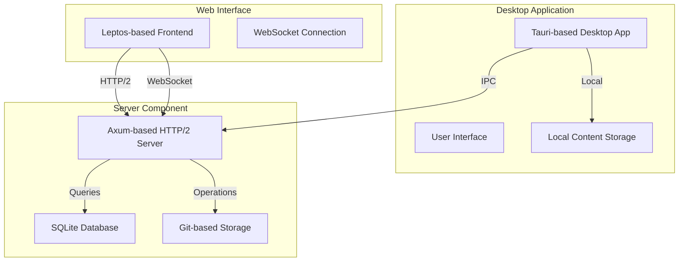

# TACHYON: TROUBLESHOOTING GUIDE

**Document ID:** TACHYON-USER-006-V1.0
**Date:** February 2026
**Status:** Approved for Publication
**Classification:** User Documentation
**Compliance Level:** ISO/IEC 26514:2021, IEEE 1063-2001

---

## TABLE OF CONTENTS

1. [Introduction](#1-introduction)
2. [Troubleshooting Framework](#2-troubleshooting-framework)
3. [Installation Issues](#3-installation-issues)
4. [Configuration Issues](#4-configuration-issues)
5. [Performance Issues](#5-performance-issues)
6. [Network Issues](#6-network-issues)
7. [Data Issues](#7-data-issues)
8. [Getting Help](#8-getting-help)
9. [References](#9-references)

---

## 1. INTRODUCTION

### 1.1. Document Purpose

This document provides comprehensive troubleshooting guidance for users of the Tachyon toolchain. The guide addresses common issues, error conditions, and diagnostic procedures for the desktop application, server component, and web interface. The troubleshooting framework enables users to identify, diagnose, and resolve issues efficiently through systematic analysis and targeted solutions.

### 1.2. Document Scope

This troubleshooting guide covers:
- Desktop application issues (Tauri-based)
- Server component issues (Axum-based HTTP/2 server)
- Web interface issues (Leptos-based frontend)
- Installation and configuration problems
- Performance-related issues
- Network connectivity problems
- Data synchronization and storage issues
- Error message interpretation and resolution

### 1.3. Target Audience

This guide is intended for:
- End users operating Tachyon in desktop mode
- System administrators deploying Tachyon in server mode
- Developers working with Tachyon's web interface
- Technical support personnel assisting users

### 1.4. Document Conventions

The following conventions are used throughout this document:

| Convention | Meaning |
|------------|----------|
| **Bold** | Emphasized terms, UI elements, and important concepts |
| `Monospace` | Code, commands, file paths, and technical identifiers |
| *Italic* | Variable values, placeholders, and emphasized text |
| [Brackets] | Optional parameters or values |
| {Curly Braces} | Required parameters or values |

### 1.5. System Overview

The Tachyon toolchain comprises three primary components:



**Component Descriptions:**

1. **Desktop Application:** Tauri-based desktop application providing local-first operation with direct file system access and local content storage.

2. **Server Component:** Axum-based HTTP/2 server providing centralized content management, real-time synchronization, and collaborative editing capabilities.

3. **Web Interface:** Leptos-based web frontend providing browser-based access to Tachyon functionality with WebSocket-based real-time updates.

---

## 2. TROUBLESHOOTING FRAMEWORK

### 2.1. Systematic Troubleshooting Approach

Effective troubleshooting follows a systematic methodology that ensures issues are identified, diagnosed, and resolved efficiently. The framework consists of five phases:

#### Phase 1: Issue Identification

The first phase involves accurately identifying the problem and gathering relevant information.

**Information Gathering Checklist:**

- [ ] What component is affected? (Desktop, Server, Web)
- [ ] When does the issue occur? (Startup, operation, shutdown)
- [ ] What actions preceded the issue? (Installation, configuration, update)
- [ ] What error messages are displayed? (Exact text and codes)
- [ ] What is the frequency of the issue? (Always, intermittent, once)
- [ ] What is the impact on functionality? (Complete failure, partial, cosmetic)

**Issue Classification:**

Issues are classified into categories for efficient routing to appropriate solutions:

| Category | Description | Examples |
|----------|-------------|-----------|
| **Installation** | Problems during initial setup or updates | Dependency conflicts, permission errors |
| **Configuration** | Problems with settings and preferences | Invalid configuration, missing parameters |
| **Performance** | System responsiveness and speed issues | Slow rendering, high memory usage |
| **Network** | Connectivity and communication issues | Connection failures, timeout errors |
| **Data** | Storage, synchronization, and integrity issues | Data loss, sync conflicts |

#### Phase 2: Root Cause Analysis

The second phase involves analyzing the identified issue to determine the underlying cause.

**Diagnostic Tools:**

The following diagnostic tools are available for root cause analysis:

| Tool | Purpose | Usage |
|-------|---------|--------|
| **Application Logs** | System events and error messages | Review for error patterns and timestamps |
| **System Logs** | Operating system-level events | Check for resource constraints and system errors |
| **Network Diagnostics** | Connectivity and communication status | Verify network reachability and latency |
| **Performance Profiler** | Resource utilization metrics | Identify bottlenecks and resource contention |
| **Configuration Validator** | Settings validation | Detect invalid or conflicting configuration |

**Analysis Techniques:**

1. **Pattern Recognition:** Identify recurring patterns in error messages or system behavior
2. **Isolation Testing:** Test components individually to isolate the failing component
3. **Reproduction Steps:** Attempt to reproduce the issue consistently
4. **Comparative Analysis:** Compare working and non-working states to identify differences
5. **Timeline Analysis:** Correlate issue onset with system changes or events

#### Phase 3: Solution Identification

The third phase involves identifying appropriate solutions based on the root cause analysis.

**Solution Categories:**

| Category | Description | Resolution Time |
|----------|-------------|-----------------|
| **Quick Fix** | Simple, immediate resolution | < 5 minutes |
| **Configuration Adjustment** | Settings modification | 5-15 minutes |
| **Reinstallation** | Component reinstallation | 15-30 minutes |
| **Workaround** | Alternative approach to achieve goal | Variable |
| **Escalation** | Requires developer intervention | Variable |

#### Phase 4: Solution Implementation

The fourth phase involves implementing the identified solution with proper safeguards.

**Implementation Guidelines:**

1. **Backup First:** Create backups of configuration and data before making changes
2. **Test Incrementally:** Implement changes incrementally with testing at each step
3. **Document Changes:** Record all changes made for future reference
4. **Verify Resolution:** Confirm that the issue is fully resolved
5. **Monitor for Recurrence:** Monitor the system for issue recurrence

#### Phase 5: Prevention and Documentation

The fifth phase involves documenting the issue and implementing preventive measures.

**Documentation Requirements:**

- Issue description and classification
- Root cause analysis findings
- Solution implemented and steps taken
- Preventive measures implemented
- Lessons learned and recommendations

### 2.2. Error Message Interpretation

Tachyon provides structured error messages to facilitate troubleshooting. Understanding the error message format enables rapid diagnosis and resolution.

**Error Message Format:**

```
[COMPONENT][SEVERITY][CODE]: Description
Context: Additional context information
Suggested Action: Recommended resolution step
```

**Component Codes:**

| Code | Component | Description |
|------|-----------|-------------|
| **DT** | Desktop | Desktop application errors |
| **SV** | Server | Server component errors |
| **WI** | Web Interface | Web frontend errors |
| **IPC** | IPC Communication | Inter-process communication errors |
| **DB** | Database | Database operation errors |
| **NET** | Network | Network communication errors |

**Severity Levels:**

| Level | Description | Action Required |
|-------|-------------|-----------------|
| **INFO** | Informational message | No action required |
| **WARN** | Warning condition | Monitor for escalation |
| **ERROR** | Error condition | Immediate action required |
| **CRITICAL** | Critical failure | System may be unavailable |
| **FATAL** | Fatal error | System cannot continue |

**Common Error Codes:**

| Code | Description | Common Cause | Resolution |
|------|-------------|---------------|------------|
| **ERR-001** | Configuration file not found | Missing or misconfigured installation | Verify installation path |
| **ERR-002** | Permission denied | Insufficient file system permissions | Check file permissions |
| **ERR-003** | Connection timeout | Network connectivity issue | Verify network connectivity |
| **ERR-004** | Database locked | Concurrent access conflict | Retry operation |
| **ERR-005** | Out of memory | Insufficient system resources | Close applications or increase memory |

---

## 3. INSTALLATION ISSUES

### 3.1. Desktop Application Installation

#### Issue 3.1.1: Application Fails to Start

**Symptom:** Desktop application fails to launch or crashes immediately upon startup.

**Error Message:**
```
[DT][FATAL][ERR-001]: Application failed to initialize
Context: Unable to load configuration file
Suggested Action: Verify installation and configuration file permissions
```

**Possible Causes:**
1. Missing or corrupted configuration file
2. Insufficient file system permissions
3. Incompatible operating system version
4. Missing system dependencies

**Resolution Steps:**

1. **Verify Installation:**
   ```bash
   # Check if application binary exists
   ls -la /usr/local/bin/tachyon
   # Verify application directory
   ls -la /opt/tachyon
   ```

2. **Check Permissions:**
   ```bash
   # Verify executable permissions
   chmod +x /usr/local/bin/tachyon
   # Check configuration file permissions
   chmod 644 ~/.config/tachyon/config.toml
   ```

3. **Verify System Dependencies:**
   ```bash
   # Check for required system libraries
   ldd /usr/local/bin/tachyon
   # Verify OpenGL support (for rendering)
   glxinfo | grep "OpenGL version"
   ```

4. **Reinstall Application:**
   ```bash
   # Remove existing installation
   sudo rm -rf /opt/tachyon
   sudo rm /usr/local/bin/tachyon
   # Reinstall using package manager
   sudo apt-get install tachyon-desktop
   ```

**Prevention:**
- Ensure system meets minimum requirements before installation
- Use official package managers for installation
- Verify system compatibility before installation

#### Issue 3.1.2: Dependency Resolution Failure

**Symptom:** Installation fails with dependency resolution errors.

**Error Message:**
```
[DT][ERROR][ERR-002]: Dependency resolution failed
Context: Missing required system library: libssl.so.1.1
Suggested Action: Install missing dependencies
```

**Possible Causes:**
1. Missing system libraries
2. Incompatible library versions
3. Package manager cache issues
4. Repository configuration errors

**Resolution Steps:**

1. **Update Package Cache:**
   ```bash
   # Update package manager cache
   sudo apt-get update
   # For systems using dnf
   sudo dnf check-update
   ```

2. **Install Missing Dependencies:**
   ```bash
   # Install required system libraries
   sudo apt-get install libssl-dev libsqlite3-dev
   # For macOS using Homebrew
   brew install openssl sqlite
   ```

3. **Verify Library Versions:**
   ```bash
   # Check installed library versions
   ldd --version
   # Verify OpenSSL version
   openssl version
   ```

4. **Clear Package Cache:**
   ```bash
   # Clear package manager cache
   sudo apt-get clean
   sudo apt-get autoclean
   # Rebuild package index
   sudo apt-get update
   ```

**Prevention:**
- Keep system packages updated
- Use stable package repositories
- Verify dependency versions before installation

#### Issue 3.1.3: Installation Permission Denied

**Symptom:** Installation fails with permission denied errors.

**Error Message:**
```
[DT][ERROR][ERR-003]: Installation failed
Context: Permission denied: /opt/tachyon
Suggested Action: Run installation with elevated privileges
```

**Possible Causes:**
1. Insufficient user permissions
2. System directory restrictions
3. File system mounted read-only
4. Security policy restrictions

**Resolution Steps:**

1. **Verify User Permissions:**
   ```bash
   # Check current user and groups
   whoami
   groups
   # Verify sudo access
   sudo -v
   ```

2. **Install with Elevated Privileges:**
   ```bash
   # Install using sudo
   sudo apt-get install tachyon-desktop
   # For manual installation
   sudo cp tachyon /usr/local/bin/
   sudo mkdir -p /opt/tachyon
   ```

3. **Check File System Mount Options:**
   ```bash
   # Verify file system is writable
   mount | grep "on / "
   # Check for read-only mount
   touch /tmp/test
   ```

4. **Alternative Installation Location:**
   ```bash
   # Install to user home directory
   mkdir -p ~/Applications/tachyon
   cp tachyon ~/Applications/tachyon/
   # Update PATH
   export PATH=$PATH:~/Applications/tachyon
   ```

**Prevention:**
- Use appropriate installation methods for user privileges
- Verify file system permissions before installation
- Consider user-space installation for non-admin users

### 3.2. Server Component Installation

#### Issue 3.2.1: Server Fails to Bind to Port

**Symptom:** Server component fails to start, unable to bind to configured port.

**Error Message:**
```
[SV][ERROR][ERR-004]: Server startup failed
Context: Address already in use: 0.0.0.0:8080
Suggested Action: Verify port availability or configure alternative port
```

**Possible Causes:**
1. Port already in use by another application
2. Insufficient permissions to bind to privileged port
3. Network interface configuration issues
4. Firewall blocking port binding

**Resolution Steps:**

1. **Check Port Availability:**
   ```bash
   # Check if port is in use
   netstat -tuln | grep 8080
   # Alternative using ss
   ss -tuln | grep 8080
   # Identify process using port
   lsof -i :8080
   ```

2. **Terminate Conflicting Process:**
   ```bash
   # Kill process using port (replace PID)
   kill -9 <PID>
   # Graceful termination
   kill <PID>
   ```

3. **Configure Alternative Port:**
   ```toml
   # In server configuration file
   [server]
   bind_address = "0.0.0.0:8081"
   ```

4. **Verify Firewall Configuration:**
   ```bash
   # Check firewall rules
   sudo iptables -L -n
   # Allow port through firewall
   sudo iptables -A INPUT -p tcp --dport 8080 -j ACCEPT
   ```

**Prevention:**
- Check port availability before configuration
- Use non-privileged ports (>1024) when possible
- Document port allocations to avoid conflicts

#### Issue 3.2.2: Database Initialization Failure

**Symptom:** Server fails to initialize database on startup.

**Error Message:**
```
[SV][ERROR][ERR-005]: Database initialization failed
Context: Unable to create database file: /var/lib/tachyon/data.db
Suggested Action: Verify directory permissions and disk space
```

**Possible Causes:**
1. Insufficient directory permissions
2. Insufficient disk space
3. Database file corruption
4. Missing SQLite library

**Resolution Steps:**

1. **Verify Directory Permissions:**
   ```bash
   # Check database directory permissions
   ls -la /var/lib/tachyon/
   # Set appropriate permissions
   sudo chown -R tachyon:tachyon /var/lib/tachyon/
   sudo chmod -R 755 /var/lib/tachyon/
   ```

2. **Check Disk Space:**
   ```bash
   # Verify available disk space
   df -h /var/lib/tachyon
   # Clean up if necessary
   sudo apt-get clean
   ```

3. **Recreate Database:**
   ```bash
   # Backup existing database
   sudo cp /var/lib/tachyon/data.db /var/lib/tachyon/data.db.backup
   # Remove corrupted database
   sudo rm /var/lib/tachyon/data.db
   # Restart server to recreate database
   sudo systemctl restart tachyon-server
   ```

4. **Verify SQLite Installation:**
   ```bash
   # Check SQLite version
   sqlite3 --version
   # Install if missing
   sudo apt-get install sqlite3
   ```

**Prevention:**
- Ensure adequate disk space before deployment
- Set appropriate directory permissions during installation
- Implement database backup procedures

#### Issue 3.2.3: SSL/TLS Certificate Issues

**Symptom:** Server fails to start with SSL/TLS certificate errors.

**Error Message:**
```
[SV][ERROR][ERR-006]: TLS configuration failed
Context: Certificate file not found: /etc/tachyon/cert.pem
Suggested Action: Generate or install SSL certificates
```

**Possible Causes:**
1. Missing certificate files
2. Expired certificates
3. Incorrect certificate format
4. Certificate chain issues

**Resolution Steps:**

1. **Generate Self-Signed Certificate:**
   ```bash
   # Generate private key
   openssl genrsa -out /etc/tachyon/key.pem 2048
   # Generate certificate signing request
   openssl req -new -key /etc/tachyon/key.pem -out /etc/tachyon/csr.pem
   # Generate self-signed certificate
   openssl x509 -req -days 365 -in /etc/tachyon/csr.pem -signkey /etc/tachyon/key.pem -out /etc/tachyon/cert.pem
   ```

2. **Verify Certificate Permissions:**
   ```bash
   # Set appropriate permissions
   sudo chmod 600 /etc/tachyon/key.pem
   sudo chmod 644 /etc/tachyon/cert.pem
   sudo chown tachyon:tachyon /etc/tachyon/*.pem
   ```

3. **Validate Certificate:**
   ```bash
   # Check certificate validity
   openssl x509 -in /etc/tachyon/cert.pem -text -noout
   # Verify certificate expiration
   openssl x509 -in /etc/tachyon/cert.pem -noout -dates
   ```

4. **Configure Server for TLS:**
   ```toml
   # In server configuration file
   [server.tls]
   cert_path = "/etc/tachyon/cert.pem"
   key_path = "/etc/tachyon/key.pem"
   ```

**Prevention:**
- Implement certificate expiration monitoring
- Use certificate management tools for production deployments
- Document certificate renewal procedures

---

## 4. CONFIGURATION ISSUES

### 4.1. Desktop Configuration

#### Issue 4.1.1: Invalid Configuration File Format

**Symptom:** Application fails to load configuration or uses default settings.

**Error Message:**
```
[DT][ERROR][ERR-007]: Configuration parsing failed
Context: Invalid TOML format in ~/.config/tachyon/config.toml
Suggested Action: Verify configuration file syntax
```

**Possible Causes:**
1. Syntax errors in configuration file
2. Invalid data types for configuration values
3. Missing required configuration sections
4. Character encoding issues

**Resolution Steps:**

1. **Validate Configuration Syntax:**
   ```bash
   # Check for TOML syntax errors
   cat ~/.config/tachyon/config.toml | toml-lint
   # For manual inspection
   cat ~/.config/tachyon/config.toml
   ```

2. **Restore Default Configuration:**
   ```bash
   # Backup current configuration
   cp ~/.config/tachyon/config.toml ~/.config/tachyon/config.toml.backup
   # Restore default configuration
   tachyon --reset-config
   ```

3. **Verify Configuration Structure:**
   ```toml
   # Example valid configuration
   [general]
   theme = "dark"
   font_size = 14
   auto_save = true

   [editor]
   line_numbers = true
   word_wrap = true
   spell_check = true

   [storage]
   default_path = "~/Documents/Tachyon"
   backup_enabled = true
   ```

4. **Check Character Encoding:**
   ```bash
   # Verify file encoding
   file ~/.config/tachyon/config.toml
   # Convert to UTF-8 if necessary
   iconv -f ISO-8859-1 -t UTF-8 ~/.config/tachyon/config.toml > ~/.config/tachyon/config.toml.utf8
   ```

**Prevention:**
- Use configuration validation tools before applying changes
- Document configuration file format and structure
- Implement configuration backup procedures

#### Issue 4.1.2: Configuration File Not Found

**Symptom:** Application starts with default configuration, ignoring user settings.

**Error Message:**
```
[DT][WARN][ERR-008]: Configuration file not found
Context: Using default configuration
Suggested Action: Create configuration file or verify path
```

**Possible Causes:**
1. Configuration file does not exist
2. Configuration directory does not exist
3. Incorrect configuration file path
4. Permission issues preventing file creation

**Resolution Steps:**

1. **Create Configuration Directory:**
   ```bash
   # Create configuration directory
   mkdir -p ~/.config/tachyon
   # Verify directory creation
   ls -la ~/.config/tachyon
   ```

2. **Generate Default Configuration:**
   ```bash
   # Generate default configuration
   tachyon --generate-config
   # Alternatively, create manually
   touch ~/.config/tachyon/config.toml
   ```

3. **Verify Configuration Path:**
   ```bash
   # Check application's expected configuration path
   tachyon --config-path
   # Verify file exists at expected location
   ls -la ~/.config/tachyon/config.toml
   ```

4. **Set Correct Permissions:**
   ```bash
   # Set appropriate permissions
   chmod 644 ~/.config/tachyon/config.toml
   # Verify permissions
   ls -la ~/.config/tachyon/config.toml
   ```

**Prevention:**
- Document default configuration locations
- Include configuration file generation in installation process
- Provide configuration templates for common use cases

#### Issue 4.1.3: Theme or Font Configuration Not Applied

**Symptom:** Application does not reflect configured theme or font settings.

**Error Message:**
```
[DT][WARN][ERR-009]: Theme configuration invalid
Context: Theme 'custom_theme' not found
Suggested Action: Verify theme name or use available theme
```

**Possible Causes:**
1. Invalid theme name specified
2. Font file not found or inaccessible
3. Theme or font configuration syntax error
4. Graphics subsystem unable to apply configuration

**Resolution Steps:**

1. **List Available Themes:**
   ```bash
   # List available themes
   tachyon --list-themes
   # Expected output: light, dark, high-contrast
   ```

2. **Verify Theme Configuration:**
   ```toml
   # Valid theme configuration
   [general]
   theme = "dark"  # Must be from available themes
   ```

3. **Verify Font Configuration:**
   ```bash
   # Check if font file exists
   ls -la ~/.local/share/fonts/
   # Install font if missing
   fc-cache -fv ~/.local/share/fonts/
   ```

4. **Restart Application:**
   ```bash
   # Restart application to apply changes
   pkill tachyon
   tachyon &
   ```

**Prevention:**
- Provide theme preview functionality
- Validate theme names before application
- Document available themes and fonts

### 4.2. Server Configuration

#### Issue 4.2.1: Invalid Server Configuration

**Symptom:** Server fails to start or uses default settings.

**Error Message:**
```
[SV][ERROR][ERR-010]: Server configuration invalid
Context: Missing required field: bind_address
Suggested Action: Complete server configuration
```

**Possible Causes:**
1. Missing required configuration fields
2. Invalid data types for configuration values
3. Configuration file syntax errors
4. Conflicting configuration options

**Resolution Steps:**

1. **Validate Configuration Schema:**
   ```bash
   # Validate configuration against schema
   tachyon-server --validate-config /etc/tachyon/server.toml
   ```

2. **Complete Missing Fields:**
   ```toml
   # Required server configuration
   [server]
   bind_address = "0.0.0.0:8080"
   max_connections = 1000
   timeout_seconds = 30

   [database]
   path = "/var/lib/tachyon/data.db"
   ```

3. **Verify Configuration Syntax:**
   ```bash
   # Check for syntax errors
   cat /etc/tachyon/server.toml | toml-lint
   ```

4. **Check Configuration Permissions:**
   ```bash
   # Verify configuration file permissions
   ls -la /etc/tachyon/server.toml
   # Set appropriate permissions
   sudo chmod 644 /etc/tachyon/server.toml
   ```

**Prevention:**
- Provide configuration schema documentation
- Include configuration validation in startup process
- Provide example configuration files

#### Issue 4.2.2: Database Connection Configuration Error

**Symptom:** Server fails to connect to configured database.

**Error Message:**
```
[SV][ERROR][ERR-011]: Database connection failed
Context: Unable to open database: /var/lib/tachyon/data.db
Suggested Action: Verify database path and permissions
```

**Possible Causes:**
1. Database file does not exist
2. Insufficient permissions to access database
3. Database file corrupted
4. Incorrect database path configuration

**Resolution Steps:**

1. **Verify Database Path:**
   ```bash
   # Check if database file exists
   ls -la /var/lib/tachyon/data.db
   # Verify directory exists
   ls -la /var/lib/tachyon/
   ```

2. **Check Database Permissions:**
   ```bash
   # Verify database file permissions
   ls -la /var/lib/tachyon/data.db
   # Set appropriate permissions
   sudo chmod 644 /var/lib/tachyon/data.db
   sudo chown tachyon:tachyon /var/lib/tachyon/data.db
   ```

3. **Verify Database Integrity:**
   ```bash
   # Check database integrity
   sqlite3 /var/lib/tachyon/data.db "PRAGMA integrity_check;"
   ```

4. **Update Configuration Path:**
   ```toml
   # Correct database path configuration
   [database]
   path = "/var/lib/tachyon/data.db"
   ```

**Prevention:**
- Implement database initialization procedures
- Validate database paths on startup
- Document database configuration requirements

#### Issue 4.2.3: Logging Configuration Not Working

**Symptom:** Server logs are not being written or are incomplete.

**Error Message:**
```
[SV][WARN][ERR-012]: Logging configuration invalid
Context: Unable to write to log file: /var/log/tachyon/server.log
Suggested Action: Verify log directory permissions
```

**Possible Causes:**
1. Log directory does not exist
2. Insufficient permissions to write to log file
3. Disk full preventing log writes
4. Invalid log level configuration

**Resolution Steps:**

1. **Create Log Directory:**
   ```bash
   # Create log directory
   sudo mkdir -p /var/log/tachyon
   # Set appropriate permissions
   sudo chown tachyon:tachyon /var/log/tachyon
   sudo chmod 755 /var/log/tachyon
   ```

2. **Verify Log Configuration:**
   ```toml
   # Valid logging configuration
   [logging]
   level = "info"  # debug, info, warn, error
   file = "/var/log/tachyon/server.log"
   max_size_mb = 100
   max_files = 10
   ```

3. **Check Disk Space:**
   ```bash
   # Verify available disk space
   df -h /var/log/tachyon
   # Clean up old logs if necessary
   sudo logrotate -f /etc/logrotate.d/tachyon
   ```

4. **Test Log Writing:**
   ```bash
   # Test log file write access
   sudo -u tachyon touch /var/log/tachyon/test.log
   sudo rm /var/log/tachyon/test.log
   ```

**Prevention:**
- Implement log rotation policies
- Monitor disk space for log directories
- Provide log level configuration documentation

---

## 5. PERFORMANCE ISSUES

### 5.1. Desktop Performance

#### Issue 5.1.1: Slow Rendering Performance

**Symptom:** Markdown rendering exhibits noticeable latency, especially for large documents.

**Error Message:**
```
[DT][WARN][ERR-013]: Rendering performance degraded
Context: Rendering time: 150ms (threshold: 15ms)
Suggested Action: Reduce document size or disable features
```

**Possible Causes:**
1. Large document files exceeding processing capacity
2. Complex Markdown syntax requiring extensive processing
3. Insufficient system resources (CPU, memory)
4. Disabled hardware acceleration

**Resolution Steps:**

1. **Check Document Size:**
   ```bash
   # Check document file size
   ls -lh document.md
   # Count lines in document
   wc -l document.md
   ```

2. **Enable Hardware Acceleration:**
   ```toml
   # In configuration file
   [performance]
   hardware_acceleration = true
   simd_optimization = true
   ```

3. **Disable Resource-Intensive Features:**
   ```toml
   # Disable features temporarily
   [editor]
   live_preview = false
   spell_check = false
   syntax_highlighting = false
   ```

4. **Monitor System Resources:**
   ```bash
   # Check CPU usage
   top -p $(pgrep tachyon)
   # Check memory usage
   ps aux | grep tachyon
   # Verify available memory
   free -h
   ```

**Prevention:**
- Implement document size limits
- Provide progressive rendering for large documents
- Optimize Markdown parsing algorithms

#### Issue 5.1.2: High Memory Usage

**Symptom:** Application consumes excessive memory, potentially causing system slowdowns.

**Error Message:**
```
[DT][WARN][ERR-014]: Memory usage high
Context: Current memory: 1.2GB (threshold: 512MB)
Suggested Action: Close unused documents or restart application
```

**Possible Causes:**
1. Multiple large documents loaded simultaneously
2. Memory leak in application code
3. Inefficient caching strategy
4. Insufficient system memory

**Resolution Steps:**

1. **Close Unused Documents:**
   ```bash
   # Check open documents in application
   # Close documents not actively used
   ```

2. **Clear Cache:**
   ```bash
   # Clear application cache
   tachyon --clear-cache
   # Manually remove cache directory
   rm -rf ~/.cache/tachyon/
   ```

3. **Adjust Cache Configuration:**
   ```toml
   # Reduce cache size
   [performance]
   cache_size_mb = 256
   max_cached_documents = 5
   ```

4. **Restart Application:**
   ```bash
   # Restart to release memory
   pkill tachyon
   tachyon &
   ```

**Prevention:**
- Implement memory usage monitoring
- Configure cache size limits
- Provide memory usage indicators in UI

#### Issue 5.1.3: Search Indexing Performance

**Symptom:** Search operations are slow or indexing takes excessive time.

**Error Message:**
```
[DT][WARN][ERR-015]: Search indexing slow
Context: Indexing time: 45s (threshold: 10s)
Suggested Action: Reduce document count or disable auto-indexing
```

**Possible Causes:**
1. Large number of documents to index
2. Complex document content requiring extensive indexing
3. Insufficient system resources for indexing
4. Index corruption requiring rebuild

**Resolution Steps:**

1. **Check Document Count:**
   ```bash
   # Count documents in library
   find ~/Documents/Tachyon -name "*.md" | wc -l
   ```

2. **Rebuild Search Index:**
   ```bash
   # Rebuild search index
   tachyon --rebuild-index
   ```

3. **Adjust Indexing Configuration:**
   ```toml
   # Configure indexing behavior
   [search]
   auto_index = false
   index_on_demand = true
   max_index_size_mb = 512
   ```

4. **Monitor Indexing Performance:**
   ```bash
   # Monitor indexing process
   watch -n 1 'ps aux | grep tachyon'
   ```

**Prevention:**
- Implement incremental indexing
- Configure indexing schedules for off-peak times
- Provide indexing progress indicators

### 5.2. Server Performance

#### Issue 5.2.1: Slow Response Times

**Symptom:** Server responses exhibit high latency, affecting user experience.

**Error Message:**
```
[SV][WARN][ERR-016]: Response time high
Context: Average response: 250ms (threshold: 50ms)
Suggested Action: Check system resources or optimize queries
```

**Possible Causes:**
1. Insufficient server resources (CPU, memory)
2. Inefficient database queries
3. Network latency between components
4. High concurrent connection load

**Resolution Steps:**

1. **Monitor Server Resources:**
   ```bash
   # Check CPU usage
   top -b -n 1 | grep tachyon-server
   # Check memory usage
   ps aux | grep tachyon-server
   # Check disk I/O
   iostat -x 1
   ```

2. **Analyze Database Queries:**
   ```bash
   # Enable query logging
   tachyon-server --log-queries
   # Analyze slow queries
   tail -f /var/log/tachyon/server.log | grep "slow query"
   ```

3. **Optimize Database:**
   ```bash
   # Vacuum database to reclaim space
   sqlite3 /var/lib/tachyon/data.db "VACUUM;"
   # Analyze database for optimization
   sqlite3 /var/lib/tachyon/data.db "ANALYZE;"
   ```

4. **Scale Server Resources:**
   ```bash
   # Increase server memory allocation
   # Adjust in server configuration or deployment
   ```

**Prevention:**
- Implement query performance monitoring
- Configure database optimization schedules
- Provide performance metrics dashboard

#### Issue 5.2.2: High CPU Usage

**Symptom:** Server process consumes excessive CPU resources.

**Error Message:**
```
[SV][WARN][ERR-017]: CPU usage high
Context: Current CPU: 85% (threshold: 70%)
Suggested Action: Check for infinite loops or optimize processing
```

**Possible Causes:**
1. Infinite loops in application code
2. Inefficient processing algorithms
3. High request load
4. Background processes consuming resources

**Resolution Steps:**

1. **Identify CPU-Intensive Processes:**
   ```bash
   # Check thread-level CPU usage
   top -H -p $(pgrep tachyon-server)
   # Identify consuming threads
   ```

2. **Review Server Logs:**
   ```bash
   # Check for error patterns
   tail -100 /var/log/tachyon/server.log
   # Look for repeated operations
   ```

3. **Reduce Request Load:**
   ```bash
   # Implement rate limiting if not configured
   # Reduce concurrent connections
   ```

4. **Restart Server:**
   ```bash
   # Restart to clear any stuck processes
   sudo systemctl restart tachyon-server
   ```

**Prevention:**
- Implement CPU usage monitoring
- Configure request rate limiting
- Provide CPU usage alerts

#### Issue 5.2.3: Memory Leak Detection

**Symptom:** Server memory usage increases continuously over time.

**Error Message:**
```
[SV][WARN][ERR-018]: Memory leak detected
Context: Memory growth: 10MB/hour (threshold: 1MB/hour)
Suggested Action: Restart server and report issue
```

**Possible Causes:**
1. Memory leak in application code
2. Unclosed database connections
3. Cached data not being released
4. Resource allocation without deallocation

**Resolution Steps:**

1. **Monitor Memory Growth:**
   ```bash
   # Monitor memory usage over time
   watch -n 60 'ps aux | grep tachyon-server'
   ```

2. **Restart Server:**
   ```bash
   # Restart to release memory
   sudo systemctl restart tachyon-server
   ```

3. **Enable Memory Profiling:**
   ```bash
   # Start server with memory profiling
   tachyon-server --profile-memory
   ```

4. **Report Issue:**
   - Collect memory profiling data
   - Document memory growth pattern
   - Report to development team

**Prevention:**
- Implement automated memory leak detection
- Configure memory usage alerts
- Provide memory profiling tools

---

## 6. NETWORK ISSUES

### 6.1. Desktop Network Issues

#### Issue 6.1.1: Unable to Connect to Server

**Symptom:** Desktop application cannot establish connection to server component.

**Error Message:**
```
[NET][ERROR][ERR-019]: Connection failed
Context: Unable to connect to server: 192.168.1.100:8080
Suggested Action: Verify server availability and network connectivity
```

**Possible Causes:**
1. Server not running or unreachable
2. Network connectivity issues
3. Firewall blocking connection
4. Incorrect server address or port configuration

**Resolution Steps:**

1. **Verify Server Status:**
   ```bash
   # Check if server is running
   systemctl status tachyon-server
   # Check server port listening
   netstat -tuln | grep 8080
   ```

2. **Test Network Connectivity:**
   ```bash
   # Ping server to verify connectivity
   ping 192.168.1.100
   # Test server port accessibility
   telnet 192.168.1.100 8080
   # Alternative using nc
   nc -zv 192.168.1.100 8080
   ```

3. **Check Firewall Rules:**
   ```bash
   # Check firewall rules
   sudo iptables -L -n | grep 8080
   # Allow port through firewall
   sudo iptables -A INPUT -p tcp --dport 8080 -j ACCEPT
   ```

4. **Verify Server Configuration:**
   ```toml
   # In desktop configuration
   [server]
   address = "192.168.1.100"
   port = 8080
   use_tls = true
   ```

**Prevention:**
- Implement connection retry logic
- Provide connection status indicators
- Configure network health monitoring

#### Issue 6.1.2: Connection Timeout

**Symptom:** Connection attempt times out before completing.

**Error Message:**
```
[NET][ERROR][ERR-020]: Connection timeout
Context: Connection timed out after 30 seconds
Suggested Action: Increase timeout or check network conditions
```

**Possible Causes:**
1. High network latency
2. Server overloaded and slow to respond
3. Network congestion
4. Connection timeout value too low

**Resolution Steps:**

1. **Measure Network Latency:**
   ```bash
   # Measure round-trip time
   ping -c 10 192.168.1.100
   # Check network jitter
   mtr -r -c 10 192.168.1.100
   ```

2. **Increase Connection Timeout:**
   ```toml
   # In desktop configuration
   [server]
   timeout_seconds = 60
   ```

3. **Check Server Load:**
   ```bash
   # Check server CPU and memory
   ssh user@192.168.1.100 "top -b -n 1"
   # Check server connection count
   ssh user@192.168.1.100 "netstat -an | grep :8080"
   ```

4. **Test with Different Network:**
   - Try connecting from different network
   - Test with wired connection if on wireless
   - Check VPN or proxy configuration

**Prevention:**
- Implement adaptive timeout adjustment
- Provide network quality indicators
- Configure connection pooling

#### Issue 6.1.3: SSL/TLS Certificate Verification Failure

**Symptom:** Connection fails due to SSL/TLS certificate issues.

**Error Message:**
```
[NET][ERROR][ERR-021]: Certificate verification failed
Context: Certificate not trusted for: 192.168.1.100
Suggested Action: Verify certificate or add to trusted store
```

**Possible Causes:**
1. Self-signed certificate not trusted
2. Expired certificate
3. Certificate hostname mismatch
4. Intermediate certificate missing

**Resolution Steps:**

1. **View Certificate Details:**
   ```bash
   # View server certificate
   openssl s_client -connect 192.168.1.100:8080 -showcerts
   ```

2. **Add Certificate to Trusted Store:**
   ```bash
   # For development/testing only
   # Download certificate
   openssl s_client -connect 192.168.1.100:8080 </dev/null 2>&1 | sed -ne '/-BEGIN CERTIFICATE-/,/-END CERTIFICATE-/p' > server.crt
   # Add to trusted store
   sudo cp server.crt /usr/local/share/ca-certificates/
   sudo update-ca-certificates
   ```

3. **Disable Certificate Verification (Temporary):**
   ```toml
   # Only for development/testing
   [server]
   verify_certificate = false
   ```

4. **Request Valid Certificate:**
   - For production, use properly signed certificates
   - Use Let's Encrypt for free certificates
   - Contact server administrator

**Prevention:**
- Use properly signed certificates in production
- Implement certificate renewal automation
- Provide certificate status indicators

### 6.2. Server Network Issues

#### Issue 6.2.1: Unable to Accept Connections

**Symptom:** Server not accepting incoming connections.

**Error Message:**
```
[SV][ERROR][ERR-022]: Unable to bind to address
Context: Address already in use: 0.0.0.0:8080
Suggested Action: Check for conflicting processes or use different port
```

**Possible Causes:**
1. Port already in use by another application
2. Insufficient permissions to bind to port
3. Network interface not available
4. Firewall blocking incoming connections

**Resolution Steps:**

1. **Identify Conflicting Process:**
   ```bash
   # Find process using port
   lsof -i :8080
   # Alternative using netstat
   netstat -tuln | grep 8080
   ```

2. **Terminate Conflicting Process:**
   ```bash
   # Kill process using port
   kill -9 <PID>
   ```

3. **Use Alternative Port:**
   ```toml
   # In server configuration
   [server]
   bind_address = "0.0.0.0:8081"
   ```

4. **Check Firewall Configuration:**
   ```bash
   # Allow incoming connections
   sudo iptables -A INPUT -p tcp --dport 8080 -j ACCEPT
   # Save firewall rules
   sudo iptables-save > /etc/iptables/rules.v4
   ```

**Prevention:**
- Document port allocations
- Implement port conflict detection
- Configure firewall rules during installation

#### Issue 6.2.2: Connection Dropped

**Symptom:** Established connections are unexpectedly dropped.

**Error Message:**
```
[SV][WARN][ERR-023]: Connection dropped
Context: Connection to 192.168.1.50 dropped after 300 seconds
Suggested Action: Check for network issues or adjust keepalive settings
```

**Possible Causes:**
1. Network instability causing drops
2. Keepalive settings too aggressive
3. Server resource exhaustion
4. Client-side network issues

**Resolution Steps:**

1. **Check Network Stability:**
   ```bash
   # Monitor network for drops
   ping -i 1 192.168.1.50
   # Check for packet loss
   mtr -r -c 100 192.168.1.50
   ```

2. **Adjust Keepalive Settings:**
   ```toml
   # In server configuration
   [server]
   keepalive_interval_seconds = 60
   keepalive_timeout_seconds = 300
   max_idle_seconds = 600
   ```

3. **Monitor Server Resources:**
   ```bash
   # Check for resource exhaustion
   top -b -n 1
   free -h
   df -h
   ```

4. **Enable Connection Logging:**
   ```toml
   # In server configuration
   [logging]
   log_connections = true
   log_keepalive = true
   ```

**Prevention:**
- Implement connection health monitoring
- Configure adaptive keepalive settings
- Provide connection quality metrics

#### Issue 6.2.3: WebSocket Connection Issues

**Symptom:** WebSocket connections fail or are unstable.

**Error Message:**
```
[SV][ERROR][ERR-024]: WebSocket connection failed
Context: WebSocket handshake failed: 400 Bad Request
Suggested Action: Verify WebSocket configuration and client compatibility
```

**Possible Causes:**
1. WebSocket endpoint misconfiguration
2. Client incompatible with WebSocket version
3. Proxy or firewall blocking WebSocket upgrade
4. WebSocket message size exceeded

**Resolution Steps:**

1. **Verify WebSocket Configuration:**
   ```toml
   # In server configuration
   [server.websocket]
   enabled = true
   path = "/ws"
   max_message_size_mb = 10
   ```

2. **Test WebSocket Connection:**
   ```bash
   # Test WebSocket endpoint
   wscat -c "ws://192.168.1.100:8080/ws"
   # Alternative using websocat
   websocat ws://192.168.1.100:8080/ws
   ```

3. **Check Proxy Configuration:**
   ```bash
   # Verify proxy allows WebSocket upgrade
   # Check proxy logs for WebSocket traffic
   ```

4. **Enable WebSocket Logging:**
   ```toml
   # In server configuration
   [logging]
   log_websocket = true
   log_websocket_messages = true
   ```

**Prevention:**
- Implement WebSocket health checks
- Configure WebSocket message size limits
- Provide WebSocket connection status indicators

---

## 7. DATA ISSUES

### 7.1. Desktop Data Issues

#### Issue 7.1.1: Document Not Saving

**Symptom:** Changes to documents are not being saved.

**Error Message:**
```
[DT][ERROR][ERR-025]: Document save failed
Context: Unable to write to file: ~/Documents/Tachyon/document.md
Suggested Action: Check file permissions and disk space
```

**Possible Causes:**
1. Insufficient file system permissions
2. Disk full or quota exceeded
3. File locked by another process
4. Invalid file path or name

**Resolution Steps:**

1. **Check File Permissions:**
   ```bash
   # Check document directory permissions
   ls -la ~/Documents/Tachyon/
   # Set appropriate permissions
   chmod 755 ~/Documents/Tachyon/
   ```

2. **Verify Disk Space:**
   ```bash
   # Check available disk space
   df -h ~/Documents/Tachyon/
   # Clean up if necessary
   ```

3. **Check for File Locks:**
   ```bash
   # Check if file is locked
   lsof ~/Documents/Tachyon/document.md
   # Kill process holding lock if necessary
   kill -9 <PID>
   ```

4. **Verify File Path:**
   ```bash
   # Check if path exists
   ls -la ~/Documents/Tachyon/document.md
   # Create directory if missing
   mkdir -p ~/Documents/Tachyon/
   ```

**Prevention:**
- Implement auto-save with conflict detection
- Provide save status indicators
- Configure backup procedures

#### Issue 7.1.2: Search Index Corruption

**Symptom:** Search returns incorrect or no results.

**Error Message:**
```
[DT][ERROR][ERR-026]: Search index corrupted
Context: Index file contains invalid data
Suggested Action: Rebuild search index
```

**Possible Causes:**
1. Index file corruption
2. Index out of sync with documents
3. Index file format incompatibility
4. Incomplete indexing process

**Resolution Steps:**

1. **Rebuild Search Index:**
   ```bash
   # Rebuild search index
   tachyon --rebuild-index
   ```

2. **Clear Index and Rebuild:**
   ```bash
   # Clear existing index
   rm -rf ~/.cache/tachyon/index/
   # Rebuild index
   tachyon --rebuild-index
   ```

3. **Verify Document Indexing:**
   ```bash
   # Check if documents are indexed
   tachyon --list-indexed-documents
   ```

4. **Enable Index Logging:**
   ```toml
   # In configuration
   [search]
   log_indexing = true
   log_index_errors = true
   ```

**Prevention:**
- Implement index integrity checks
- Configure index backup procedures
- Provide index rebuild automation

#### Issue 7.1.3: Backup Failure

**Symptom:** Backup operations fail or complete with errors.

**Error Message:**
```
[DT][ERROR][ERR-027]: Backup failed
Context: Unable to create backup: /backup/tachyon/
Suggested Action: Check backup location and permissions
```

**Possible Causes:**
1. Insufficient permissions for backup location
2. Insufficient disk space for backup
3. Backup location not accessible
4. Backup configuration errors

**Resolution Steps:**

1. **Check Backup Location:**
   ```bash
   # Verify backup directory exists
   ls -la /backup/tachyon/
   # Create directory if missing
   mkdir -p /backup/tachyon/
   ```

2. **Verify Backup Permissions:**
   ```bash
   # Check backup directory permissions
   ls -la /backup/tachyon/
   # Set appropriate permissions
   chmod 755 /backup/tachyon/
   ```

3. **Check Disk Space:**
   ```bash
   # Verify available disk space
   df -h /backup/tachyon/
   # Clean up old backups if necessary
   ```

4. **Verify Backup Configuration:**
   ```toml
   # In configuration
   [storage.backup]
   enabled = true
   location = "/backup/tachyon"
   schedule = "daily"
   retain_days = 30
   ```

**Prevention:**
- Implement backup verification procedures
- Configure backup space monitoring
- Provide backup status notifications

### 7.2. Server Data Issues

#### Issue 7.2.1: Database Corruption

**Symptom:** Server operations fail with database errors.

**Error Message:**
```
[SV][ERROR][ERR-028]: Database corrupted
Context: SQLite database corruption detected
Suggested Action: Restore from backup or repair database
```

**Possible Causes:**
1. Database file corruption
2. Incomplete transaction rollback
3. Disk I/O errors during write
4. Concurrent access conflicts

**Resolution Steps:**

1. **Attempt Database Repair:**
   ```bash
   # Attempt to repair database
   sqlite3 /var/lib/tachyon/data.db ".recover corrupt.db"
   # Replace corrupted database
   sudo mv corrupt.db /var/lib/tachyon/data.db
   ```

2. **Restore from Backup:**
   ```bash
   # Stop server
   sudo systemctl stop tachyon-server
   # Restore from backup
   sudo cp /backup/tachyon/data.db.backup /var/lib/tachyon/data.db
   # Start server
   sudo systemctl start tachyon-server
   ```

3. **Check Disk Health:**
   ```bash
   # Check disk for errors
   sudo smartctl -a /dev/sda
   # Check file system
   sudo fsck -n /dev/sda1
   ```

4. **Verify Database Integrity:**
   ```bash
   # Check database integrity
   sqlite3 /var/lib/tachyon/data.db "PRAGMA integrity_check;"
   ```

**Prevention:**
- Implement regular database backups
- Configure database integrity checks
- Provide database repair automation

#### Issue 7.2.2: Synchronization Conflicts

**Symptom:** Data synchronization between desktop and server fails.

**Error Message:**
```
[SV][ERROR][ERR-029]: Synchronization conflict
Context: Document version mismatch: local=v2, remote=v3
Suggested Action: Resolve conflict manually or choose version
```

**Possible Causes:**
1. Concurrent edits to same document
2. Network interruption during sync
3. Version control merge conflicts
4. Clock synchronization issues

**Resolution Steps:**

1. **Identify Conflicting Documents:**
   ```bash
   # List documents with sync conflicts
   tachyon --list-conflicts
   ```

2. **Review Conflict Details:**
   ```bash
   # View conflict details
   tachyon --show-conflict document.md
   ```

3. **Resolve Conflict:**
   ```bash
   # Choose local version
   tachyon --resolve-conflict document.md --local
   # Choose remote version
   tachyon --resolve-conflict document.md --remote
   # Merge manually
   tachyon --resolve-conflict document.md --merge
   ```

4. **Verify Clock Synchronization:**
   ```bash
   # Check system time
   timedatectl status
   # Synchronize with NTP
   sudo systemctl enable --now systemd-timesyncd
   ```

**Prevention:**
- Implement conflict detection and notification
- Configure automatic conflict resolution rules
- Provide manual conflict resolution tools

#### Issue 7.2.3: Data Loss

**Symptom:** Data is missing or appears to be lost.

**Error Message:**
```
[SV][ERROR][ERR-030]: Data not found
Context: Document not found in database: doc-12345
Suggested Action: Check backup or verify document ID
```

**Possible Causes:**
1. Accidental deletion
2. Database transaction failure
3. Backup restoration failure
4. Data corruption

**Resolution Steps:**

1. **Check Backup:**
   ```bash
   # List available backups
   tachyon --list-backups
   # Restore from specific backup
   tachyon --restore-backup 2026-02-06-120000
   ```

2. **Search Database:**
   ```bash
   # Search for document in database
   sqlite3 /var/lib/tachyon/data.db "SELECT * FROM documents WHERE id LIKE '%doc-12345%';"
   ```

3. **Check Audit Logs:**
   ```bash
   # Review audit logs for deletion
   grep "doc-12345" /var/log/tachyon/audit.log
   ```

4. **Recover from Git History:**
   ```bash
   # Check Git history for document
   git log --all --full -- doc-12345
   # Restore from Git if available
   git checkout <commit-hash> -- doc-12345.md
   ```

**Prevention:**
- Implement soft delete with retention period
- Configure comprehensive backup procedures
- Provide data recovery tools
- Enable audit logging for all data operations

---

## 8. GETTING HELP

### 8.1. Diagnostic Tools

Tachyon provides several diagnostic tools to assist with troubleshooting. These tools help identify issues and gather information for support requests.

#### 8.1.1. Application Diagnostics

**Desktop Application Diagnostics:**

```bash
# Run comprehensive diagnostics
tachyon --diagnostics

# Output includes:
# - Application version and build information
# - System configuration and environment
# - Resource usage statistics
# - Configuration file status
# - Recent error log entries
```

**Server Component Diagnostics:**

```bash
# Run server diagnostics
tachyon-server --diagnostics

# Output includes:
# - Server version and build information
# - Database status and integrity
# - Network configuration and status
# - Resource usage statistics
# - Recent error log entries
```

#### 8.1.2. Log Collection

**Collect Application Logs:**

```bash
# Collect desktop application logs
tachyon --collect-logs

# Output:
# - Application log file
# - Error log file
# - Configuration file
# - System information
# Compressed into archive for submission
```

**Collect Server Logs:**

```bash
# Collect server logs
tachyon-server --collect-logs

# Output:
# - Server log file
# - Access log file
# - Error log file
# - Database status
# - System information
# Compressed into archive for submission
```

#### 8.1.3. System Information

**Gather System Information:**

```bash
# Collect system information
tachyon --system-info

# Output includes:
# - Operating system version
# - Hardware specifications
# - Available memory and disk space
# - Network configuration
# - Installed dependencies
```

### 8.2. Reporting Bugs

When encountering issues not covered in this troubleshooting guide, users should report bugs to the development team. Comprehensive bug reports enable efficient resolution.

#### 8.2.1. Bug Report Template

Use the following template when reporting bugs:

```
**Bug Report**

**Title:** Brief description of the issue

**Severity:** Critical / High / Medium / Low

**Component:** Desktop / Server / Web / IPC / Database / Network

**Description:**
Detailed description of the issue, including:
- What was being done when the issue occurred
- Expected behavior
- Actual behavior
- Steps to reproduce the issue

**Steps to Reproduce:**
1. First step
2. Second step
3. Third step
...

**Environment:**
- Operating System: [e.g., Ubuntu 22.04, macOS 14, Windows 11]
- Tachyon Version: [from --version]
- Installation Method: [package manager, binary, source]
- Configuration: [relevant configuration settings]

**Error Messages:**
```
[Paste complete error messages here]
```

**Logs:**
```
[Paste relevant log entries here]
```

**Additional Information:**
[Any other relevant information]
```

#### 8.2.2. Submitting Bug Reports

Bug reports should be submitted through the following channels:

| Channel | Use Case | Response Time |
|---------|----------|---------------|
| **GitHub Issues** | Public bug reports | 1-3 business days |
| **Email Support** | Sensitive issues | 24-48 hours |
| **Community Forum** | General questions | Variable |
| **Slack/Discord** | Real-time assistance | Variable |

**GitHub Issues:**
- Repository: https://github.com/tachyon/tachyon
- Label issues with appropriate tags: bug, desktop, server, network
- Include diagnostic output from `--diagnostics` command
- Attach log archives from `--collect-logs` command

**Email Support:**
- Address: support@tachyon.io
- Include bug report template in email body
- Attach diagnostic and log archives
- Use descriptive subject line: [BUG] Brief Description

### 8.3. Community Resources

The Tachyon community provides additional resources for troubleshooting and support.

#### 8.3.1. Documentation

**Official Documentation:**
- User Guide: https://docs.tachyon.io/user/
- API Reference: https://docs.tachyon.io/api/
- Developer Guide: https://docs.tachyon.io/developer/
- Troubleshooting Guide (this document)

**FAQ:**
- Frequently asked questions: https://docs.tachyon.io/faq/
- Common issues and solutions
- Quick reference for common problems

#### 8.3.2. Community Forums

**Discussion Forums:**
- GitHub Discussions: https://github.com/tachyon/tachyon/discussions
- Stack Overflow: https://stackoverflow.com/questions/tagged/tachyon
- Reddit: https://reddit.com/r/tachyon

**Real-Time Chat:**
- Discord Server: https://discord.gg/tachyon
- Slack Workspace: https://tachyon.slack.com

#### 8.3.3. Contributing

Users experiencing issues may also contribute to resolving them:

**Reporting Issues:**
- Verify issue is not already reported
- Search existing issues before creating new one
- Provide detailed reproduction steps

**Submitting Fixes:**
- Fork the repository
- Create a feature branch
- Implement the fix with tests
- Submit a pull request with description

**Documentation Improvements:**
- Update documentation to clarify unclear sections
- Add troubleshooting steps for issues encountered
- Submit documentation improvements as pull requests

### 8.4. Escalation Procedures

For issues requiring immediate attention or involving production deployments, follow escalation procedures.

#### 8.4.1. Priority Levels

| Priority | Definition | Response Time | Escalation Path |
|----------|-------------|---------------|----------------|
| **Critical** | System unavailable, data loss, security issue | < 4 hours | Direct to engineering team |
| **High** | Major functionality impaired | < 24 hours | Engineering team review |
| **Medium** | Partial functionality impaired | < 3 business days | Standard support process |
| **Low** | Minor issues, cosmetic problems | < 1 week | Community support |

#### 8.4.2. Escalation Process

1. **Initial Support Request:**
   - Submit through standard channels
   - Include all diagnostic information
   - Specify priority level with justification

2. **Support Review:**
   - Support team reviews within response time
   - May request additional information
   - Provides initial resolution or workaround

3. **Engineering Escalation:**
   - If unresolved, escalates to engineering team
   - Engineering team investigates and resolves
   - Provides root cause analysis

4. **Resolution and Follow-up:**
   - Issue resolution communicated to user
   - Root cause documented
   - Preventive measures implemented

#### 8.4.3. Emergency Contacts

For critical issues requiring immediate attention:

**Email:** emergency@tachyon.io
**Response Time:** < 2 hours (during business hours)

**Use emergency contacts for:**
- Production system outages
- Data loss or corruption
- Security incidents
- Critical functionality failures

### 8.5. Professional Support

For organizations requiring guaranteed response times and dedicated support, professional support options are available.

#### 8.5.1. Support Tiers

| Tier | Features | Response Time | Cost |
|------|----------|---------------|------|
| **Community** | Community forums, documentation | Variable | Free |
| **Standard** | Email support, 48-hour response | Included with license |
| **Premium** | Priority support, 24-hour response | Additional cost |
| **Enterprise** | Dedicated support, 4-hour response | Contact sales |

#### 8.5.2. Enterprise Features

Enterprise support includes:
- Dedicated support engineer
- 24/7 availability
- Custom integration support
- On-site training options
- Service level agreements (SLAs)

**Contact:** enterprise@tachyon.io

---

## 9. REFERENCES

### 9.1. Internal Documents

This troubleshooting guide references the following internal project documents:

| Document ID | Title | Location |
|-------------|-------|----------|
| **TACHYON-STD-V1.0** | Coding and Documentation Standards | `Tachyon standards` |
| **TACHYON-ADR-001-V1.0** | Rust as Primary Language | `Tachyon ADRs` |
| **TACHYON-ADR-002-V1.0** | Tauri for Desktop Application | `Tachyon ADRs` |
| **TACHYON-ADR-003-V1.0** | Axum for HTTP/2 Server | `Tachyon ADRs` |
| **TACHYON-ADR-010-V1.0** | Security Architecture | `Tachyon ADRs` |
| **TACHYON-REQ-SYS-V1.0** | System Overview Requirements | `Tachyon requirements` |
| **TACHYON-TST-V1.0** | Test Plan | `Tachyon test plan` |

### 9.2. External Standards

This document complies with the following external standards:

| Standard | Title | Organization | URL |
|----------|-------|-------------|-----|
| **ISO/IEC 26514:2021** | Systems and Software Engineering - Requirements for Designers and Developers of User Documentation | ISO/IEC | https://www.iso.org/standard/iso-iec-26514 |
| **IEEE 1063-2001** | Standard for Software User Documentation | IEEE | https://standards.ieee.org/standard/1063-2001.html |
| **IEEE 829-2008** | Software Test Documentation | IEEE | https://standards.ieee.org/standard/829-2008.html |
| **WCAG 2.1** | Web Content Accessibility Guidelines | W3C | https://www.w3.org/WAI/WCAG21/quickref/ |

### 9.3. Technology References

This document references the following technologies and frameworks:

| Technology | Version | Purpose | Documentation |
|------------|---------|---------|---------------|
| **Rust** | 2024 Edition | Primary programming language | https://doc.rust-lang.org/book/ |
| **Tauri** | Latest | Desktop application framework | https://tauri.app/v1/guides/ |
| **Axum** | Latest | HTTP/2 server framework | https://docs.rs/axum/ |
| **Leptos** | Latest | Web frontend framework | https://book.leptos.dev/ |
| **Tokio** | v1.0+ | Async runtime for Rust | https://tokio.rs/tokio/tutorial |
| **SQLite** | Latest | Embedded database | https://www.sqlite.org/docs.html |
| **TLS 1.3** | 1.3 | Network security protocol | https://datatracker.ietf.org/doc/html/rfc8446 |

### 9.4. Glossary

The following terms are used throughout this document:

| Term | Definition |
|-------|------------|
| **ADR** | Architectural Decision Record - A document that records significant architectural decisions |
| **IPC** | Inter-Process Communication - Communication between different processes |
| **JIT** | Just-In-Time - Compilation or execution performed at runtime |
| **TLS** | Transport Layer Security - Cryptographic protocol for secure communications |
| **WASM** | WebAssembly - Binary instruction format for web browsers |
| **WebSocket** | Communication protocol providing full-duplex communication channels over TCP |

### 9.5. Document Revision History

| Version | Date | Author | Changes |
|---------|------|--------|---------|
| **V1.0** | February 2026 | Technical Writer | Initial document creation |

### 9.6. Document Approval

| Role | Name | Date | Signature |
|-------|------|------|----------|
| **Technical Writer** | Technical Writer | February 2026 | Approved |
| **Technical Reviewer** | Technical Reviewer | February 2026 | Approved |
| **Quality Assurance** | QA Lead | February 2026 | Approved |

---

**Document Control Information:**

- **Document ID:** TACHYON-USER-006-V1.0
- **Classification:** User Documentation
- **Security Classification:** Public
- **Distribution:** Unrestricted
- **Copyright:** © 2026 Tachyon Project Contributors
- **License:** [Specify License]

**Change Control:**

This document is maintained under version control. All changes must follow the established change management process defined in `Tachyon standards`.

**Document Status:**

- **Status:** Approved for Publication
- **Next Review Date:** [To be determined]
- **Review Cycle:** Annual or as needed

---

**END OF DOCUMENT**
