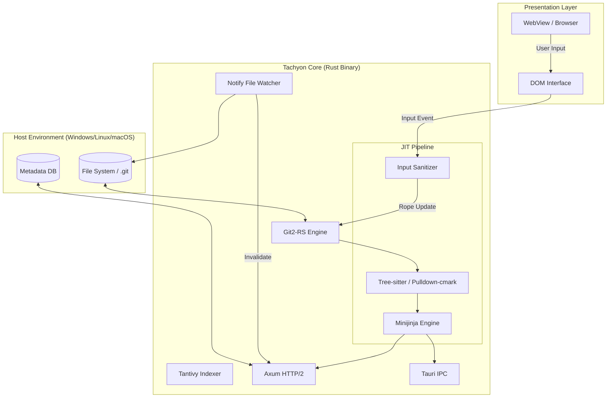

# TACHYON: PROJECT SPECIFICATION BLUEPRINT

**Document ID:** TACHYON-SPEC-V1.0
**Date:** February 2026
**Status:** Approved for Implementation
**Classification:** Technical Architecture & Engineering Specification

---

## 1. Introduction

### 1.1. Project Abstract

Tachyon is a deterministic, high-performance Knowledge Management System (KMS) and Internal Developer Portal (IDP). It is engineered to bridge the gap between personal note-taking applications (e.g., Notion) and enterprise-grade static site generators (e.g., Docusaurus).

Tachyon distinguishes itself through a **Just-In-Time (JIT)** rendering architecture, operating directly upon a local Git repository or file system without a preliminary build step. It provides a single binary executable that functions polymorphically as a Desktop Application (GUI), a Headless Server (Daemon), or a Static Site Compiler (CLI).

### 1.2. Design Philosophy

1.  **Local-First:** The file system is the single source of truth. There is no hidden proprietary database for content.
2.  **HFT-Grade Performance:** Architecture prioritizes microsecond-latency responses using Rust, zero-copy parsing, and arena allocation.
3.  **Unified Experience:** The editing environment (Desktop) and consumption environment (Server) share 100% of the rendering codebase.
4.  **Compliance-Ready:** Granular access control and self-hosted capability ensure data sovereignty.

---

## 2. System Architecture

### 2.1. Technology Stack

| Component         | Technology          | Rationale                                                                |
| :---------------- | :------------------ | :----------------------------------------------------------------------- |
| **Language**      | Rust (2024 Edition) | Memory safety, zero-cost abstractions, predictable latency.              |
| **Async Runtime** | `tokio`             | Industry-standard cross-platform I/O (IOCP/Kqueue/Epoll).                |
| **App Wrapper**   | `tauri` (v2)        | Native OS WebView encapsulation with minimal binary overhead (~5MB).     |
| **Web Server**    | `axum`              | Ergonomic, modular HTTP/2 server framework.                              |
| **Data Access**   | `git2-rs`           | Direct bindings to `libgit2` for repo manipulation without shelling out. |
| **Metadata DB**   | `sqlite` (Embedded) | Storage for User Sessions, RBAC mappings, and Cache metadata.            |
| **Search Engine** | `tantivy`           | Rust-native, schema-aware full-text search with mmap support.            |
| **Frontend UI**   | HTML5 / TailwindCSS | Server-Side Rendered (SSR) for SEO and performance.                      |
| **Editor Logic**  | Leptos (Wasm)       | Rust-native DOM manipulation for the text editing surface.               |

### 2.2. High-Level Diagram



---

## 3. Component Specifications

### 3.1. The Data Layer (Git + SQLite)

- **Content Storage:** All documentation, assets, and config files reside in the user's Git repository.
  - **Locking Strategy:** Soft-locking via in-memory `DashMap`. No physical lock files shall be written to disk to prevent commit pollution.
- **Metadata Storage:** SQLite is used strictly for non-content data:
  - Active User Sessions (Server Mode).
  - OIDC/SAML Group Mappings.
  - File History / "Recently Viewed" (Local Mode).

### 3.2. The JIT Rendering Engine

- **Parsing:**
  - **Prose:** `pulldown-cmark` (SIMD-enabled) for standard Markdown.
  - **Code:** `tree-sitter` for syntax highlighting (Server-side rendering of code blocks).
  - **Math:** `katex-rs` for server-side LaTeX rendering (prevents client-side layout shifts).
- **Directives:** Custom parsing logic for `::: directive` syntax (e.g., Admonitions, Tabs). This logic must operate on the AST (Abstract Syntax Tree) before HTML generation.
- **Caching:**
  - **L1 Cache (RAM):** LRU Cache storing compiled HTML strings keyed by `(FilePath + CommitHash + UserRole)`.
  - **L2 Cache (Disk):** None. Regeneration is fast enough (<2ms) to negate the need for disk caching of HTML.

### 3.3. The "Raw Leptos" Editor (The Core Innovation)

To achieve consistency across Mobile and Desktop without heavy JS libraries, the editor is implemented as follows:

- **Input Surface:** A native HTML `div` with `contenteditable="true"`. This delegates virtual keyboard handling, cursor placement, and text selection to the OS/Browser.
- **State Management:** Rust (`Leptos`) maintains a `Rope` data structure representing the document.
- **The Loop:**
  1.  User types character.
  2.  Browser fires `input` event.
  3.  Leptos intercepts event.
  4.  **Sanitizer:** Compares DOM state with `Rope` state.
  5.  **Reconciliation:** Leptos patches _only_ the changed DOM nodes to apply syntax highlighting (via `tree-sitter-wasm`).
- **Mobile Optimization:** On touch devices, live syntax highlighting is debounced (paused) during active typing to prevent cursor jump issues on Android/iOS.

---

## 4. Operation Modes & Interfaces

### 4.1. Desktop Mode (The "Notion" Experience)

- **Entry Point:** `tachyon_gui` (Tauri).
- **Behavior:**
  - Spawns a background `tokio` thread running the Axum server on a random loopback port.
  - Launches a WebView pointing to `http://127.0.0.1:{port}`.
  - Enables **IPC Bridge** for native OS dialogs (File Open, Save As).
  - **Auto-Sync:** Commits changes to the local Git repo on a debounce timer (2s) or on Application Close.

### 4.2. Server Mode (The "Enterprise" Experience)

- **Entry Point:** `tachyon serve` (CLI).
- **Behavior:**
  - Binds to `0.0.0.0`.
  - Enforces `tachyon.toml` security policies (Auth, RBAC).
  - Disables local system dialogs.
  - Enables **Multi-User Editing** via WebSocket broadcasting (Last-Write-Wins logic with "Toast" notifications for conflicts).

### 4.3. Static Build Mode (The "SSG" Experience)

- **Entry Point:** `tachyon build` (CLI).
- **Behavior:**
  - Performs a deterministic crawl of the `content/` directory.
  - Renders all routes to static HTML.
  - **Security:** Automatically excludes any folder marked `access: internal` or `private/` from the build output.
  - Generates a `search.json` or `search.wasm` index for client-side search.

---

## 5. User Interface (The "Axiom" Design System)

### 5.1. Visual Language

The UI follows the **Axiom** design specifications:

- **Typography:** Atkinson Hyperlegible (UI), JetBrains Mono (Code), Merriweather (Prose).
- **Layout:** 3-Pane Responsive Grid (Navigation, Content, Context).
- **Theming:** Server-side CSS generation (Tailwind). Zero FOUC (Flash of Unstyled Content).

### 5.2. Responsive Strategy

- **Desktop (>1024px):** 3-Column Layout. Live "Monaco-like" editing features enabled.
- **Tablet (768px - 1024px):** 2-Column (Left Nav collapses to Icon Rail).
- **Mobile (<768px):** Single Column.
  - **Read Mode:** Full screen text.
  - **Edit Mode:**
    - Left/Right sidebars become Off-Canvas Drawers.
    - Virtual Keyboard activation triggers the **Mobile Toolbar** (floating above keyboard via Visual Viewport API).

---

## 6. Infrastructure & Deployment

### 6.1. Monorepo Structure

The official repository includes templates for `tachyon init`.

```text
/
├── src/                # Rust Source
├── web/                # Frontend Source (Leptos/TS)
├── templates/
│   ├── base/           # "Notion-like"
│   ├── docs/           # "Docusaurus-like"
│   └── enterprise/     # "Internal Portal"
└── tests/              # Integration Tests
```

### 6.2. Initialization (`tachyon init`)

- **Mechanism:** Fetches the specific template folder from the GitHub main branch tarball (to avoid cloning the entire history).
- **Setup:** Initializes a fresh `.git` repository in the target directory.

### 6.3. Publishing Strategy

- **GitHub Releases:** Hosts the raw binaries (`.exe`, `.dmg`, `.deb`).
- **Docker Hub:** Minimal container `FROM scratch` containing the static binary.
- **Tauri Updater:** The Desktop App polls `tachyon.dev/updater.json` to auto-update via GitHub Releases.

---

## 7. Security & Compliance

### 7.1. Access Control (RBAC)

- **Scope:** Active only in Server Mode.
- **Mechanism:** Middleware intercepts every request.
  1.  Decodes Session/JWT.
  2.  Reads Target File Frontmatter (`access: internal`, `groups: [engineering]`).
  3.  Evaluates Rule.
  4.  **Result:** Returns `200 OK` or `404 Not Found` (Security through Obscurity).
- **Redaction:** `::: internal` blocks are removed from the AST prior to HTML string generation.

### 7.2. SEO Compliance

- **SSR:** All content is fully rendered in the initial HTTP response.
- **Hydration:** Interactive elements (Leptos) hydrate _after_ the First Contentful Paint (FCP).
- **Meta Tags:** Rust parser extracts Title/Description from Markdown Frontmatter and injects into `<head>`.

### 7.3. Standards

- **ISO/IEC 25010:** Performance Efficiency (Time behavior < 100ms).
- **WCAG 2.1 AA:** High contrast themes, Aria labels on all interactive elements (Native HTML controls).

---

## 8. Implementation Roadmap

1.  **Phase 1: Core Engine:** Build the `git2` reader and `pulldown-cmark` JIT renderer.
2.  **Phase 2: The Shell:** Implement the Axum server and the Tauri wrapper.
3.  **Phase 3: The Editor:** Implement the "Raw Leptos" editor with `tree-sitter` and Mobile Sanitizer.
4.  **Phase 4: Ecosystem:** Build the `init` command, templates, and CI/CD pipelines.

---

**Approval:**
_Architecture confirmed. Proceed to development._
